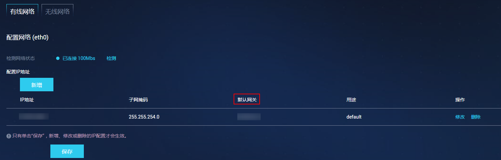
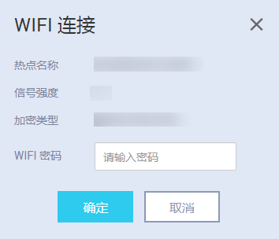
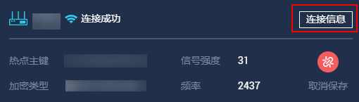

# 无线网络配置（SSH）

HiLens Kit有两种组网方式，分为无线和有线两种方式连接路由器，本章介绍无线网络配置方式。

> **说明：** 
>不能同时使用无线网络和有线网络连接同一个路由器，无线连接会自动删除默认网关，再次使用有线网络时需要配置默认网关。**推荐使用无线连接到路由器，以免更新设备IP后遗忘或丢失IP。**
>如果选择有线网络配置，请参见[有线网络配置（SSH）](有线网络配置（SSH）.md)。

## 配置要求

**针对使用无线网络连接路由器的方式，需要输入无线网络密码，成功连接无线网络。**

当前HiLens Kit仅支持**2.4G频段**的无线网络和常规的**加密类型**无线网络，且**无线网络名称**不包含英文的单引号和双引号，长度8-63个字符。

-   支持的2.4G频段无线网络所使用的协议为IEEE802.11n\\IEEE802.11g\\IEEE802.11b。
-   支持的无线网络加密类型有WEP、WPA-PSK/WPA2-PSK和AES。
-   暂不支持需要验证的无线网络。
-   暂不支持TKIP加密。
-   路由器网关不能使用**xxx.xxx.0.xxx**网段，比如**192.168.0.1**，也不要和HiLens Kit网口在同一网段，例如，设备IP是**192.168.2.111**，那么路由器的网关就不能设置成**192.168.2.xxx**。

## 前提条件

-   网线连接PC和设备，详细操作请参见[连接PC和HiLens Kit-1](连接PC和HiLens-Kit-1.md)。

## 操作步骤

1.  登录华为HiLens智能边缘管理系统，在本地PC中打开浏览器。在地址栏中输入华为HiLens智能边缘管理系统的地址，地址格式为“**https**://_华为HiLens__智能边缘管理系统的访问IP地址_”（默认IP为192.168.2.111）。按“Enter“键。

    > **说明：** 
    >如果浏览器显示“此网站的安全证书有问题”，请单击“继续浏览此网站\(不推荐\)”。

2.  在系统登录界面中，配置登录信息。

    在“用户名”和“密码”输入框中输入登录的用户名和密码。

    初识用户名和密码请见[默认数据](https://support.huawei.com/enterprise/zh/doc/EDOC1100112066/2347bab9)。

    **图 1**  登录华为HiLens智能边缘管理系统-2  
    

3.  在主菜单中选择“管理\>网络\>有线网络“。

    进入“有线网络“配置页面。

4.  检查“配置IP地址“区域的“IP地址“是否存在“默认网关“，如[图2](#hilens_02_0079_fig9120542134018)所示。

    **图 2**  检查默认网关  
    

    -   若不存在默认网关，请执行下一步。
    -   若存在默认网关，请执行以下操作：

        单击操作栏“修改“，在弹出的“修改IP地址“对话框中，删除“默认网关“文本框中的已有值，单击“确定“。

        执行下一步。

5.  在主菜单中选择“管理\>网络\>无线网络“。

    进入“无线网络“配置页面。

6.  单击，打开WIFI开关。

    搜索附近热点，可连接附近的无线网络。

7.  单击，可刷新热点信息。
8.  单击。

    弹出信息提示框。

9.  在“WIFI密码“文本框中输入WIFI密码，[图3](#hilens_02_0079_fig636412444716)所示。单击“确定“。

    页面右上角弹出“连接成功“，完成无线网络连接路由器。

    **图 3**  无线连接路由器  
    

## 查看无线网络IP

配置无线网络后，您可以在华为HiLens智能边缘管理系统获取无线网络的IP地址。

1.  登录华为HiLens智能边缘管理系统，在本地PC中打开浏览器。在地址栏中输入华为HiLens智能边缘管理系统的地址，地址格式为“**https**://_华为HiLens__智能边缘管理系统的访问IP地址_”（默认IP为192.168.2.111）。按“Enter“键。

    > **说明：** 
    >如果浏览器显示“此网站的安全证书有问题”，请单击“继续浏览此网站\(不推荐\)”。

2.  在系统登录界面中，配置登录信息。

    在“用户名”和“密码”输入框中输入登录的用户名和密码。

    初识用户名和密码请见[默认数据](https://support.huawei.com/enterprise/zh/doc/EDOC1100112066/2347bab9)。

    **图 4**  登录华为HiLens智能边缘管理系统-3  
    

3.  在主菜单中选择“管理\>网络\>无线网络“。

    进入“无线网络“配置页面。

4.  在您所连接的无线网络卡片右上角，单击“连接信息“。

    弹出“查看WIFI信息“窗口。

    “IP地址“即无线网络的IP地址。

    **图 5**  查看无线IP  
    

## 后续操作

注册HiLens Kit，详情请见[SSH注册HiLens Kit](SSH注册HiLens-Kit.md)。

