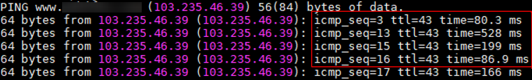

# 无线网络（外网）&有线网络（内网）

本节主要介绍如何使用无线网络（WIFI）连接外网，同时使用有线网络连接公司、学校等内部网络的操作方式。

方式一：先配置无线网络，再配置有线网络，然后添加被删除的无线IP默认路由表项。

方式二：先配置有线网络，再配置无线网络，然后添加被删除的有线IP默认路由表项。

本节以方式一详细介绍HiLens Kit同时使用无线和有线进行组网配置的过程。

## 准备工作

1.  网线连接本地PC和HiLens Kit。
2.  在浏览器输入“https://XXX.XXX.XXX.XXX“，并按“Enter”打开智能边缘系统登录界面（HiLens IES Web）。

    其中“XXX.XXX.XXX.XXX“为设备默认IP，默认参数请见[默认参数](https://support.huawei.com/enterprise/zh/doc/EDOC1100133284/e63f5d68)。

3.  在“用户名“和“密码“输入框中输入登录的用户名和密码，默认参数请见[默认参数](https://support.huawei.com/enterprise/zh/doc/EDOC1100133284/e63f5d68)。
4.  使用默认IP，SSH登录HiLens Kit，进入管理员（develop）权限命令行界面，详情请见[SSH登录HiLens Kit设备](SSH登录HiLens-Kit设备.md)。

    如果公司、学校等内部网络分配IP要求与接入设备MAC地址绑定，请固化HiLens Kit有线网口\(eth0\) MAC地址。

    1.  在HiLens Kit管理员权限命令行界面输入命令**ifconfig**，查看HiLens Kit设备有线网口的MAC地址。

        如[图1](#fig8857185515265)所示，红框所标识的内容就是HiLens Kit有线网口“eth0“的MAC地址。

        **图 1**  查看MAC地址  
        

    2.  在管理员权限命令行界面打开文件“vi /etc/rc.d/rc.local“，追加如下内容：

        **Ifconfig eth0 down**

        **Ifconfig eth0 hw ether xx:xx:xx:xx:xx:xx**（“xx:xx:xx:xx:xx:xx“为MAC地址）

        **Ifconfig eth0 up**

    3.  重启设备使修改操作生效。

## 步骤一：配置无线网络

使用无线网络连接外网，动态获取无线网络的IP地址。针对使用无线网络连接路由器的方式，需要输入无线网络密码，成功连接无线网络。

-   **操作步骤**

    无线网络的配置要求及详细步骤请见[无线网络配置（SSH）](无线网络配置（SSH）.md)。

-   **网络验证**
    1.  在命令行界面执行命令**ifconfig**，查看HiLens Kit的IP信息。

        以无线网络IP为“192.168.137.26“为例，“wlan0“表示无线网口。

        **图 2**  设备IP-1  
        

    2.  执行命令**route**，查看路由表项信息。

        以无线网络IP为“192.168.137.26“，所分配的默认网关为“192.168.137.1“为例。

        **图 3**  路由表项信息-1  
        

    3.  执行命令检查无线网络是否连接成功。

        **ping www.huaweicloud.com**

        如果设备连接成功，其提示信息将显示如下类似信息。

        **图 4**  有线连接提示信息-1  
        

## 步骤二：配置有线网络

-   **操作步骤**

    使用有线网络连接公司、学校等内部网络，需要在有线网口新增内网IP。如果需要域名解析，请配置对应的DNS。

    1.  在浏览器输入“https://XXX.XXX.XXX.XXX“，并按“Enter”打开智能边缘系统登录界面（HiLens IES Web）。

        其中“XXX.XXX.XXX.XXX“为设备默认IP，默认参数请见[默认参数](https://support.huawei.com/enterprise/zh/doc/EDOC1100133284/e63f5d68)。

    2.  在“用户名“和“密码“输入框中输入登录的用户名和密码，默认参数请见[默认参数](https://support.huawei.com/enterprise/zh/doc/EDOC1100133284/e63f5d68)。
    3.  在主菜单中选择“管理\>网络\>有线网络“。

        进入“有线网络“配置页面。

        **图 5**  有线网络配置  
        

    4.  在配置IP地址下方单击“新增“，按[表1](#table64562491807)在新增IP对话框中填写内网IP信息，并单击“确定“。
    5.  在有线网络页面的“配置IP地址“下方单击“保存“。

        **表 1**  新增IP参数

        
        <table><thead align="left"><tr id="row1545594915010"><th class="cellrowborder" valign="top" width="25.41%" id="mcps1.2.3.1.1">
参数

        </th>
        <th class="cellrowborder" valign="top" width="74.59%" id="mcps1.2.3.1.2">
说明

        </th>
        </tr>
        </thead>
        <tbody><tr id="row184550493015"><td class="cellrowborder" valign="top" width="25.41%" headers="mcps1.2.3.1.1 ">
用途

        </td>
        <td class="cellrowborder" valign="top" width="74.59%" headers="mcps1.2.3.1.2 ">
IP地址的用途。

        
支持输入英文、数字和下划线字符，字符串长度1~32个字符。

        </td>
        </tr>
        <tr id="row44561949703"><td class="cellrowborder" valign="top" width="25.41%" headers="mcps1.2.3.1.1 ">
IP地址

        </td>
        <td class="cellrowborder" valign="top" width="74.59%" headers="mcps1.2.3.1.2 ">
需要修改的IPv4地址。

        
此处IP地址应和路由器IP在同一网段的IP地址。

        </td>
        </tr>
        <tr id="row154569499014"><td class="cellrowborder" valign="top" width="25.41%" headers="mcps1.2.3.1.1 ">
默认网关

        </td>
        <td class="cellrowborder" valign="top" width="74.59%" headers="mcps1.2.3.1.2 ">
该IP地址对应的默认网关。

        
 说明： 

请确保默认网关全局唯一。

        

        </td>
        </tr>
        </tbody>
        </table>

        **图 6**  添加IP地址  
        

    6.  配置内部网络对应的DNS地址。根据是否升级HiLens Kit系统固件版本，配置DNS的方式也不同。
        -   **已升级HiLens Kit系统固件版本**

            已升级HiLens Kit系统固件版本至2.2.200.011，详情请见[升级HiLens Kit系统固件版本](升级HiLens-Kit系统固件版本.md)，配置DNS方式如下。

            1.  在智能边缘系统的“管理\>网络\>有线网络“页面。单击“配置DNS地址“的“新增“。

                弹出添加DNS地址对话框。

                **图 7**  添加DNS  
                

            2.  在对话框中填写公司或学校内部网络的DNS地址，单击“确定“。
            3.  在有线网络页面的“配置DNS地址“下方单击“保存“。

        -   **未升级HiLens Kit系统固件版本**

            使用SSH远程配置DNS。

            在PuTTY里进入文件“vi /etc/resolv.conf“，新增DNS：

            **nameserver x.x.x.x**（x.x.x.x为新增的DNS地址）

            保存并退出。

-   **网络验证**
    1.  使用默认IP，SSH登录HiLens Kit，详情请见[SSH登录HiLens Kit设备](SSH登录HiLens-Kit设备.md)。
    2.  执行命令**ifconfig**，查看HiLens Kit的IP信息。

        以有线网络IP为“10.78.14.58“为例，“eth0“表示有线网口，“eth0:1“为新增IP地址。

        **图 8**  设备IP  
        

    3.  执行命令**route**，查看路由表项信息。

        以有线网络IP为“10.78.14.58“，，所分配的默认网关为“192.168.137.1“为例，会发现[步骤一：配置无线网络](#section4688639494)分配的IP对应默认路由信息没有了，导致此时无法访问外网。

        **图 9**  路由表项信息  
        

## 步骤三：添加路由表项

手动添加[步骤一：配置无线网络](#section4688639494)时分配的IP所对应的默认路由表项。

-   **操作步骤**
    1.  使用默认IP，SSH登录HiLens Kit，进入管理员（develop）权限命令行界面，详情请见[SSH登录HiLens Kit设备](SSH登录HiLens-Kit设备.md)。
    2.  在命令行界面执行命令，添加默认路由表项。

        以[步骤一：配置无线网络](#section4688639494)分配的IP所对应的默认网关是“192.168.137.1“为例。

        **route add default gw 192.168.137.1**

    3.  拔出PC侧网线，断开PC和HiLens Kit的网线，网线连接HiLens Kit和内部网络。

-   **网络验证**
    1.  在内网PC上使用HiLens Kit新配置内网IP（本例中是“10.78.14.58“）SSH登录HiLens Kit，详情请见[SSH登录HiLens Kit设备](SSH登录HiLens-Kit设备.md)。
    2.  依次执行命令**ping**检查是否成功连接有线网络（外网）和无线网络（内网）。

        如果设备连接成功，其提示信息将显示如下类似信息。

        **图 10**  有线网络连接提示信息  
        

        **图 11**  无线网络连接提示信息  
        

