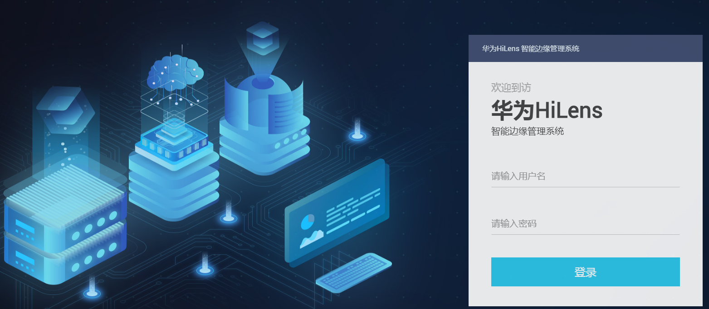

# 智能边缘系统注册HiLens Kit

## 前提条件

依次完成如下操作：

1.  网线连接PC和设备，详细操作请参见[连接PC和HiLens Kit](连接PC和HiLens-Kit.md)。
2.  升级HiLens Kit系统固件版本，详情请参见[升级HiLens Kit系统固件版本](升级HiLens-Kit系统固件版本.md)。
3.  同步设备时区和时间，详情请参见[同步时区和时间](同步时区和时间.md)。
4.  选择如下方式中的一种组网配置：

    -   [配置无线网络](配置无线网络.md)
    -   [配置有线网络](配置有线网络.md)

    不能同时使用无线网络和有线网络连接同一个路由器，无线连接会自动删除默认网关，再次使用有线网络时需要配置默认网关。**推荐使用无线连接到路由器，以免更新设备IP后遗忘或丢失IP。**

## 操作步骤

1.  登录华为HiLens智能边缘管理系统，在本地PC中打开浏览器。在地址栏中输入华为HiLens智能边缘管理系统的地址，地址格式为“**https**://_华为HiLens__智能边缘管理系统的访问IP地址_”（默认IP为192.168.2.111）。按“Enter“键。

    > **说明：** 
    >如果浏览器显示“此网站的安全证书有问题”，请单击“继续浏览此网站\(不推荐\)”。

2.  在系统登录界面中，配置登录信息。

    在“用户名”和“密码”输入框中输入登录的用户名和密码。

    初识用户名和密码请见[默认数据](https://support.huawei.com/enterprise/zh/doc/EDOC1100112066/2347bab9)。

    **图 1**  登录华为HiLens智能边缘管理系统-5  
    

3.  在主菜单中选择“维护\>网管注册“。

    进入“配置网管注册“页面。

4.  “选择网管模式“勾选“华为HiLens云平台注册“，按[表1](#table44861339122019)填写注册设备的基本信息。

    如果“选择网管模式“没有“华为HiLens云平台注册“选项，请升级HiLens系统固件版本，升级操作请执行两次，详情请见[升级HiLens Kit系统固件版本](升级HiLens-Kit系统固件版本.md)。

    如果设备恢复出厂设置，请重新升级HiLens系统固件版本，升级操作请执行两次，详情请见[升级HiLens Kit系统固件版本](升级HiLens-Kit系统固件版本.md)。

    **表 1**  注册设备参数说明

    
    <table><thead align="left"><tr id="row104863395208"><th class="cellrowborder" valign="top" width="50%" id="mcps1.2.3.1.1">
参数

    </th>
    <th class="cellrowborder" valign="top" width="50%" id="mcps1.2.3.1.2">
说明

    </th>
    </tr>
    </thead>
    <tbody><tr id="row184862396208"><td class="cellrowborder" valign="top" width="50%" headers="mcps1.2.3.1.1 ">
“设备名”

    </td>
    <td class="cellrowborder" valign="top" width="50%" headers="mcps1.2.3.1.2 ">
设备的名称，由用户自定义。支持英文字母、数字和下划线，不支持以数字开头的名称以及只有数字的名称。

    </td>
    </tr>
    <tr id="row13486839192018"><td class="cellrowborder" valign="top" width="50%" headers="mcps1.2.3.1.1 ">
“帐号名”

    </td>
    <td class="cellrowborder" valign="top" width="50%" headers="mcps1.2.3.1.2 ">
华为云帐号名，相关概念请参见<a href="https://support.huaweicloud.com/productdesc-iam/iam_01_0023.html" target="_blank" rel="noopener noreferrer">IAM基本概念</a>。

    
 说明： 

注册HiLens Kit所使用的帐号名必须是华为云帐号，不是华为帐号。

    

    </td>
    </tr>
    <tr id="row104861539162016"><td class="cellrowborder" valign="top" width="50%" headers="mcps1.2.3.1.1 ">
“用户名”

    </td>
    <td class="cellrowborder" valign="top" width="50%" headers="mcps1.2.3.1.2 ">
IAM用户名，相关概念请参见<a href="https://support.huaweicloud.com/productdesc-iam/iam_01_0023.html" target="_blank" rel="noopener noreferrer">IAM基本概念</a>。如果没有IAM账户时，“用户名”与“帐号名”一致。

    </td>
    </tr>
    <tr id="row19486639132019"><td class="cellrowborder" valign="top" width="50%" headers="mcps1.2.3.1.1 ">
“密码”

    </td>
    <td class="cellrowborder" valign="top" width="50%" headers="mcps1.2.3.1.2 ">
华为云帐号密码。

    </td>
    </tr>
    </tbody>
    </table>

    注册HiLens Kit所使用的用户名、帐号名、设备名仅支持英文字母、数字和下划线，不支持以数字开头的名称以及只有数字的名称。

5.  单击“保存“。

    页面右上方提示“注册成功“。

## 在华为HiLens管理控制台查看注册后的设备

登录[华为HiLens管理控制台](https://console.huaweicloud.com/hilens/?region=cn-north-4#/hilens/deviceAuthority)，在管理控制台左侧菜单栏单击“设备管理 \>设备列表“，默认设备列表展现所有设备，查看到您所注册的设备列表，且设备状态处于“在线“状态，则说明您的设备成功注册。

如果注册失败或设备状态处于离线状态，请参见[HiLens Kit注册失败](https://support.huaweicloud.com/hilens_faq/HiLens_03_0005.html)排查原因。

> **说明：** 
>使用智能边缘系统注册设备默认注册至北京四区域，请将控制台切换至“北京四“区域。

**图 2**  设备注册状态  

