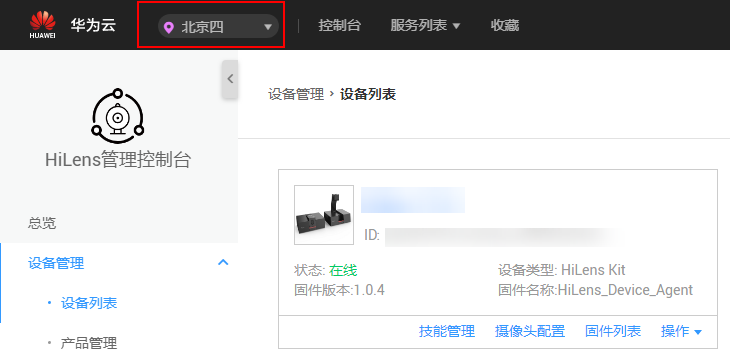

# 智能边缘系统注册设备

## 前提条件

-   确保您拥有至少一台HiLens Kit设备。
-   确保华为云账号没有欠费。
-   采用智能边缘系统注册设备，固件版本必须2.2.200.011及以上，如果低于此版本请先[升级系统固件版本](升级HiLens-Kit系统固件版本.md)。

    系统固件版本查询方式：[登录Huawei HiLens智能边缘管理系统用户界面](https://support.huawei.com/enterprise/zh/doc/EDOC1100133284/1e2e9a10)，进入“维护\>固件升级“页面，查看“当前版本号“。

    全新HiLens Kit硬件，推荐进行固件升级，以获取更好的稳定性。

    如果固件版本低于2.2.200.011，当前仅支持[SSH注册设备](使用SSH注册设备.md)。SSH方式注册成功后，后续您仍可以升级系统固件版本，相关方法和风险参考[升级HiLens Kit系统固件版本](升级HiLens-Kit系统固件版本.md)。

-   使用智能边缘系统注册设备默认注册至北京四区域。

    如果不能接受该限制，请选择[使用SSH注册设备](使用SSH注册设备.md)。如果要注册到其他区域，需要先通过SSH工具修改设备配置参考[步骤四：切换设备注册区域至北京一（可选）](使用SSH注册设备.md#section191304259256)。

## 步骤一：连接PC和HiLens Kit

详情请参见[连接PC和HiLens Kit](连接PC和HiLens-Kit.md)。

## 步骤二：升级HiLens Kit系统固件版本

已使用过HiLens Kit的用户，升级前请仔细阅读[升级风险](升级HiLens-Kit系统固件版本.md#section1035617614114)。

请执行**两次**升级系统固件版本操作，操作步骤如下：

详细升级操作请参见[HiLens Kit升级指导书](https://support.huawei.com/enterprise/zh/doc/EDOC1100133290?idPath=7919749%7C9856522%7C22892968%7C23710428%7C250700826)。

1.  首次获取升级包时，在企业技术支持网站（Support-E网站）[注册账号](https://uniportal.huawei.com/accounts/register.do?method=toRegister&appurl=http://support.huawei.com/enterprise?isFirstLogin=true&nls=zh)并[注册产品](https://support.huawei.com/enterprisemysupport/mysupport#click=productreg)，输入HiLens Kit的产品序列号（SN），系统默认输入产品名称，完成产品注册申请，详情请参见[提升权限](https://support.huawei.com/enterprise/enhanceMyPrivilege)。

    SN码标注于HiLens Kit底部，为一串长达20的字符串，例如“21023XXXXXXXXXXXXXXX“。

    产品注册申请提交之后，若是显示为“产品注册成功“，则可以直接执行下一步；若提示“产品待审核“则需要等待审核成功之后执行下一步，一个工作日之内审核。

2.  在[软件版本列表](https://support.huawei.com/enterprise/zh/ai-computing-platform/a200-3000hilens-pid-250700826/software/251268332?idAbsPath=fixnode01%7C7919749%7C9856522%7C22892968%7C23710428%7C250700826)中选择目标版本“A200-3000HiLens-FWV2.2.200.011.hpm“，下载升级包至本地PC。
3.  登录Huawei HiLens智能边缘管理系统，在本地PC中打开浏览器。在地址栏中输入华为HiLens智能边缘管理系统的地址，地址格式为“**https**://_华为HiLens__智能边缘管理系统的访问IP地址_”（默认IP为192.168.2.111）。

    详细操作请参见[登录Huawei HiLens智能边缘系统](https://support.huawei.com/enterprise/zh/doc/EDOC1100112066/a6312166)。

4.  在主菜单中选择“维护 \> 固件升级 \> 系统固件升级“。

    进入“系统固件升级“页面。

5.  单击“升级文件“后的  ，选择文件，即步骤2中下载的升级包。

    界面提示“已添加文件“。

    > **说明：**   
    >上传过程中，请勿切换或者关闭当前页面，否则会导致上传失败。  

6.  单击“升级“，在弹出的提示框中 勾选“升级完成后系统自动重启生效“。

    如果不勾选该选项，则需手动重启生效。

7.  单击“确定“。

    可在页面查看升级包版本号、升级进度等信息。

8.  等待10分钟左右，提示升级成功。

    若首次执行升级操作，重新登录Huawei HiLens智能边缘管理系统，请**重复执行**步骤3-步骤8。

    > **说明：**   
    >为确保设备注册成功，在执行第二次升级操作时，请使用同一个升级包。  

    若已执行升级操作两次，则已完成HiLens Kit固件版本升级，请执行下一步骤。

## 步骤三：同步时区和时间

1.  登录Huawei HiLens智能边缘管理系统，详细操作请参见[登录Huawei HiLens智能边缘系统](https://support.huawei.com/enterprise/zh/doc/EDOC1100112066/a6312166)。
2.  在主菜单中选择“管理\>时间“。

    进入“设置系统时间“页面。

3.  “地区“选择“亚洲“，“时区“选择“上海“，单击“保存“。

    系统会自动退出。

4.  重新登录Huawei HiLens智能边缘管理系统，详细操作请参见[登录Huawei HiLens智能边缘系统](https://support.huawei.com/enterprise/zh/doc/EDOC1100112066/a6312166)。
5.  在主菜单中选择“管理\>时间“。

    进入“设置系统时间“页面。

6.  核对“时间“，如不正确，单击校正时间，单击“保存“。

    若时间不正确，会导致注册后无法安装技能。

## 步骤四：组网配置

HiLens Kit有两种组网方式，分为无线和有线两种方式连接路由器，您可以选择其中一种方式进行组网配置。

两种不同组网方案的连接方式的操作指导如下：

-   [无线网络配置](无线网络配置.md)
-   [有线网络配置](有线网络配置.md)

    有线网络配置完成后，需要配置DNS地址：

    1.  在Huawei HiLens智能边缘管理系统“管理 \> 网络 \> 有线网络“页面。单击“配置IP地址“的“新增“。

        添加DNS地址“nameserver 8.8.8.8“。

    2.  单击“确定“。
    3.  单击“保存“，重启系统，使配置生效。

**不能同时使用无线网络和有线网络连接同一个路由器，推荐使用无线连接到路由器**，以免更新设备IP后遗忘或丢失IP。

## 步骤五：注册HiLens Kit

1.  登录Huawei HiLens智能边缘管理系统，详细操作请参见[登录Huawei HiLens智能边缘系统](https://support.huawei.com/enterprise/zh/doc/EDOC1100112066/a6312166)。
2.  在主菜单中选择“维护 \> 网管注册“。

    进入“配置网管注册“页面。

3.  “选择网管模式“勾选“华为HiLens云平台注册“，按[表1](#table13251458174018)填写注册设备的基本信息。

    **表 1**  注册设备参数说明

    
    <table><thead align="left"><tr id="row10259587406"><th class="cellrowborder" valign="top" width="50%" id="mcps1.2.3.1.1">
参数

    </th>
    <th class="cellrowborder" valign="top" width="50%" id="mcps1.2.3.1.2">
说明

    </th>
    </tr>
    </thead>
    <tbody><tr id="row2025358114014"><td class="cellrowborder" valign="top" width="50%" headers="mcps1.2.3.1.1 ">
“设备名”

    </td>
    <td class="cellrowborder" valign="top" width="50%" headers="mcps1.2.3.1.2 ">
设备的名称。由用户自定义。

    </td>
    </tr>
    <tr id="row325135812400"><td class="cellrowborder" valign="top" width="50%" headers="mcps1.2.3.1.1 ">
“账号名”

    </td>
    <td class="cellrowborder" valign="top" width="50%" headers="mcps1.2.3.1.2 ">
华为云账号名，相关概念请参见<a href="https://support.huaweicloud.com/productdesc-iam/iam_01_0023.html" target="_blank" rel="noopener noreferrer">IAM基本概念</a>。

    </td>
    </tr>
    <tr id="row125125811403"><td class="cellrowborder" valign="top" width="50%" headers="mcps1.2.3.1.1 ">
“用户名”

    </td>
    <td class="cellrowborder" valign="top" width="50%" headers="mcps1.2.3.1.2 ">
IAM用户名，相关概念请参见<a href="https://support.huaweicloud.com/productdesc-iam/iam_01_0023.html" target="_blank" rel="noopener noreferrer">IAM基本概念</a>。如果没有IAM账户时，“用户名”与“账号名”一致。

    </td>
    </tr>
    <tr id="row526158124017"><td class="cellrowborder" valign="top" width="50%" headers="mcps1.2.3.1.1 ">
“密码”

    </td>
    <td class="cellrowborder" valign="top" width="50%" headers="mcps1.2.3.1.2 ">
华为云账号密码。

    </td>
    </tr>
    </tbody>
    </table>

4.  单击“保存“。

    页面右上方提示“注册成功“。

## 在Huawei HiLens管理控制台查看注册后的设备

登录[Huawei HiLens管理控制台](https://console.huaweicloud.com/hilens/?region=cn-north-4#/hilens/deviceAuthority)，在管理控制台左侧菜单栏单击“设备管理 \>设备列表“，默认设备列表展现所有设备，查看到您所注册的设备列表，且设备状态处于“在线“状态，则说明您的设备成功注册。

> **说明：**   
>使用智能边缘系统注册设备默认注册至北京四区域，请将控制台切换至“北京四“区域。  

**图 1**  设备注册状态  

