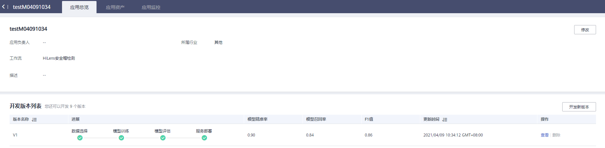
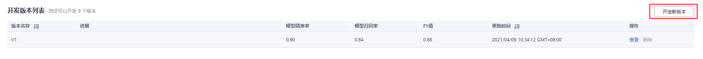
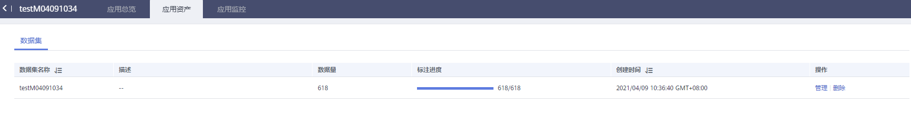
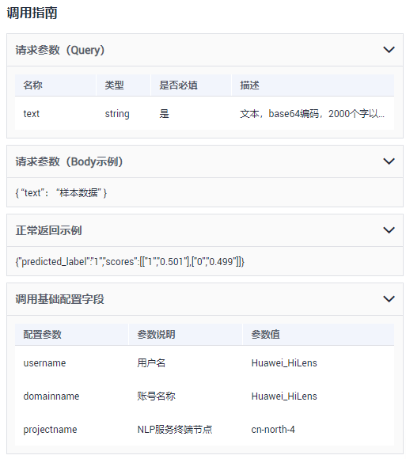

# 查看技能详情

新建可训练技能后，您可以查看技能详情，包括技能开发的配置信息、历史版本、应用资产、应用监控。

## 前提条件

已在华为HiLens控制台选择可训练技能模板新建技能，详情请见[新建可训练技能](新建可训练技能.md)。

## 查看技能详情

1.  登录华为HiLens管理控制台，在左侧导航栏选择“技能开发\>技能管理“。

    默认进入“基础技能“页签。

2.  单击“可训练技能“，切换至“可训练技能“页签。
3.  选择技能单击操作列的“查看“。

    默认进入“应用总览“页签。

    您可以任意切换页签，查看[应用开发配置](#section1531542011467)、[应用资产](#section75151234114613)（数据集）、[应用监控](#section129284154619)。

    **图 1**  应用总览  
    

## 查看应用开发配置

在开发版本列表，选择版本并单击“操作“列的“查看“，您可以查看应用开发过程中各个步骤的配置信息，包括“数据选择“、“模型训练“、“模型评估“、“服务部署“。

您也可以在开发版本列表右上角，单击“开发新版本“，重新编辑应用开发的配置信息，将更新的应用设置成新的版本，详情请见[更新应用版本](更新应用版本.md)。

**图 2**  开发新版本  

## 查看应用资产

在“应用资产“页签下，可以查看当前应用的资产信息，比如通用文本分类工作流中的资产信息就是训练数据集，您可以查看“数据集名称“、“描述“、“数据量“、“标注进度“、“标签总数“、“创建时间“和“操作“，其中“操作“列可执行“管理“和“删除“操作。

“管理“：进入数据集管理页面，单击“开始标注“，可手动标注数据，详情请见[标注数据-物体检测](https://support.huaweicloud.com/engineers-modelarts/modelarts_23_0012.html#section2)。

“删除“：单击“删除“，弹出“删除数据集“对话框，单击“确认“，即可删除当前数据集。

**图 3**  应用资产  

## 查看应用监控

在“应用监控“页签下，您可以查看当前版本应用的“调用指南“。

**图 4**  调用指南  

