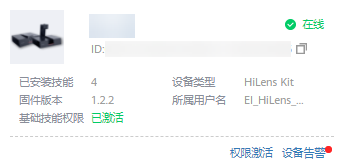
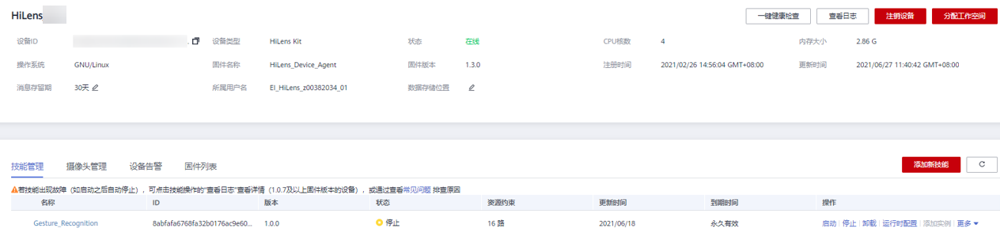

# 查看设备信息

在设备列表页面，您可以查看已注册设备的基本信息，或者查看此设备升级状态。

## 查看设备基本信息

在“设备管理 \> 设备列表“页面，默认展示设备的一些基本信息，如[图1](#fig3243115812144)所示。

**图 1**  设备卡片  

单击设备对应的卡片的设备名称，进入设备详情页面，如[图2](#fig16412175116525)所示，您可以查看设备的详细情况，并且对设备进行管理，包含技能管理、摄像头管理、升级固件等操作。

**图 2**  设备详情页  

