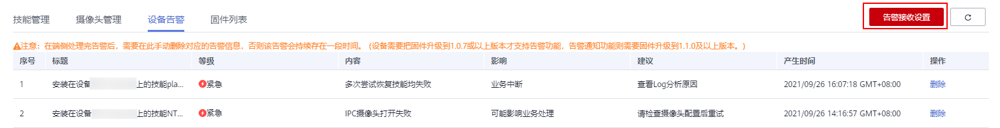
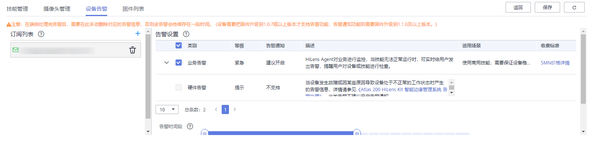
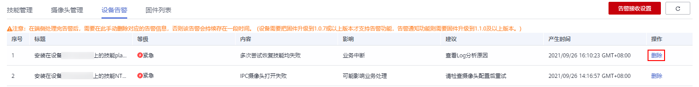

# 查看设备告警

当设备发生故障或因某些原因导致设备处于不正常的工作状态时，华为HiLens能够根据设备不同模块出现的故障产生告警信息，您可以通过查看设备硬件告警信息，在端侧处理告警事件。

华为HiLens也能对业务进行监控，您可以通过[设置告警接收信息](#section43975321972)，当设备技能无法正常运行时，华为HiLens实时给您发送业务告警信息。

> **说明：** 
>-   设备需要把固件升级到1.0.7或以上版本才支持告警功能，设备需要把固件升级到1.1.0或以上版本才能支持告警通知功能，固件升级请参见[升级HiLens\_Device\_Agent固件版本](升级HiLens_Device_Agent固件版本.md)。
>-   设备只有处于“在线“状态才能将告警信息同步至华为HiLens控制台。

## 告警级别

-   一般告警（Minor）

    一般告警不会对系统产生大的影响，需要尽快采取相应的措施，防止故障升级。

-   严重告警（Major）

    严重告警将会对系统产生较大的影响，有可能中断部分系统的正常运行，导致业务中断。

-   紧急告警（Critical）

    紧急告警可能会使设备下电，系统中断。需要马上采取相应的措施进行处理。

## 查看告警步骤

在华为HiLens管理控制台中，单击左侧导航栏“设备管理 \>设备列表“，在发生告警事件的设备卡片单击“设备告警“，默认进入“设备告警“页签。

**图 1**  设备告警  

您可以在“设备告警“列表查看告警事件的相关信息，并进一步在端侧处理告警。告警信息包括告警的“标题“、“等级“、“内容“、“影响“、“建议“、“产生时间“、“操作“。其中，设备告警可分“一般“、“严重“、“紧急“三个等级，详情请参见[告警级别](#section1855712412716)。

**图 2**  设备告警列表  

当您在端侧处理完告警，存在一定时间后，端侧检测到无异常之后，告警会自动清理。

## 设置告警接收信息

1.  登录HiLens管理控制台，单击左侧导航栏“设备管理\>设备列表“，进入设备列表页面。
2.  单击“设备告警“，在“设备告警“页签右侧，单击“告警接收设置“。

    **图 3**  告警接收设置  
    

3.  在告警设置下方勾选可实时接收告警信息的告警类别“业务告警“，设置“告警时间段“和“告警频率“。

    **图 4**  设备告警-20  
    

    -   “告警时间段“：设置向订阅对象发送告警的时间段。
    -   “告警频率“：设置告警频率，在设置的告警时间段内，告警达到指定次数则不再发送消息。例如告警频率设置为“日“、“3“，则每日在设置的告警时间段内如果告警次数达到3次，则不再发送告警信息。

    单击业务告警左侧的可查看业务告警信息描述和影响。

    不支持实时接收“硬件告警“。

4.  在“设备告警“页签右上方单击“保存“。
5.  单击订阅列表右侧，选择订阅类型（短信/邮件），填写对应的通讯方式（手机号码/邮箱地址），设置告警接收对象。
6.  确认信息后，单击。
7.  添加完消息订阅人后，接收人会收到短信或邮件，单击“订阅确认“。

    反馈“订阅成功“信息，完成业务告警消息订阅。

## 删除告警

您可以根据自身情况删除告警信息。

1.  在华为HiLens管理控制台中，单击左侧导航栏“设备管理 \>设备列表“，在发生告警事件的设备卡片单击“设备告警“，默认进入“设备告警“页签。
2.  在告警列表中，已处理的告警“操作“列单击“删除“。

    弹出“删除告警信息“对话框。

    **图 5**  删除告警  
    

3.  在对话框中单击“确定“，完成删除告警操作。

    **图 6**  删除告警信息  
    

