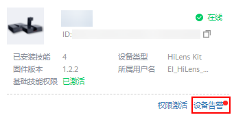

# 查看设备告警

当设备发生故障或因某些原因导致设备处于不正常的工作状态时，Huawei HiLens能够根据不同类型及不同模块出现的故障产生告警信息，您可以通过查看设备告警信息，在端侧处理告警事件。

> **说明：**   
>-   设备需要把固件升级到1.0.7或以上版本才支持告警功能，固件升级请参见[升级HiLens Framework固件版本](升级HiLens-Framework固件版本.md)。  
>-   设备只有处于“在线“状态才能将告警信息同步至Huawei HiLens控制台。  

## 操作步骤

在Huawei HiLens管理控制台中，单击左侧导航栏“设备管理 \>设备列表“，在发生告警事件的设备卡片单击“设备告警“，默认进入“设备告警“页签。

**图 1**  设备告警  

您可以在“设备告警“列表查看告警事件的相关信息，并进一步在端侧处理告警。告警信息包括告警的“标题“、“等级“、“内容“、“影响“、“建议“、“产生时间“、“操作“。其中，设备告警可分“一般“、“严重“、“紧急“三个等级，详情请参见[告警级别](#section16830134014511)。

**图 2**  设备告警列表  

当您在端侧处理完告警，存在一定时间后，端侧检测到无异常之后，告警会自动清理。

## 告警级别

-   一般告警（Minor）

    一般告警不会对系统产生大的影响，需要尽快采取相应的措施，防止故障升级。

-   严重告警（Major）

    严重告警将会对系统产生较大的影响，有可能中断部分系统的正常运行，导致业务中断。

-   紧急告警（Critical）

    紧急告警可能会使设备下电，系统中断。需要马上采取相应的措施进行处理。

## 删除告警

您可以根据自身情况删除告警信息。

1.  在Huawei HiLens管理控制台中，单击左侧导航栏“设备管理 \>设备列表“，在发生告警事件的设备卡片单击“设备告警“，默认进入“设备告警“页签。
2.  在告警列表中，已处理的告警“操作“列单击“删除“。

    弹出“删除告警信息“对话框。

3.  在对话框中单击“确定“，完成删除告警操作。

    **图 3**  删除告警信息  
    

