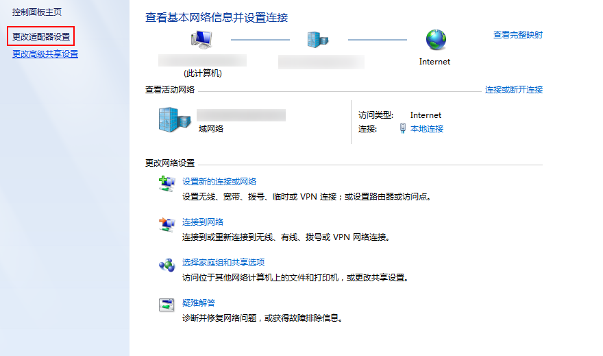
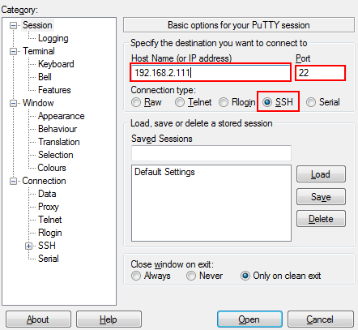

# 步骤1：使用SSH连接到HiLens Kit

如果需要操作HiLens Kit的系统文件等配置，可以在本地电脑使用SSH连接到设备上，用Linux指令进行操作。下面以Putty工具（[下载地址](https://www.putty.org)）为例，介绍在Windows 7环境下如何通过SSH连接HiLens Kit，这里以HiLens Kit的设备IP为192.168.2.111为例。

## SSH连接到HiLens Kit

1.  将HiLens Kit连接到电脑，后面板接口如[图1](#fig062502229)和[表1](#table98731719132214)所示。

    **图 1**  后面板接口  
    

    **表 1**  后面板接口说明

    
    <table><thead align="left"><tr id="row28731419142217"><th class="cellrowborder" valign="top" width="50%" id="mcps1.2.3.1.1">
接口

    </th>
    <th class="cellrowborder" valign="top" width="50%" id="mcps1.2.3.1.2">
说明

    </th>
    </tr>
    </thead>
    <tbody><tr id="row1287312194225"><td class="cellrowborder" valign="top" width="50%" headers="mcps1.2.3.1.1 ">
1

    </td>
    <td class="cellrowborder" valign="top" width="50%" headers="mcps1.2.3.1.2 ">
电源开关

    </td>
    </tr>
    <tr id="row1687391962213"><td class="cellrowborder" valign="top" width="50%" headers="mcps1.2.3.1.1 ">
2

    </td>
    <td class="cellrowborder" valign="top" width="50%" headers="mcps1.2.3.1.2 ">
电源接口

    </td>
    </tr>
    <tr id="row1687417194228"><td class="cellrowborder" valign="top" width="50%" headers="mcps1.2.3.1.1 ">
3

    </td>
    <td class="cellrowborder" valign="top" width="50%" headers="mcps1.2.3.1.2 ">
以太网口

    </td>
    </tr>
    </tbody>
    </table>

    1.  将DC 12V的电源适配器的端口插入HiLens Kit后面板的电源接口。
    2.  打开HiLens Kit的电源开关（按住开关键1到2秒放开）。
    3.  将网线的一端连接到设备的以太网口上，另一端连接到对端设备的以太网口上。

2.  单击电脑右下角网络图标，单击“打开网络和共享中心“。

    **图 2**  网络和共享中心  
    

3.  在“网络和共享中心“窗口，单击左侧导航栏中的“更改适配器设置“，进入网络连接。

    **图 3**  网络连接  
    

4.  HiLens Kit用网线连到电脑后，在“网络连接“页面上会显示对应的“连接“，右键单击该“连接“（一般命名为“本地连接“），单击“属性“，弹出“属性“窗口。
5.  在“属性“设置窗口中，双击“Intenet 协议版本4“，选择“使用下面的IP地址“，在右侧输入框中输入一个和设备同一个网段的IP，单击“子网掩码“文本框，自动生成子网掩码，如[图4](#fig178991002443)所示，单击“确定“，完成网络属性修改。

    > **说明：**   
    >-   只有“设备连接“中的IP和HiLens Kit设备IP在同一网段，才能从电脑SSH连接到HiLens Kit设备。同一个网段指设备连接IP的前三段地址要与设备IP一致。例如，设备IP是192.168.2.111，那么设备连接IP可以是192.168.2.x，其中x是2-255中除111之外的整数。  
    >-   此处以HiLens Kit的默认设备IP是192.168.2.111为例。如果设备IP已修改，此处使用修改后的设备IP。修改IP的具体步骤请见[有线网络直连路由器](步骤2-HiLens-Kit组网配置.md#section72995910316)。  

    **图 4**  修改网络属性  
    

6.  使用SSH远程连接端侧设备。
    1.  运行Putty，单击“Session“，在“Host Name\(or IP address\)“的输入框中输入设备IP，在“Port“输入框中输入端口号。以设备IP是192.168.2.111，设备端口号是22为例，如[图5](#fig13585102521318)所示。

        **图 5**  使用Putty登录HiLens Kit  
        

    2.  单击“open“。

        登录端侧设备。

7.  登录设备系统。

    在“admin@192.168.2.111's password“提示语后输入默认账户“admin“的密码，首次登录默认密码请参见[HiLens Kit 用户指南\>默认数据](https://support.huawei.com/enterprise/zh/doc/EDOC1100112066/2347bab9)。

8.  登录开发者命令行界面，如[图6](#fig163371813315)所示。
    1.  在“IES：/-\>“提示语后执行命令**develop**。
    2.  在“Password“提示语后输入root密码，首次登录默认密码请参见[HiLens Kit 用户指南\>默认数据](https://support.huawei.com/enterprise/zh/doc/EDOC1100112066/2347bab9)。

        **图 6**  SSH连接登录设备  
        

