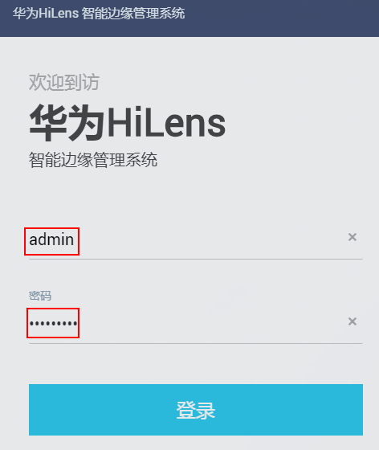
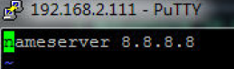

# 步骤2：HiLens Kit组网配置

HiLens Kit有两种组网方式，分为无线和有线两种方式连接路由器，您可以选择其中一种方式进行组网配置。

两种不同组网方案的连接方式的操作指导如下：

-   [无线网络连接路由器](#section3503179113711)
-   [有线网络直连路由器](#section72995910316)

**不能同时使用无线网络和有线网络连接同一个路由器，推荐使用无线连接到路由器**，以免更新设备IP后遗忘或丢失IP。

## 无线网络连接路由器

**针对使用无线网络连接路由器的方式，需要输入无线网络密码，成功连接无线网络。**

1.  网线连接电脑和设备，确保可以SSH连接到HiLens Kit设备，详细操作指导请参见[步骤1：使用SSH连接到HiLens Kit](步骤1-使用SSH连接到HiLens-Kit.md)。
2.  浏览器输入https://192.168.2.111（以设备IP是192.168.2.111为例），登录Huawei HiLens智能边缘管理系统。

    > **说明：**   
    >-   推荐使用chrome浏览器或IE11以上版本浏览器登录Huawei HiLens智能边缘管理系统。  
    >-   为了防止除您允许的IP地址范围之外的用户去访问HiLens Kit智能边缘系统，建议您通过配置防火墙，防止HiLens Kit智能边缘系统受到其他攻击。配置防火墙的具体操作请见[配置防火墙](配置防火墙.md)。  

    -   首次登录Huawei HiLens智能边缘管理系统，以默认账号“admin“和默认密码登录，默认参数请参见[HiLens Kit 用户指南\>默认数据](https://support.huawei.com/enterprise/zh/doc/EDOC1100112066/2347bab9)。
    -   非首次登录，以修改后的账号名和密码登录，修改密码详情请见[修改HiLens Kit用户密码](修改HiLens-Kit用户密码.md)。

        **图 1**  登录边缘管理系统  
        

3.  单击“管理“，进入管理页面。
4.  单击“网络“，在“网络“页签下，单击“有线网络“，进入“有线网络“配置页面。

    检查“配置IP地址“区域的“IP地址“是否存在“默认网关“，如[图2](#fig16625310197)所示。

    **图 2**  检查默认网关  
    

    -   若不存在默认网关，请执行步骤[5](#li126711717398)。
    -   若存在默认网关，请执行以下操作：
        1.  单击操作栏“修改“，在弹出的“修改IP地址“对话框中，删除“默认网关“文本框中的已有值，单击“确定“。

            返回“有线网络“页签。

            **图 3**  删除默认网关  
            

        2.  “有线网络“页签下，单击“保存“。

5.  单击“网络“，在“网络“页签下，单击“无线网络“，进入“无线网络“配置页面。
6.  选择对应的路由器，单击“连接“，弹出“WIFI连接“对话框。
7.  在“WIFI密码“文本框中输入WIFI密码，[图4](#fig087144152019)所示。单击“确定“，完成无线网络连接路由器。

    **图 4**  无线连接路由器  
    

8.  连接完成后，SSH连接到设备。执行命令检查是否连接成功。

    ****ping 8.8.8.8****

    或者

    **ping www.huaweicloud.com**

    如果设备连接成功，其提示信息将显示如下类似信息。

    **图 5**  无线连接提示信息  
    

## 有线网络直连路由器

**针对使用有线网络直连路由器的方式，需要修改设备IP，使设备IP与路由器IP在同一网段。**

同一个网段指设备连接IP的前三段地址要与设备IP一致。例如，设备IP是192.168.2.111，那么设备连接IP可以是192.168.2.x，其中x是2-255中除111之外的整数。

1.  网线连接电脑和设备，确保可以SSH连接到HiLens Kit设备，详细操作指导请参见[步骤1：使用SSH连接到HiLens Kit](步骤1-使用SSH连接到HiLens-Kit.md)。
2.  浏览器输入https://192.168.2.111（以设备IP是192.168.2.111为例）。

    > **说明：**   
    >-   推荐使用chrome浏览器或IE11以上版本浏览器登录Huawei HiLens智能边缘管理系统。  
    >-   为了防止除您允许的IP地址范围之外的用户去访问HiLens Kit智能边缘系统，建议您通过配置防火墙，防止HiLens Kit智能边缘系统受到其他攻击。配置防火墙的具体操作请见[配置防火墙](配置防火墙.md)。  

    -   首次登录Huawei HiLens智能边缘管理系统，以默认账号名为“admin“和默认密码登录，默认参数请参见[HiLens Kit 用户指南\>默认数据](https://support.huawei.com/enterprise/zh/doc/EDOC1100112066/2347bab9)。
    -   非首次登录，以修改后的账号名和密码登录，修改密码详情请见[修改HiLens Kit用户密码](修改HiLens-Kit用户密码.md)。

3.  单击“管理“，进入管理页面。
4.  单击“网络“，在“网络“页签下，单击“有线网络“，进入“有线网络“配置页面。

    **图 6**  有线连接路由器  
    

5.  在“有线网络“配置页面修改设备IP：
    1.  在“配置IP地址“区域的操作栏单击“修改“，弹出“修改IP地址“对话框。
    2.  按[表1](#table134013851418)填写修改IP相关参数。本示例使用路由器IP是“192.168.2.1“，如[图7](#fig1919518203141)所示，单击“确定“，完成修改设备IP。

        **表 1**  修改IP参数

        
        <table><thead align="left"><tr id="row16340153831416"><th class="cellrowborder" valign="top" width="25.41%" id="mcps1.2.3.1.1">
参数

        </th>
        <th class="cellrowborder" valign="top" width="74.59%" id="mcps1.2.3.1.2">
说明

        </th>
        </tr>
        </thead>
        <tbody><tr id="row11340838131410"><td class="cellrowborder" valign="top" width="25.41%" headers="mcps1.2.3.1.1 ">
用途

        </td>
        <td class="cellrowborder" valign="top" width="74.59%" headers="mcps1.2.3.1.2 ">
修改设备IP的用途。用途只能包含数字、字母、下划线。

        </td>
        </tr>
        <tr id="row6340103811147"><td class="cellrowborder" valign="top" width="25.41%" headers="mcps1.2.3.1.1 ">
IP地址

        </td>
        <td class="cellrowborder" valign="top" width="74.59%" headers="mcps1.2.3.1.2 ">
和路由器IP在同一网段的IP地址。

        </td>
        </tr>
        <tr id="row11340103841411"><td class="cellrowborder" valign="top" width="25.41%" headers="mcps1.2.3.1.1 ">
默认网关

        </td>
        <td class="cellrowborder" valign="top" width="74.59%" headers="mcps1.2.3.1.2 ">
路由器IP。

        </td>
        </tr>
        </tbody>
        </table>

        **图 7**  修改IP地址  
        

6.  用Putty登录设备，执行命令，进入文件

    **vi /etc/resolv.conf**

    删掉原有内容，并修改为

    **nameserver 8.8.8.8**

    并保存退出，如[图8](#fig16948115281820)所示。

    **图 8**  配置DNS  
    

7.  拔出电脑侧网线，网线连接设备与路由器。
8.  连接完成后，SSH连接到设备。执行命令检查是否连接成功。

    ****ping 8.8.8.8****

    或者

    **ping www.huaweicloud.com**

    如果设备连接成功，其提示信息将显示如下类似信息。

    **图 9**  有线连接提示信息  
    

