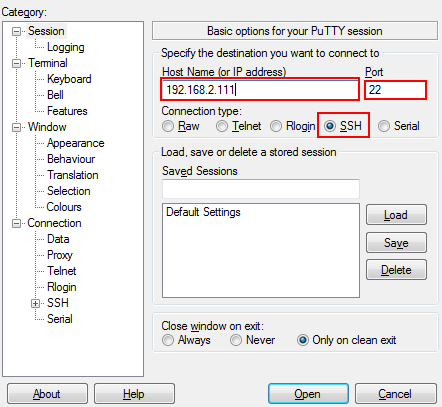
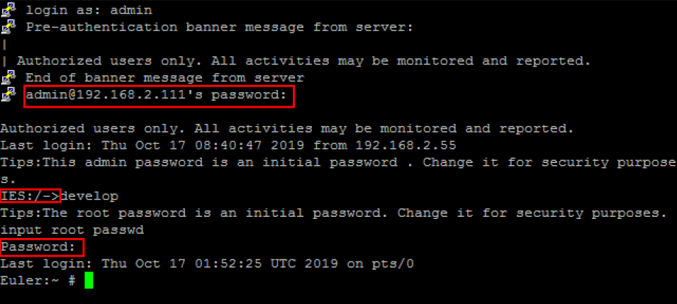
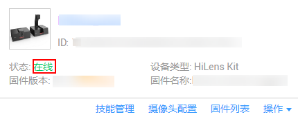
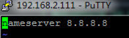
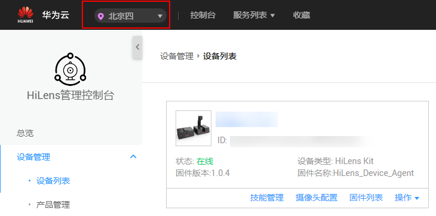

# 步骤3：注册 Huawei Kit设备

针对首次使用Huawei HiLens的普通用户或开发者，首先您必须先注册一个设备至Huawei HiLens控制台。在您完成HiLens Kit的连接准备及组网配置后，您可以将HiLens Kit设备注册到Huawei HiLens控制台，连接端侧与云侧。

-   目前只支持注册华为发布的HiLens Kit设备。
-   针对注册的HiLens Kit设备，只能安装并使用“适用于Ascend芯片”的技能。

## 前提条件

-   确保您拥有至少一台HiLens Kit设备。
-   在Huawei HiLens中注册设备前，请在本地电脑连接HiLens Kit，并完成组网设置。详情请参见[步骤1：使用SSH连接到HiLens Kit](步骤1-使用SSH连接到HiLens-Kit.md)和[步骤2：HiLens Kit组网配置](步骤2-HiLens-Kit组网配置.md)。

## 1.SSH连接HiLens Kit设备

1.  使用SSH远程连接HiLens Kit设备。
    1.  运行Putty，单击“Session“，在“Host Name\(or IP address\)“的输入框中输入设备IP，在“Port“输入框中输入端口号。以设备IP是192.168.2.111，设备端口号是22为例，如[图1](#fig13585102521318)所示。

        **图 1**  使用Putty登录HiLens Kit  
        

    2.  单击“open“。

        登录端侧设备。

2.  使用SSH远程登录设备系统。

    在“admin@192.168.2.111‘s password“提示语后输入默认账户“admin“的密码，首次登录默认密码请参见[HiLens Kit 用户指南\>默认数据](https://support.huawei.com/enterprise/zh/doc/EDOC1100112066/2347bab9)。

3.  使用SSH远程登录开发者命令行界面。

    1.  在“IES：/-\>“提示语后执行命令**develop**。
    2.  在“Password“提示语后输入root密码，首次登录默认密码请参见[HiLens Kit 用户指南\>默认数据](https://support.huawei.com/enterprise/zh/doc/EDOC1100112066/2347bab9)。

    **图 2**  SSH登录设备  
    

4.  使用SSH远程修改设备时间。

    1.  调整时区，与中国时区一致，执行命令

        **timedatectl set-timezone Asia/Shanghai**

    2.  修改设备时间，以当前时间为2019年10月17日19时19分19秒为例。执行命令

        **date -s "2019-10-17 19:19:19"**

        **hwclock -w**

## 2.切换设备注册区域至北京一（可选）

设备默认注册至区域北京四，若希望把设备注册至北京一，请修改设备中配置文件的相关内容。详细步骤如下：

1.  在Putty里进入文件

    **vi/home/hilens/hda/etc/hda.conf**

2.  修改设备注册区域，如[图3](#fig6375511467)所示。

    **region = cn-north-1**

    并保存。

    **图 3**  修改设备注册区域  
    

3.  重启设备，即执行

    **reboot**

    重启后，请参见[3.注册设备至控制台](#section15337205583212)。

## 3.注册设备至控制台

1.  使用SSH远程注册HiLens Kit设备至Huawei HiLens控制台，执行命令

    **hdactl register -u用户名 -d账号名 -n设备名**

    按回车弹出“password“提示语。

    **用户名**指IAM用户名，**账号名**指华为云账号名，相关概念请参见[IAM基本概念](https://support.huaweicloud.com/productdesc-iam/iam_01_0023.html)，**设备名**请自己定义。如果没有IAM账户时，“账号名“与“用户名“一致。注册HiLens Kit所使用的用户名、账号名、设备名仅支持英文字母和下划线。

2.  在“password“提示语后输入华为云账号的密码，按回车完成设备注册。

    如果IAM用户和华为云账号不一致，在“password“提示语后输入IAM用户密码。

    > **说明：**   
    >-   IAM用户禁止将设备注册到子项目，相关基本概念请参见[IAM基本概念](https://support.huaweicloud.com/productdesc-iam/iam_01_0023.html)。  
    >-   设备注册完成后，您可登录Huawei HiLens管理控制台，在“设备管理\>设备列表“中查看设备状态。短时间内处于离线状态，请您耐心等待。  

3.  登录Huawei HiLens管理控制台，单击左侧导航栏“设备管理\>设备列表“，在“产品管理“页面查看设备状态，如[图4](#fig192741125192511)所示。

    **图 4**  设备状态  
    

    -   若设备处于在线状态，则成功重启设备。
    -   若设备处于离线状态，则需配置DNS，具体操作请见步骤[4](#li0274625142520)。

4.  使用SSH远程配置DNS。
    1.  在Putty里进入文件

        **vi /etc/resolv.conf**

    2.  删掉原有内容，并修改为

        **nameserver 8.8.8.8**

        如[图5](#fig1227414257257)所示，并保存退出。重新执行步骤[3](#li152744258254)。

        **图 5**  配置DNS内容  
        

## 在Huawei HiLens管理控制台查看注册后的设备

登录[Huawei HiLens管理控制台](https://console.huaweicloud.com/hilens/?region=cn-north-4#/hilens/deviceAuthority)，在管理控制台左侧菜单栏单击“设备管理 \>设备列表“，默认设备列表展现所有设备，查看到您所注册的设备列表，则说明您的设备成功注册。

**图 6**  设备注册状态  

> **须知：**   
>查看设备注册状态时：  
>-   若未修改设备注册区域，默认进入“北京四“区域，请在HiLens管理页面页面左上角确认处于“北京四“。  
>-   若执行[2.切换设备注册区域至北京一](#section191304259256)，请在HiLens管理页面页面左上角切换至“北京一“。  

