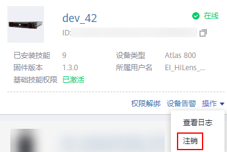

# 注销设备

注销设备后，华为HiLens云侧与设备解绑，HiLens管理控制台上将没有相应的设备记录，同时失去对设备的控制权。

注销设备后，该设备才能重新注册到新帐号下的华为HiLens控制台。

## 前提条件

如待注销设备已激活，请先解绑激活信息才能注销设备。

在管理控制台左侧菜单栏选择“设备管理 \>设备列表“，单击设备卡片上的“权限激活“，根据页面提示解绑激活信息。

## 注销设备

1.  在华为HiLens管理控制台中，单击左侧导航栏“设备管理 \>设备列表“，进入“设备列表“页面。
2.  选择指定的设备，单击“操作\>注销“。

    您也可以单击设备卡片进入设备详情页，单击右上角“注销设备“。

    **图 1**  注销设备  
    

3.  在弹出的对话框中，确认要注销的设备信息，单击“确定“完成注销操作。

    设备注销后，设备上部署的技能将同时被卸载。

    > **说明：** 
    >注销设备前，需要先卸载从技能市场安装的技能。若不卸载从技能市场上安装的技能就注销设备，设备再次注册时，技能和日志都会被删除。

