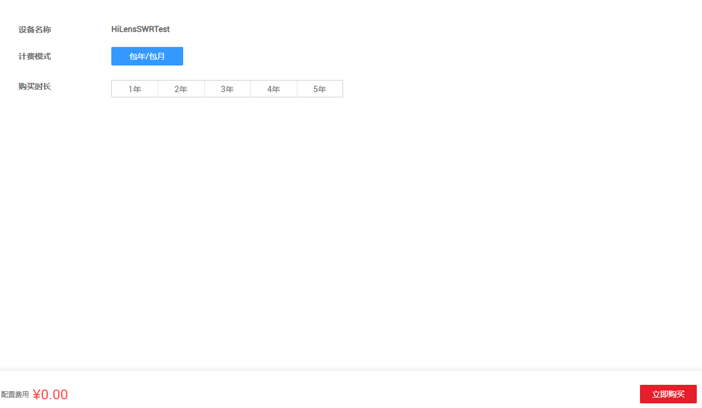
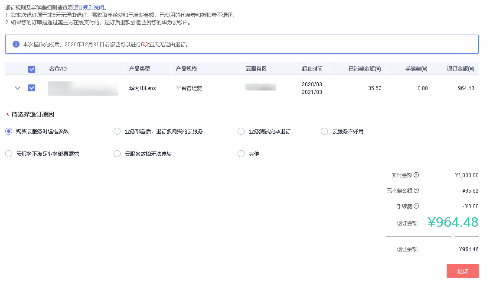

# 激活设备（注册设备数量超过限制）

当在Huawei HiLens管理控制台上注册设备数量超过平台管理限制时，您需要激活超过数量限制的设备，才能正常使用超过数量限制的设备。

激活时Huawei  HiLens服务会对每个待激活的设备收取平台管理费1000元/年。

## 操作步骤

1.  在Huawei HiLens管理控制台中，单击左侧导航栏“设备管理 \>设备列表“，进入“设备列表“页面。
2.  选择未激活的设备，单击“点击激活“，进入“设备平台管理费“页面。

    **图 1**  未激活设备  
    

3.  在“设备平台管理费“页面，根据默认的“计费模式“选择“购买数量“，然后单击“立即购买“。

    **图 2**  设备平台管理费  
    

4.  在“订单确认“页面，确认订单详情后，单击“提交订单“。

    进入“支付“页面。

    **图 3**  订单确认  
    

5.  在“支付“页面，勾选支付方式，确认订单后，单击“确认付款“，输入支付密码，完成设备激活。

    支付平台管理费后，页面显示“订单支付成功“，您可以返回[Huawei HiLens控制台](https://console.huaweicloud.com/hilens/?region=cn-north-4#/hilens/allManagement)，在左侧导航栏中选择“设备管理\>设备列表“，等待30秒左右后查看已激活的设备状态是否更新。

## 续费（解冻）设备

当已激活的设备使用超过管理年限，设备会处于冻结状态。如果您需要继续使用该设备，需要通过续费操作为设备解冻。

1.  在Huawei HiLens管理控制台中，单击左侧导航栏“设备管理 \>设备列表“，进入“设备列表“页面。
2.  选择处于冻结的设备，单击“点击续费“，进入“设备平台管理费“页面。

    也可以批量选择设备续费，单击右上角“批量设备续费“，勾选需要续费的设备，然后单击“确定“，进入“续费“页面。

    **图 4**  冻结设备  
    

3.  在“续费“页面，查看冻结设备详情，滑动滑块选择续费时长。

    **图 5**  设备续费  
    

    若您想设置统一到期日期（实际续费时长=当前选择时长+续费到统一到期日需要补齐的时长）

    1.  单击统一到期日右侧更改，在设置统一到期日对话框中选择统一到期日期，并单击确定。
    2.  勾选“统一到期日设置为每月X号XX:XX:XX“。

4.  单击“去支付“，在“支付“页面，勾选支付方式，确认订单后，单击“确认付款“，输入支付密码，完成设备解冻。

    支付平台管理费后，页面显示“订单支付成功“，您可以返回[Huawei HiLens控制台](https://console.huaweicloud.com/hilens/?region=cn-north-4#/hilens/allManagement)，在左侧导航栏中选择“设备管理\>设备列表“，等待30秒左右后查看已激活的设备状态是否更新。

## 退订设备

当已激活的设备不想使用时，您可以退订已激活设备。

1.  在Huawei HiLens管理控制台中，单击左侧导航栏“设备管理 \>设备列表“，进入“设备列表“页面。
2.  在待退订的设备卡片中，单击“操作\>退订管理费“，进入“退订资源“页面。

    也可以批量选择设备退订，单击右上角“批量退订管理费“，勾选需要续费的设备，然后单击“确定“，进入“退订“页面。

3.  按如下操作确认退订信息，单击“退订“，如[图6](#fig678510919581)所示。

    -   勾选需退订的设备。
    -   勾选“退订原因“。

    **图 6**  退订资源  
    

4.  在退订对话框中，单击“是“，确定退订设备资源。

    **图 7**  确认退订  
    

    确认退订设备后，页面显示“退订申请提交成功“。您可以返回[Huawei HiLens控制台](https://console.huaweicloud.com/hilens/?region=cn-north-4#/hilens/allManagement)，在左侧导航栏中选择“设备管理\>设备列表“，等待30秒左右后查看设备状态是否更新。

