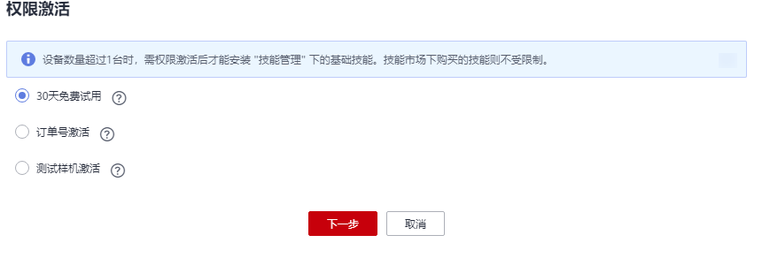
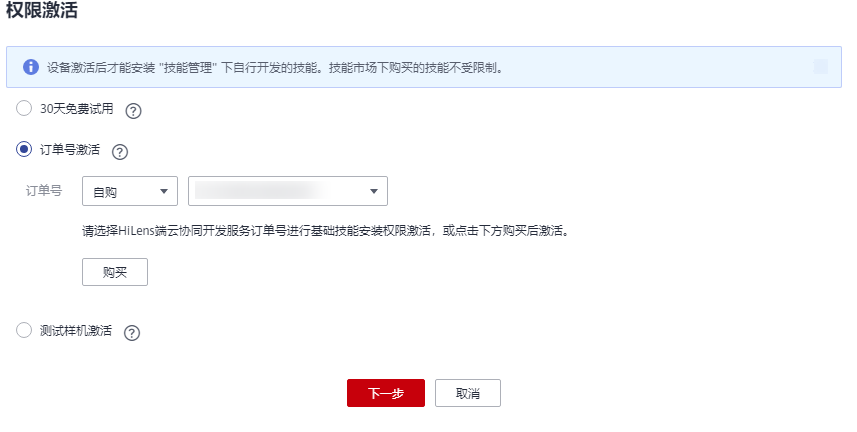
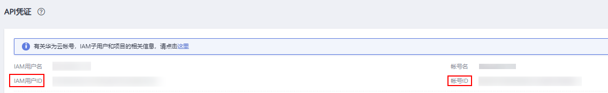
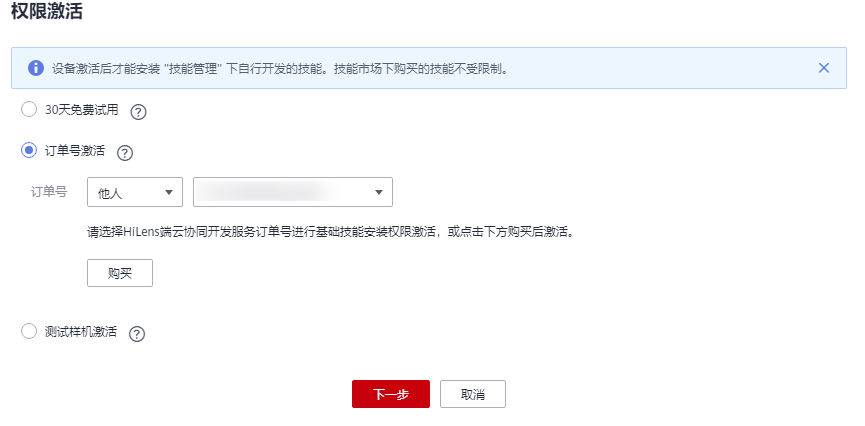
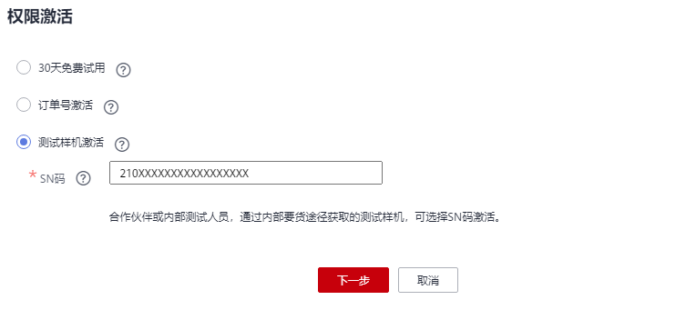

# 激活设备（购买端边云协同平台服务）

超过1台的设备，购买HiLens端边云协同平台服务后，需要激活权限，才能安装技能管理页面下的基础技能，即在控制台新建的技能以及在HiLens Studio开发的技能。

> **说明：** 
>注册的第一台设备不需要购买HiLens端边云协同平台服务，也不需要激活权限，可直接安装基础技能至该台设备上。

## 激活方式

-   30天免费试用激活

    超过1台的设备，每种设备类型每台可享受一次30天免费试用。操作步骤请见[30天免费试用激活](#section17749733165911)。

-   订单号激活

    激活需购买HiLens端边云协同平台服务，在订单有效期内激活。激活时长与订单购买时长一致。激活前，请仔细阅读[订单激活说明](#section7211711337)。

    自购：使用自己帐号的订单激活设备，操作步骤请见[自购订单号激活](#section10872174952413)。

    他购：使用他人帐号下的订单激活自己帐号下的设备，首先需要使用他人帐号进行激活权限转移，然后使用自己帐号激活设备，操作步骤请见[他人订单号激活](#section7951320174810)。

-   测试样机激活

    非华为云官网购买的测试样机，可选择SN码激活。仅HiLens Kit支持该方式。操作步骤请见[测试样机激活](#section1786528112810)。

## 订单激活说明

-   首次激活，需要在购买HiLens端边云协同平台服务订单到期时间之前，否则过期失效。
-   对于老设备，保留其激活状态。但若注销后再注册，则需重新激活。
-   首次激活后，可在包周期时长内使用服务，第2次、第3次...激活设备，激活到期时间一样。即无论激活多少次，自行开发的技能安装权限使用期限仅从首次激活时间开始计算，直到包周期时间结束。
-   必须在订单到期前进行激活，否则订单到期后会激活失败。
-   使用自行开发的技能安装权限到期后，需要重新购买HiLens端边云协同平台服务，重新激活设备。

## 30天免费试用激活

1.  登录华为HiLens管理控制台，在左侧导航栏选择“设备管理\>设备列表“。

    进入“设备列表“页面。

2.  选择“基础技能权限“处于“未激活“状态的设备，单击设备卡片上的“权限激活“。

    弹出“权限激活“对话框。

    **图 1**  免费试用激活  
    

3.  勾选“30天免费试用“，单击“下一步“。
4.  确认试用信息，包括“首次激活时间“、“免费激活时长“、“激活到期时间“，然后单击“确定“。

## 自购订单号激活

使用订单号激活设备，需要先购买HiLens端边云协同平台服务，详情请见[订购HiLens端边云协同平台服务](订购HiLens端边云协同平台服务.md)。

1.  登录华为HiLens管理控制台，在左侧导航栏选择“设备管理\>设备列表“。

    进入“设备列表“页面。

2.  选择“基础技能权限“处于“未激活“状态的设备，单击设备卡片上的“权限激活“。

    弹出“权限激活“对话框。

    **图 2**  订单号激活  
    

3.  勾选“订单号激活“，填写订单号信息。

    在订单号下拉框选择订单是“自购“，选择“自购“：在后面下拉框中选择已购买的平台服务订单号。

    如果想要购买平台服务，可单击下方“购买“，进入“华为HiLens产品订购“页面购买，详情请见[订购HiLens端边云协同平台服务](订购HiLens端边云协同平台服务.md)。

4.  单击“下一步“，确认订单号和订单号信息。
5.  单击“确定“，完成设备的基础技能权限激活。

## 他人订单号激活

如果要使用他人的订单激活自己帐号下的设备，需要登录他人帐号的华为HiLens控制台，先将激活权限转移至自己帐号，然后使用自己帐号激活设备。

-   步骤一：转移激活权限
    1.  使用他人帐号登录华为HiLens控制台，在左侧导航栏选择“产品订购\>订单管理“。

        进入“我的技能“页面。

    2.  单击“平台服务“，切换至“平台服务“页签。
    3.  选择待转移的订单号，单击操作列的“激活权限转移“。

        弹出“激活权限转移“对话框。

    4.  单击操作列的“编辑“，按[表1](#table92701342122013)填写信息，然后单击操作列的“保存“。

        **表 1**  激活权限转移参数说明

        
        <table><thead align="left"><tr id="row192711942182010"><th class="cellrowborder" valign="top" width="20.119999999999997%" id="mcps1.2.3.1.1">
参数

        </th>
        <th class="cellrowborder" valign="top" width="79.88%" id="mcps1.2.3.1.2">
说明

        </th>
        </tr>
        </thead>
        <tbody><tr id="row10271164214208"><td class="cellrowborder" valign="top" width="20.119999999999997%" headers="mcps1.2.3.1.1 ">
帐号ID

        </td>
        <td class="cellrowborder" valign="top" width="79.88%" headers="mcps1.2.3.1.2 ">
转移目标帐号ID，即待激活设备所注册的帐号ID。

        
单击控制台右上角帐号名，选择“我的凭证”，可进入“我的凭证”页面查看“帐号ID”，如<a href="#fig182671549124413">图3</a>所示。

        </td>
        </tr>
        <tr id="row127114427201"><td class="cellrowborder" valign="top" width="20.119999999999997%" headers="mcps1.2.3.1.1 ">
用户ID

        </td>
        <td class="cellrowborder" valign="top" width="79.88%" headers="mcps1.2.3.1.2 ">
转移目标用户ID，即待激活设备所注册的用户ID。

        
单击控制台右上角帐号名，选择“我的凭证”，可进入“我的凭证”页面查看“用户ID”，如<a href="#fig182671549124413">图3</a>所示。

        </td>
        </tr>
        <tr id="row42711742122015"><td class="cellrowborder" valign="top" width="20.119999999999997%" headers="mcps1.2.3.1.1 ">
持有激活数量

        </td>
        <td class="cellrowborder" valign="top" width="79.88%" headers="mcps1.2.3.1.2 ">
转移可激活的设备数。转移数量不能大于当前订单所拥有的可激活总数。

        </td>
        </tr>
        </tbody>
        </table>

        **图 3**  我的凭证-14  
        

    5.  单击“确定“。

        完成激活权限转移。

-   步骤二：激活设备
    1.  使用自己帐号登录华为HiLens管理控制台，在左侧导航栏选择“设备管理\>设备列表“。

        进入“设备列表“页面。

    2.  选择“基础技能权限“处于“未激活“状态的设备，单击设备卡片上的“权限激活“。

        弹出“权限激活“对话框。

        **图 4**  他人订单激活  
        

    3.  勾选“订单号激活“，填写订单号信息。

        在订单号下拉框选择订单是“他人“，在后面下拉框中选择已进行权限转移的订单号。

        如果想要购买平台服务，可单击下方“购买“，进入“华为HiLens产品订购“页面购买，详情请见[订购HiLens端边云协同平台服务](订购HiLens端边云协同平台服务.md)。

    4.  单击“下一步“，确认订单号和订单号信息。
    5.  单击“确定“，完成设备的基础技能权限激活。

## 测试样机激活

1.  登录华为HiLens管理控制台，在左侧导航栏选择“设备管理\>设备列表“。

    进入“设备列表“页面。

2.  选择“基础技能权限“处于“未激活“状态的设备，单击设备卡片上的“权限激活“。

    弹出“权限激活“对话框。

    **图 5**  测试样机激活  
    

3.  勾选“测试样机激活“，填写设备的“SN码“。

    SN码：统一标识编码，一般贴于设备底部，共20位SN码，如“210xxxxxxxxxxxxxxxxx“。

4.  单击“下一步“，确认SN码和SN码信息。
5.  单击“确定“，完成设备的基础技能权限激活。

