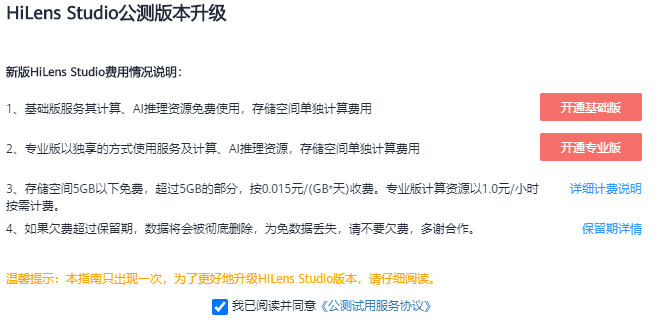

# 申请HiLens Studio公测

目前HiLens Studio处于公测阶段，首次使用HiLens Studio需要开通公测权限。

HiLens Studio新版本分为基础版和专业版，针对新用户，在申请公测时需要选择开通HiLens Studio基础版还是专业版，版本详情请见[版本说明](#section167061841347)，申请公测操作请见[申请公测](#section13374156135514)。

## 版本说明

HiLens Studio基础版和专业版的区别主要在于是否能够使用专属的推理资源。基础版说明请见[表1](#table2849203151012)，专业版说明请见[表2](#table61681142161617)。

**表 1**  HiLens Studio基础版

<table><thead align="left"><tr id="row48491316106"><th class="cellrowborder" valign="top" width="17.549999999999997%" id="mcps1.2.5.1.1">
资源

</th>
<th class="cellrowborder" valign="top" width="25.75%" id="mcps1.2.5.1.2">
涉及功能

</th>
<th class="cellrowborder" valign="top" width="22.189999999999998%" id="mcps1.2.5.1.3">
计费模式

</th>
<th class="cellrowborder" valign="top" width="34.510000000000005%" id="mcps1.2.5.1.4">
计费说明

</th>
</tr>
</thead>
<tbody><tr id="row118501231181012"><td class="cellrowborder" valign="top" width="17.549999999999997%" headers="mcps1.2.5.1.1 ">
存储资源

</td>
<td class="cellrowborder" valign="top" width="25.75%" headers="mcps1.2.5.1.2 ">
创建技能项目、上传模型和数据

</td>
<td class="cellrowborder" valign="top" width="22.189999999999998%" headers="mcps1.2.5.1.3 ">
按需

</td>
<td class="cellrowborder" valign="top" width="34.510000000000005%" headers="mcps1.2.5.1.4 ">
按累计所有主帐号和子帐号使用的存储资源大小超过5GB的部分，收取费用。

存储资源5GB以下免费。

</td>
</tr>
<tr id="row1585063119107"><td class="cellrowborder" valign="top" width="17.549999999999997%" headers="mcps1.2.5.1.1 ">
推理资源（共享）

</td>
<td class="cellrowborder" valign="top" width="25.75%" headers="mcps1.2.5.1.2 ">
调试和运行技能

</td>
<td class="cellrowborder" valign="top" width="22.189999999999998%" headers="mcps1.2.5.1.3 ">
免费

</td>
<td class="cellrowborder" valign="top" width="34.510000000000005%" headers="mcps1.2.5.1.4 ">
-

</td>
</tr>
</tbody>
</table>

**表 2**  HiLens Studio专业版

<table><thead align="left"><tr id="row1916815426167"><th class="cellrowborder" valign="top" width="16.18%" id="mcps1.2.5.1.1">
资源

</th>
<th class="cellrowborder" valign="top" width="27.21%" id="mcps1.2.5.1.2">
涉及功能

</th>
<th class="cellrowborder" valign="top" width="17.69%" id="mcps1.2.5.1.3">
计费模式

</th>
<th class="cellrowborder" valign="top" width="38.92%" id="mcps1.2.5.1.4">
计费说明

</th>
</tr>
</thead>
<tbody><tr id="row11168842131612"><td class="cellrowborder" valign="top" width="16.18%" headers="mcps1.2.5.1.1 ">
存储资源

</td>
<td class="cellrowborder" valign="top" width="27.21%" headers="mcps1.2.5.1.2 ">
创建技能项目、上传模型和数据

</td>
<td class="cellrowborder" valign="top" width="17.69%" headers="mcps1.2.5.1.3 ">
按需

</td>
<td class="cellrowborder" valign="top" width="38.92%" headers="mcps1.2.5.1.4 ">
按累计所有主帐号和子帐号使用的存储资源大小超过5GB的部分，收取费用。

存储资源5GB以下免费。

</td>
</tr>
<tr id="row61684427161"><td class="cellrowborder" rowspan="3" valign="top" width="16.18%" headers="mcps1.2.5.1.1 ">
推理资源（专属）

</td>
<td class="cellrowborder" rowspan="3" valign="top" width="27.21%" headers="mcps1.2.5.1.2 ">
调试和运行技能

</td>
<td class="cellrowborder" valign="top" width="17.69%" headers="mcps1.2.5.1.3 ">
按需

</td>
<td class="cellrowborder" valign="top" width="38.92%" headers="mcps1.2.5.1.4 ">
按累计所有主帐号和子帐号的计算时长，收取费用。

</td>
</tr>
<tr id="row1160023617419"><td class="cellrowborder" valign="top" headers="mcps1.2.5.1.1 ">
按需套餐包（计算资源套餐包）

</td>
<td class="cellrowborder" valign="top" headers="mcps1.2.5.1.2 ">
用户可以购买按需套餐包，扣费时计算时长会先在套餐包内进行抵扣，抵扣完后的剩余计算时长默认转回按需计费方式。

购买按需套餐包后，系统将自动开通专业版，您在使用时进入专业版HiLens Studio即可享受套餐内额度。

</td>
</tr>
<tr id="row1339921965915"><td class="cellrowborder" valign="top" headers="mcps1.2.5.1.1 ">
包年/包月

</td>
<td class="cellrowborder" valign="top" headers="mcps1.2.5.1.2 ">
用户可以购买包年/包月套餐包，扣费时计算时长会先在套餐包内进行抵扣，抵扣完后的剩余计算时长默认转回按需计费方式。

购买按需套餐包后，系统将自动开通专业版，您在使用时进入专业版HiLens Studio即可享受套餐内额度。

</td>
</tr>
</tbody>
</table>

## 前提条件

1.  已[注册](https://reg.huaweicloud.com/registerui/public/custom/register.html?locale=zh-cn#/register)华为云帐号，并完成实名认证。具体申请信息请见[帐号注册](https://support.huaweicloud.com/usermanual-account/account_id_001.html)和[实名认证](https://support.huaweicloud.com/usermanual-account/account_auth_00001.html)。
2.  HiLens Studio当前为公测阶段，新版本分为基础版和专业版，根据您选择的版本，会按使用的功能或资源按需收费，详情请见[版本说明](#section167061841347)。因此在使用HiLens Studio时，为保证HiLens Studio所有功能正常工作，建议您确保当前帐号未欠费。

## 申请公测

1.  登录华为HiLens管理控制台，在左侧导航栏中选择“技能开发\>HiLens Studio“。

    弹出“HiLens Studio公测版本升级“对话框。

    **图 1**  HiLens Studio公测版本升级  
    

2.  单击并仔细阅读[《公测试用服务协议》](https://www.huaweicloud.com/declaration/fsa_test.html)，勾选“我已阅读并同意《公测试用服务协议》“。根据自身需要，选择单击“开通基础版“或“开通专业版“。

    进入新版HiLens Studio页面，开始使用HiLens Studio。

    HiLens Studio基础版和专业版的区别请见[版本说明](#section167061841347)。

