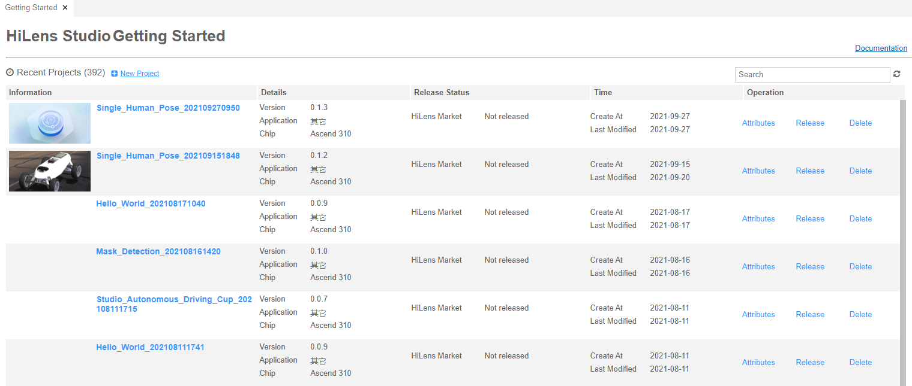

# 管理技能项目

针对已经在HiLens Studio开发的技能，您可以在华为HiLens平台中“技能开发\>HiLens Studio“页面管理所开发的技能，包括查看属性、安装技能、发布技能、删除技能等。

## 开发项目管理说明

在“HiLens Studio启动“页面或“Getting Started“页面仅支持管理可在HiLens Studio开发的技能，且仅支持管理“适用于Ascend芯片的技能“，不支持在技能市场购买的技能或之前已经在控制台“技能开发“页面[新建的技能](新建技能.md)。

## 支持的操作及其说明

**图 1**  HiLens Studio Getting Started  

**进入“HiLens Studio Getting Started“页面**：在管理控制台左侧菜单栏选择“技能开发\>HiLens Studio“  ，单击技能项目列表中的技能名称，单击“Help\>Getting Started“,进入HiLens Studio中的“Getting Started“页面，展示了在HiLens Studio中开发的技能项目列表，包括“Information“（技能项目信息）、“Details“（技能详情）、“Release Status“（发布状态）、“Time“（创建/修改时间）、和“Operation“（操作）。其中，可进行的操作如下：

-   **打开技能项目**

    在“Getting Started“页面，单击技能项目列表中的技能名称，在HiLens Studio界面打开该技能项目，然后您可以[编辑技能项目](使用手机实时视频流编写-调试代码.md#section31895539159)。

    > **说明：** 
    >-   如果打开技能空项目，即单击右上角，左侧无法看到技能项目的文件，请重新[新建技能项目](新建技能项目.md)。
    >-   如果打不开HiLens Studio界面，请检查浏览器是否设置阻止弹出式窗口。如果浏览器设置了阻止弹出式窗口，请添加HiLens Studio网址为允许浏览器弹窗的白名单地址。

-   [HiLens Studio安装技能](HiLens-Studio安装技能.md)
-   [HiLens Studio发布技能](HiLens-Studio发布技能.md)
-   **查看技能属性**

    在“Getting Started“页面，单击技能项目列表操作列的“Attributes“，可跳至技能的基本信息页面，查看并编辑此技能的“基本信息“，详情请见[填写技能信息](新建技能项目.md#section551025514581)。

-   **删除技能项目**

    在“Getting Started“页面，单击技能项目列表“Operation“列的“Delete“，单击“Delete Project“对话框中的“Yes“，删除技能项目。

