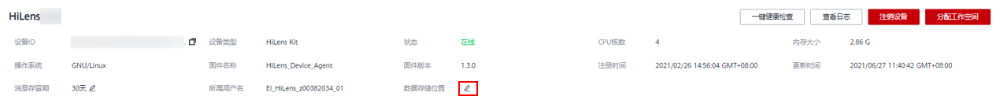
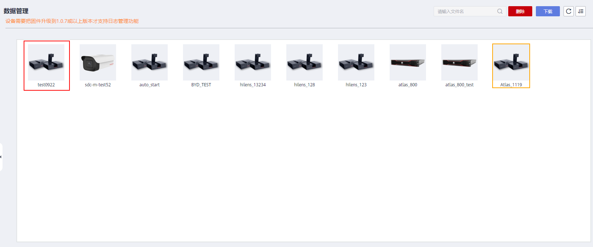

# 管理数据

当技能下发到设备端侧后，您可以在华为HiLens控制台下载设备的数据，便于事后回溯，也可以通过查看设备数据，查看技能运行效果。

> **说明：** 
>-   数据管理里面只能管理HiLens Kit设备的数据。小海思芯片35xx系列的设备数据暂时不能在华为HiLens控制台管理。
>-   只有以文件的方式输出到OBS供用户查看的技能，才能使用数据管理功能查看数据。

## 前提条件

-   普通用户成功将购买的技能安装到设备上，详情请参见[安装技能](安装技能.md)。
-   开发者成功将技能部署到设备上，详情请参见[安装和调试技能](安装和调试技能.md)。
-   技能输出模块中定义了将数据输出至OBS的场景，针对此类技能，才能通过数据管理页面查看数据。
    -   如果您的技能开发者，您需要查看自己开发的技能在设备上的运行效果，在开发技能时，您需要指定数据存储至OBS中才能保证可以通过管理控制台下载。
    -   如果您是技能使用者，需要在技能市场中，通过技能详情页面了解此技能是否将数据存储至OBS中。

## 配置数据存储位置（OBS存储路径）

1.  登录华为HiLens管理控制台，在管理控制台左侧菜单栏选择“设备管理 \>设备列表“，然后在设备列表中，单击需要进行管理的某一设备，进入设备详情页面。
2.  在设备详情区域，您可以单击“数据存储位置“右侧的，然后在弹出对话框中选择您的OBS目录，设置当前设备的视频数据存储于您选择的OBS目录下。

    > **说明：** 
    >-   由于设备数据的存储将耗费华为云的存储资源，使用OBS服务进行存储，将会产生相应的费用，详细操作及规范请参见[OBS控制台指南](https://support.huaweicloud.com/usermanual-obs/obs_03_0054.html)。
    >-   由于通过URL访问桶时，桶名会作为URL的一部分，根据DNS标准，URL不支持大写字母，无法区分带大写字母的桶。因此，“桶名称”仅支持小写字母、数字、“-”、“.”作为桶的命名规则，禁止两个英文句号\(.\)或英文句号\(.\)和中划线\(-\)相邻。详细命名规则请参见[创建桶](https://support.huaweicloud.com/usermanual-obs/obs_03_0306.html)。

    **图 1**  配置数据存储位置  
    

## 查看数据

您可根据数据输出类型，查看设备数据以及技能的运行效果，技能输出方式请见[表1](#table125984955416)。

> **说明：** 
>-   视频数据大多数技能通过设备的HDMI接口输出到显示屏，少数视频数据输出到服务器查看。请前往“技能市场“，在“技能详情“页面的“产品描述“中查看此技能的输出设置。例如，明星脸判断技能，其描述为“可以通过HDMI查看”，表示此技能部署后，需通过显示屏查看技能运行效果。
>-   除“HDMI“输出方式以外，其他输出方式的技能存储在OBS中，需根据[配置数据存储位置（OBS存储路径）](#section62758120211)查看数据。

**表 1**  技能输出方式

<table><thead align="left"><tr id="row166023965415"><th class="cellrowborder" valign="top" width="17.419999999999998%" id="mcps1.2.3.1.1">
方式

</th>
<th class="cellrowborder" valign="top" width="82.58%" id="mcps1.2.3.1.2">
查看数据说明

</th>
</tr>
</thead>
<tbody><tr id="row146026910544"><td class="cellrowborder" valign="top" width="17.419999999999998%" headers="mcps1.2.3.1.1 ">
HDMI

</td>
<td class="cellrowborder" valign="top" width="82.58%" headers="mcps1.2.3.1.2 ">
直接通过设备的HDMI接口输出到显示屏。

</td>
</tr>
<tr id="row126028913541"><td class="cellrowborder" valign="top" width="17.419999999999998%" headers="mcps1.2.3.1.1 ">
RTMP

</td>
<td class="cellrowborder" valign="top" width="82.58%" headers="mcps1.2.3.1.2 ">
实时输出到服务器供用户查看，服务器地址请查看技能“产品描述”。

</td>
</tr>
<tr id="row06028917543"><td class="cellrowborder" valign="top" width="17.419999999999998%" headers="mcps1.2.3.1.1 ">
H264_FILE

</td>
<td class="cellrowborder" valign="top" width="82.58%" headers="mcps1.2.3.1.2 ">
以文件的方式输出到OBS供用户查看。

OBS文件路径请见<a href="#section62758120211">配置数据存储位置（OBS存储路径）</a>。

</td>
</tr>
</tbody>
</table>

## 下载数据

1.  登录华为HiLens管理控制台，单击“数据管理\(Beta\)“，进入“数据管理“页面。
2.  在“数据管理“页面，双击指定的设备名称，进入待下载的设备数据文件夹。

    **图 2**  数据管理  
    

3.  选择需下载的数据文件夹，然后单击右上角的“下载“。将数据下载至本地。

## 删除数据

1.  登录华为HiLens管理控制台，单击“数据管理\(Beta\)“，进入“数据管理“页面。
2.  在“数据管理“页面，双击指定的设备名称，进入待删除的设备数据文件夹。

    **图 3**  数据管理-41  
    

3.  选择待删除的数据文件夹，然后单击右上角的“删除“，删除所选数据。

