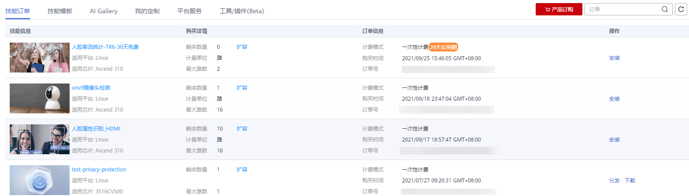
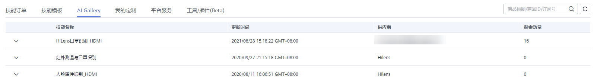
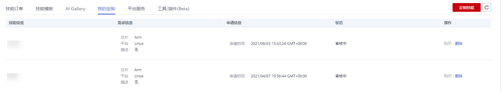
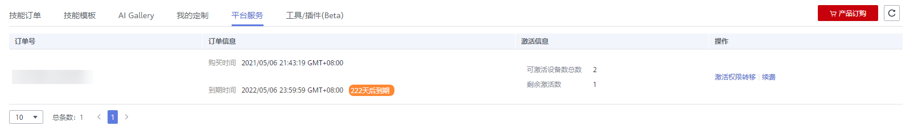
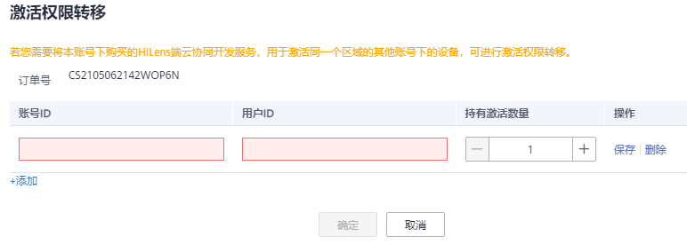
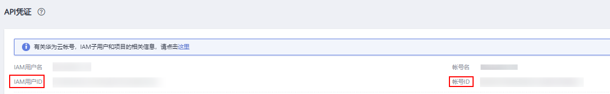

# 管理订单

您可以统一管理在华为HiLens购买的产品，包括在技能市场购买的技能以及定制技能、在AI Gallery购买的技能、订购的HiLens端边云协同平台服务。

-   [技能订单](#section236085153415)：管理技能市场购买的技能。
-   [AI Gallery](#section55135394611)：管理在AI Gallery购买的技能。
-   [我的定制](#section18626181563411)：管理在技能市场定制的技能。
-   [平台服务](#section11278174254220)：管理已购买的HiLens端边云协同平台服务。

## 技能订单

在华为HiLens管理控制台中，选择左侧导航栏的“产品订购\>订单管理“，默认进入“技能订单“页面。“技能订单“页面展示您购买的所有技能，以及购买时的详细信息。

**图 1**  技能订单  

在“技能订单“页面，您可以执行如下操作：

-   **安装技能**

    单击操作列的“安装“，将此技能安装至已注册的设备中，后续的详细操作指导可参见[安装技能](安装技能.md)。

-   **扩容**

    1.  单击购买详情列的“扩容“，增加购买的份数。
    2.  在“购买技能“页面，增加“购买数量“对应的数值，并勾选“我同意《声明》“，然后单击右下角的“立即购买“。
    3.  在“订单确认“页面确认订单详情，然后单击右下角的“提交订单“。
    4.  选择支付方式，然后单击右下角的“确认付款“，完成扩容。

    仅包周期的计费技能支持扩容操作。****

-   **分发技能**

    单击操作列的“分发“，将此技能分发至产品上，后续的详细操作可参见[分发技能](分发技能.md)。

-   **下载技能**

    单击操作列的“下载“。浏览器自动下载技能的SDK包。

## AI Gallery

在华为HiLens管理控制台中，选择左侧导航栏的“产品订购\>订单管理“，然后单击“AI Gallery“页签。

AI Gallery页面展示了您在ModelArts AI Gallery订阅的HiLens技能，以及订阅的详细信息。

**图 2**  AI Gallery  

## 我的定制

在华为HiLens管理控制台中，选择左侧导航栏的“产品订购\>订单管理“，然后单击“我的定制“页签。

**图 3**  我的定制  

“我的定制“页面展示了您定制的技能列表。定制技能的相关操作请参见[定制技能](定制技能.md)。在“我的定制“页面，您还可以执行如下操作对定制需求进行管理：

-   **购买**

    针对定制完成的技能，您可以购买Licence。

-   **删除**

    对于不需再实现的定制需求，您可以单击“删除“按钮进行清除。

    > **说明：** 
    >“定制中“或“定制完成“的技能无法删除。

## 平台服务

华为HiLens管理控制台中，选择左侧导航栏的“产品订购\>订单管理“，然后单击“平台服务“页签。

**图 4**  平台服务  

“平台服务“页面展示了您所订购的HiLens端边云协同平台服务。订购平台服务的相关操作请参见[订购HiLens端边云协同平台服务](订购HiLens端边云协同平台服务.md)。在“平台服务“页面，可以执行如下操作，对平台服务进行管理：

-   **激活权限转移**

    若您需要将本账号下购买的HiLens端边云协同平台服务，用于激活同一个区域的其他账号下的设备，可进行激活权限转移，具体操作请见[转移激活权限](#section38976595014)。激活权限转移后，可登录转移权限的目标帐号激活设备。

-   **续费**

    如果您购买的平台服务已到期，可通过续费获取新的订单号，重新激活设备，具体操作请见[续费订单](订购HiLens端边云协同平台服务.md#section2039545417711)。

## 转移激活权限

1.  登录华为HiLens管理控制台，在左侧导航栏选择“产品订购\>订单管理“。

    进入“订单管理“页面。

2.  单击“平台服务“，切换至“平台服务“页签。
3.  选择待转移的订单号，单击操作列的“激活权限转移“。

    弹出“激活权限转移“对话框。

4.  单击操作列的“编辑“，按[表1](#table869161225611)填写信息，然后单击“操作“列的“保存“。

    **图 5**  激活权限转移  
    

    **表 1**  激活权限转移参数说明

    
    <table><thead align="left"><tr id="row46921219568"><th class="cellrowborder" valign="top" width="17.8%" id="mcps1.2.3.1.1">
参数

    </th>
    <th class="cellrowborder" valign="top" width="82.19999999999999%" id="mcps1.2.3.1.2">
说明

    </th>
    </tr>
    </thead>
    <tbody><tr id="row1369181225612"><td class="cellrowborder" valign="top" width="17.8%" headers="mcps1.2.3.1.1 ">
帐号ID

    </td>
    <td class="cellrowborder" valign="top" width="82.19999999999999%" headers="mcps1.2.3.1.2 ">
转移目标帐号ID，即待激活设备所注册的帐号ID。

    
单击控制台右上角帐号名，选择“我的凭证”，可进入“我的凭证”页面查看“帐号ID”，如<a href="#fig9699128565">图6</a>所示。

    </td>
    </tr>
    <tr id="row8691312155615"><td class="cellrowborder" valign="top" width="17.8%" headers="mcps1.2.3.1.1 ">
用户ID

    </td>
    <td class="cellrowborder" valign="top" width="82.19999999999999%" headers="mcps1.2.3.1.2 ">
转移目标用户ID，即待激活设备所注册的用户ID。

    
单击控制台右上角帐号名，选择“我的凭证”，可进入“我的凭证”页面查看“用户ID”，如<a href="#fig9699128565">图6</a>所示。

    </td>
    </tr>
    <tr id="row106919123562"><td class="cellrowborder" valign="top" width="17.8%" headers="mcps1.2.3.1.1 ">
持有激活数量

    </td>
    <td class="cellrowborder" valign="top" width="82.19999999999999%" headers="mcps1.2.3.1.2 ">
转移可激活的设备数。转移数量不能大于当前订单所拥有的可激活总数。

    </td>
    </tr>
    </tbody>
    </table>

    **图 6**  我的凭证  
    

5.  单击“确定“。

    完成激活权限转移。

激活权限转移后，可登录转移权限的目标帐号激活设备，详细操作请见[他人订单号激活](激活设备（购买端边云协同平台服务）.md#section7951320174810)。

