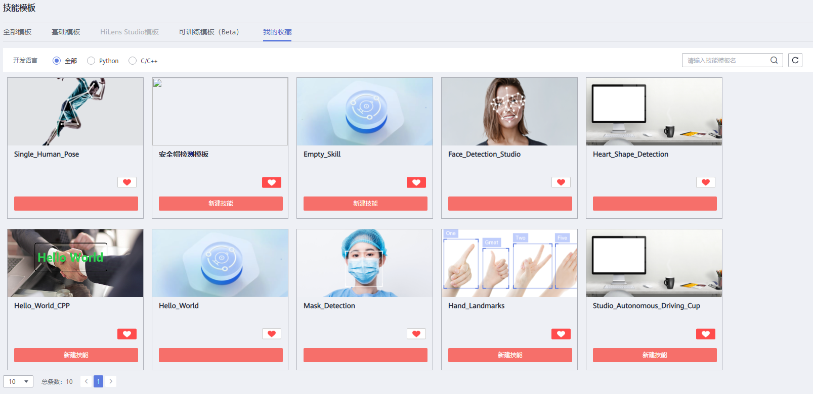
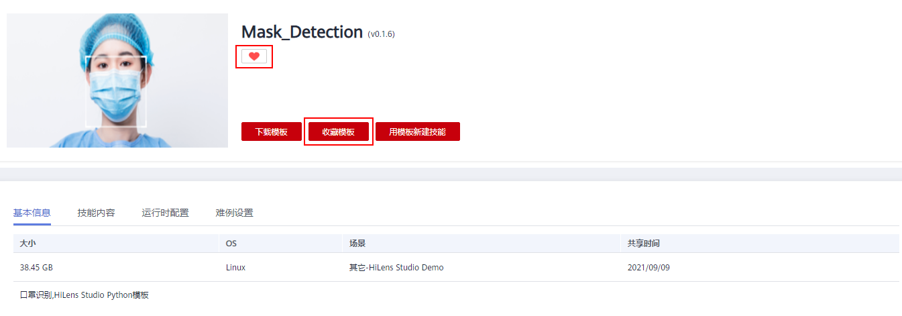

# 获取技能模板

技能模板可用于快速新建技能，提升开发效率。

本章节介绍如何获取和使用技能模板。

## 技能模板介绍

技能模板分为基础模板、HiLens Studio模板、可训练模板。

-   基础模板

    已有技能的算法模型和逻辑代码，可快速便捷地在华为HiLens控制台开发技能。

-   HiLens Studio模板

    已有技能的算法模板和逻辑代码。可快速便捷地在开发环境HiLens Studio中开发技能。开发技能时，可导入新的算法模型至HiLens Studio中，也可在HiLens Studio中修改和调试逻辑代码。

    当前暂不支持在“技能开发\>技能模板“页面展示HiLens Studio模板，可前往HiLens Studio直接选择HiLens Studio模板新建技能项目，详情请见[新建技能项目](新建技能项目.md)。

-   可训练模板

    已有技能的算法模板和逻辑代码，可快速便捷地在ModelArts Pro控制台开发技能。使用该模板可在ModelArts Pro控制台自主上传训练数据优化模型，一键部署技能至设备。该模板暂不支持修改逻辑代码。

    可在“技能开发\>技能模板“页面选择可训练模板新建技能，详情请见[新建可训练技能](新建可训练技能.md)。

基于基础模板，还可以执行如下操作：

-   [查看技能模板](#section246113309499)
-   [下载技能模板](#section1673118371493)
-   [收藏技能模板](#section1658717419498)
-   [使用技能模板新建技能](#section1129481610546)

## 查看技能模板

1.  登录华为HiLens管理控制台，在左侧导航栏中选择“技能开发\>技能模板“，默认进入“全部模板“页面。
2.  在“全部模板“页面中，单击技能模板的卡片，可进入技能详情页面，您可以查看技能的基本信息、运行时参数等信息。

    您可以单击“我的收藏“页签，查看您收藏的技能列表，也可在此页面单击技能卡片进入详情页。

    **图 1**  技能模板  
    

## 下载技能模板

1.  在“全部模板“、“基础模板“或“我的收藏“页面中，单击技能模板的卡片，可进入技能详情页面。
2.  在技能详情页面，单击右上角的“下载模板“，技能模板将已压缩包的形式下载至您的本地。

    压缩包为“.zip“格式。下载的压缩包中包含了此技能模板的算法模型和逻辑代码，有些技能模板可能不存在算法模型，此时压缩包中仅有逻辑代码文件。

    **图 2**  下载技能模板  
    

## 收藏技能模板

**图 3**  收藏技能模板  

-   在“全部模板“页面中，单击技能模板的卡片，进入技能详情页面。在技能详情页面，单击右上角的“收藏模板“。
-   在“全部模板“页面中，单击技能模板的卡片的图标即可收藏模板。

技能模板收藏后，将显示在“我的收藏“页面中。再次点击卡片上的图标，或技能详情右上角的“取消收藏”按钮，即可取消收藏该模板。

## 使用技能模板新建技能

1.  在“全部模板“、“基础模板“或“我的收藏“页面中，单击技能模板的卡片，可进入技能详情页面。
2.  在技能详情页面，单击右上角的“用模板新建技能“跳转至“新建技能“页面。新建技能的详细的参数填写请参见[使用技能模板](使用技能模板.md)。

