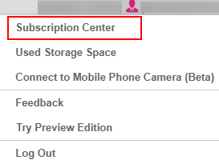
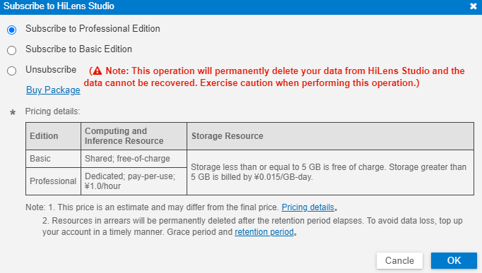
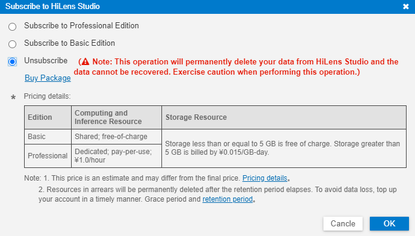

# 订购/退订版本

除了在[申请HiLens Studio公测](申请HiLens-Studio公测.md)时中订购HiLens Studio版本，在HiLens Studio界面，也可以选择切换版本和退订版本。

## 前提条件

-   保证华为云帐号处于不欠费状态。在华为HiLens控制台开发技能时，会占用OBS资源，需要收取一定费用，收费规则请参见[对象存储服务 OBS](https://www.huaweicloud.com/pricing.html?tab=detail#/obs)。

-   已申请HiLens Studio公测，详细操作请参见[申请HiLens Studio公测](申请HiLens-Studio公测.md)。

## 订购版本

1.  登录华为HiLens管理控制台，在左侧导航栏中选择“技能开发\>HiLensStudio“。

    进入HiLens Studio 页面。

2.  在HiLens Studio页面单击右上角帐号名，在下拉框中单击“Subscription Center“。

    **图 1**  订购中心  
    

3.  在HiLens Studio订购对话框中，勾选需要切换的HiLens Studio版本，然后单击“OK“。

    基础版和专业版HiLens Studio说明请见[版本说明](申请HiLens-Studio公测.md#section167061841347)。

    **图 2**  HiLens Studio订购  
    

## 退订版本

如果您不再使用HiLens Studio，可选择退订HiLens Studio版本。

> **说明：** 
>退订操作将会彻底删除您保存在HiLens Studio内的数据且不可恢复，请谨慎操作！

1.  登录华为HiLens管理控制台，在左侧导航栏中选择“技能开发\>HiLensStudio“。

    进入HiLens Studio 页面。

2.  在HiLens Studio页面单击右上角帐号名，在下拉框中单击“Subscription Center“。

    **图 3**  订购中心-24  
    

3.  在HiLens Studio订购对话框中，勾选“Unsubscribe“，然后单击“OK“。

    **图 4**  退订HiLens Studio  
    

