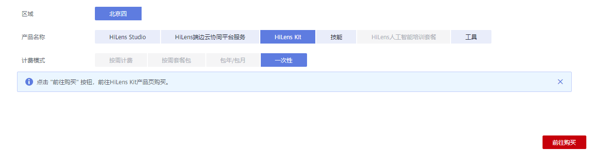

# 订购HiLens Kit

HiLens Kit是多模态AI开发套件，支持通过端云协同实现图像、视频、语音等多种数据分析与推理计算，可广泛用于智能监控、智慧家庭、AI教育、智慧工业、智慧门店等应用场景。

华为HiLens支持HiLens Kit设备云上管理、实现云上技能开发和技能安装，您可以在华为云官网一次性购买HiLens Kit设备。

## 操作步骤

1.  登录华为HiLens管理控制台，在左侧导航栏选择“产品订购\>订单管理“。

    进入“订单管理“页面。

2.  单击右上角的“产品订购“。

    进入“华为HiLens产品订购“页面。

3.  按[表1](#table1329916226411)填写信息，然后单击右下角的“前往购买“。

    进入HiLens Kit购买页。

    **图 1**  订购HiLens Kit  
    

    **表 1**  购买HiLens Kit

    
    <table><thead align="left"><tr id="row192981922841"><th class="cellrowborder" valign="top" width="20.849999999999998%" id="mcps1.2.3.1.1">
参数

    </th>
    <th class="cellrowborder" valign="top" width="79.14999999999999%" id="mcps1.2.3.1.2">
说明

    </th>
    </tr>
    </thead>
    <tbody><tr id="row22986229412"><td class="cellrowborder" valign="top" width="20.849999999999998%" headers="mcps1.2.3.1.1 ">
区域

    </td>
    <td class="cellrowborder" valign="top" width="79.14999999999999%" headers="mcps1.2.3.1.2 ">
选择区域。当前华为HiLens已开通“北京四”和“北京一”区域。

    </td>
    </tr>
    <tr id="row4754163074912"><td class="cellrowborder" valign="top" width="20.849999999999998%" headers="mcps1.2.3.1.1 ">
产品名称

    </td>
    <td class="cellrowborder" valign="top" width="79.14999999999999%" headers="mcps1.2.3.1.2 ">
选择“HiLens Kit”。

    </td>
    </tr>
    <tr id="row1429810221749"><td class="cellrowborder" valign="top" width="20.849999999999998%" headers="mcps1.2.3.1.1 ">
计费模式

    </td>
    <td class="cellrowborder" valign="top" width="79.14999999999999%" headers="mcps1.2.3.1.2 ">
HiLens Kit支持“一次性”计费模式。

    </td>
    </tr>
    </tbody>
    </table>

4.  选择购买数量，单击“订单确认“。
5.  在订单确认页面填写收货人信息及收货地址，确认订单信息，勾选“我已阅读并同意签署《华为云硬件销售协议》“。
6.  单击“去支付“，在支付页面完成付款。

## 后续操作

购买HiLens Kit后，注册HiLens Kit设备至华为HiLens控制台，在控制台进行设备管理，注册操作请见[注册HiLens Kit](https://support.huaweicloud.com/usermanual-hilens/hilens_02_0048.html)。

