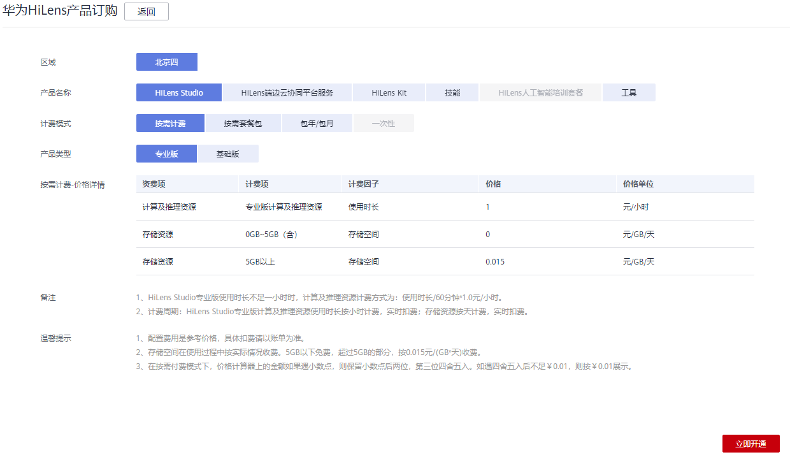

# 订购HiLens Studio

华为HiLens是端云协同多模态AI开发应用平台，在使用华为HiLens的过程中，涉及购买HiLens Kit、HiLens Studio开发技能、端云协同开发以及技能市场购买技能等场景均会产生费用，需要订购HiLens产品才能正常使用这些功能。

华为HiLens提供HiLens Studio、HiLens端边云协同平台服务、HiLens Kit以及技能产品，计费说明请见《产品介绍\>计费说明》。

华为HiLens提供给开发者的多语言类集成开发环境HiLens Studio，使用HiLens Studio前，您需要按需订购HiLens Studio版本。本章节介绍如何选择和订购HiLens Studio版本。

## 版本说明

HiLens Studio基础版和专业版的区别主要在于是否能够使用专属的推理资源。基础版说明请见[表1](#hilens_02_0099_table2849203151012)，专业版说明请见[表2](#hilens_02_0099_table61681142161617)。

**表 1**  HiLens Studio基础版

<table><thead align="left"><tr id="hilens_02_0099_row48491316106"><th class="cellrowborder" valign="top" width="17.549999999999997%" id="mcps1.2.5.1.1">
资源

</th>
<th class="cellrowborder" valign="top" width="25.75%" id="mcps1.2.5.1.2">
涉及功能

</th>
<th class="cellrowborder" valign="top" width="22.189999999999998%" id="mcps1.2.5.1.3">
计费模式

</th>
<th class="cellrowborder" valign="top" width="34.510000000000005%" id="mcps1.2.5.1.4">
计费说明

</th>
</tr>
</thead>
<tbody><tr id="hilens_02_0099_row118501231181012"><td class="cellrowborder" valign="top" width="17.549999999999997%" headers="mcps1.2.5.1.1 ">
存储资源

</td>
<td class="cellrowborder" valign="top" width="25.75%" headers="mcps1.2.5.1.2 ">
创建技能项目、上传模型和数据

</td>
<td class="cellrowborder" valign="top" width="22.189999999999998%" headers="mcps1.2.5.1.3 ">
按需

</td>
<td class="cellrowborder" valign="top" width="34.510000000000005%" headers="mcps1.2.5.1.4 ">
按累计所有主帐号和子帐号使用的存储资源大小超过5GB的部分，收取费用。

存储资源5GB以下免费。

</td>
</tr>
<tr id="hilens_02_0099_row1585063119107"><td class="cellrowborder" valign="top" width="17.549999999999997%" headers="mcps1.2.5.1.1 ">
推理资源（共享）

</td>
<td class="cellrowborder" valign="top" width="25.75%" headers="mcps1.2.5.1.2 ">
调试和运行技能

</td>
<td class="cellrowborder" valign="top" width="22.189999999999998%" headers="mcps1.2.5.1.3 ">
免费

</td>
<td class="cellrowborder" valign="top" width="34.510000000000005%" headers="mcps1.2.5.1.4 ">
-

</td>
</tr>
</tbody>
</table>

**表 2**  HiLens Studio专业版

<table><thead align="left"><tr id="hilens_02_0099_row1916815426167"><th class="cellrowborder" valign="top" width="16.18%" id="mcps1.2.5.1.1">
资源

</th>
<th class="cellrowborder" valign="top" width="27.21%" id="mcps1.2.5.1.2">
涉及功能

</th>
<th class="cellrowborder" valign="top" width="17.69%" id="mcps1.2.5.1.3">
计费模式

</th>
<th class="cellrowborder" valign="top" width="38.92%" id="mcps1.2.5.1.4">
计费说明

</th>
</tr>
</thead>
<tbody><tr id="hilens_02_0099_row11168842131612"><td class="cellrowborder" valign="top" width="16.18%" headers="mcps1.2.5.1.1 ">
存储资源

</td>
<td class="cellrowborder" valign="top" width="27.21%" headers="mcps1.2.5.1.2 ">
创建技能项目、上传模型和数据

</td>
<td class="cellrowborder" valign="top" width="17.69%" headers="mcps1.2.5.1.3 ">
按需

</td>
<td class="cellrowborder" valign="top" width="38.92%" headers="mcps1.2.5.1.4 ">
按累计所有主帐号和子帐号使用的存储资源大小超过5GB的部分，收取费用。

存储资源5GB以下免费。

</td>
</tr>
<tr id="hilens_02_0099_row61684427161"><td class="cellrowborder" rowspan="3" valign="top" width="16.18%" headers="mcps1.2.5.1.1 ">
推理资源（专属）

</td>
<td class="cellrowborder" rowspan="3" valign="top" width="27.21%" headers="mcps1.2.5.1.2 ">
调试和运行技能

</td>
<td class="cellrowborder" valign="top" width="17.69%" headers="mcps1.2.5.1.3 ">
按需

</td>
<td class="cellrowborder" valign="top" width="38.92%" headers="mcps1.2.5.1.4 ">
按累计所有主帐号和子帐号的计算时长，收取费用。

</td>
</tr>
<tr id="hilens_02_0099_row1160023617419"><td class="cellrowborder" valign="top" headers="mcps1.2.5.1.1 ">
按需套餐包（计算资源套餐包）

</td>
<td class="cellrowborder" valign="top" headers="mcps1.2.5.1.2 ">
用户可以购买按需套餐包，扣费时计算时长会先在套餐包内进行抵扣，抵扣完后的剩余计算时长默认转回按需计费方式。

购买按需套餐包后，系统将自动开通专业版，您在使用时进入专业版HiLens Studio即可享受套餐内额度。

</td>
</tr>
<tr id="hilens_02_0099_row1339921965915"><td class="cellrowborder" valign="top" headers="mcps1.2.5.1.1 ">
包年/包月

</td>
<td class="cellrowborder" valign="top" headers="mcps1.2.5.1.2 ">
用户可以购买包年/包月套餐包，扣费时计算时长会先在套餐包内进行抵扣，抵扣完后的剩余计算时长默认转回按需计费方式。

购买按需套餐包后，系统将自动开通专业版，您在使用时进入专业版HiLens Studio即可享受套餐内额度。

</td>
</tr>
</tbody>
</table>

## 订购HiLens Studio

1.  登录华为HiLens管理控制台，在左侧导航栏选择“产品订购\>订单管理“。

    进入“订单管理“页面。

2.  单击右上角的“产品订购“。

    进入“华为HiLens产品订购“页面。

3.  按[表3](#table15167126103110)填写信息，阅读“备注“和“温馨提示“，单击“立即开通“。

    **图 1**  订购HiLens Studio  
    

    **表 3**  订购HiLens Studio参数说明

    
    <table><thead align="left"><tr id="row81671263311"><th class="cellrowborder" valign="top" width="29.470000000000002%" id="mcps1.2.3.1.1">
参数

    </th>
    <th class="cellrowborder" valign="top" width="70.53%" id="mcps1.2.3.1.2">
说明

    </th>
    </tr>
    </thead>
    <tbody><tr id="row7167192614317"><td class="cellrowborder" valign="top" width="29.470000000000002%" headers="mcps1.2.3.1.1 ">
区域

    </td>
    <td class="cellrowborder" valign="top" width="70.53%" headers="mcps1.2.3.1.2 ">
选择区域。当前HiLens Studio支持在“北京四”和“北京一”区域订购使用。

    </td>
    </tr>
    <tr id="row15167152643119"><td class="cellrowborder" valign="top" width="29.470000000000002%" headers="mcps1.2.3.1.1 ">
产品名称

    </td>
    <td class="cellrowborder" valign="top" width="70.53%" headers="mcps1.2.3.1.2 ">
选择订购的产品名称“HiLens Studio”。

    </td>
    </tr>
    <tr id="row131677265311"><td class="cellrowborder" valign="top" width="29.470000000000002%" headers="mcps1.2.3.1.1 ">
产品类型

    </td>
    <td class="cellrowborder" valign="top" width="70.53%" headers="mcps1.2.3.1.2 ">
选择待订购的HiLens Studio版本。HiLens Studio包括基础版和专业版，不同版本其计费模式不同，具体说明请见<a href="#section3782818102911">版本说明</a>。

    </td>
    </tr>
    <tr id="row516715268319"><td class="cellrowborder" valign="top" width="29.470000000000002%" headers="mcps1.2.3.1.1 ">
计费模式

    </td>
    <td class="cellrowborder" valign="top" width="70.53%" headers="mcps1.2.3.1.2 ">
选择HiLens Studio的计费模式。HiLens Studio支持“按需计费”、“按需套餐包”和“包年/包月”计费模式。

    
根据不同计费模式填写信息。

    <ul id="ul116782611312"><li>按需计费：不同的HiLens Studio版本按需计费价格不同，请见“按需计费-价格详情”。</li><li>按需套餐包：仅HiLens Studio“专业版”支持按需套餐包计费，请按<a href="#table5169172603114">表4</a>填写信息。</li><li>包年/包月：仅HiLens Studio“专业版”支持包年/包月套餐包计费，请按<a href="#table121691326173110">表5</a>填写信息。</li></ul>
    </td>
    </tr>
    </tbody>
    </table>

    **表 4**  按需套餐包参数说明

    
    <table><thead align="left"><tr id="row10168142663119"><th class="cellrowborder" valign="top" width="29.630000000000003%" id="mcps1.2.3.1.1">
参数

    </th>
    <th class="cellrowborder" valign="top" width="70.37%" id="mcps1.2.3.1.2">
说明

    </th>
    </tr>
    </thead>
    <tbody><tr id="row7168182653116"><td class="cellrowborder" valign="top" width="29.630000000000003%" headers="mcps1.2.3.1.1 ">
资源包类型

    </td>
    <td class="cellrowborder" valign="top" width="70.37%" headers="mcps1.2.3.1.2 ">
按需套餐包计费模式的资源包类型为“计算及推理资源”。

    </td>
    </tr>
    <tr id="row18168112619310"><td class="cellrowborder" valign="top" width="29.630000000000003%" headers="mcps1.2.3.1.1 ">
规格

    </td>
    <td class="cellrowborder" valign="top" width="70.37%" headers="mcps1.2.3.1.2 ">
选择计算及推理资源的规格时长。

    </td>
    </tr>
    <tr id="row316992617311"><td class="cellrowborder" valign="top" width="29.630000000000003%" headers="mcps1.2.3.1.1 ">
购买时长

    </td>
    <td class="cellrowborder" valign="top" width="70.37%" headers="mcps1.2.3.1.2 ">
选择订购HiLens Studio订购时长。当前仅支持“1年”。

    </td>
    </tr>
    </tbody>
    </table>

    **表 5**  包年/包月参数说明

    
    <table><thead align="left"><tr id="row6169202623111"><th class="cellrowborder" valign="top" width="29.630000000000003%" id="mcps1.2.3.1.1">
参数

    </th>
    <th class="cellrowborder" valign="top" width="70.37%" id="mcps1.2.3.1.2">
说明

    </th>
    </tr>
    </thead>
    <tbody><tr id="row6169102693111"><td class="cellrowborder" valign="top" width="29.630000000000003%" headers="mcps1.2.3.1.1 ">
资源包类型

    </td>
    <td class="cellrowborder" valign="top" width="70.37%" headers="mcps1.2.3.1.2 ">
包年/包月套餐包计费模式的资源包类型为“计算及推理资源”。

    </td>
    </tr>
    <tr id="row3169926123115"><td class="cellrowborder" valign="top" width="29.630000000000003%" headers="mcps1.2.3.1.1 ">
在线帐号数量

    </td>
    <td class="cellrowborder" valign="top" width="70.37%" headers="mcps1.2.3.1.2 ">
支持华为云帐号和IAM帐号同时在线的最大帐号数量。

    
可勾选“是否自动续费”，帐号会自动续费包年/包月套餐。

    </td>
    </tr>
    <tr id="row716992673119"><td class="cellrowborder" valign="top" width="29.630000000000003%" headers="mcps1.2.3.1.1 ">
购买时长

    </td>
    <td class="cellrowborder" valign="top" width="70.37%" headers="mcps1.2.3.1.2 ">
可使用HiLens Studio专业版的时长。

    </td>
    </tr>
    <tr id="row11169102611311"><td class="cellrowborder" valign="top" width="29.630000000000003%" headers="mcps1.2.3.1.1 ">
生效时间

    </td>
    <td class="cellrowborder" valign="top" width="70.37%" headers="mcps1.2.3.1.2 ">
订购HiLens Studio包年/包月套餐包的生效时间为“支付完成后立即生效”。

    </td>
    </tr>
    </tbody>
    </table>

4.  确认订单后，单击右下角的“提交订单“。
5.  在“支付“页面，勾选支付方式，确认订单后，单击“确认付款“，输入支付密码，完成HiLens Studio购买。

## 后续操作

购买HiLens Studio后，您可以使用HiLens Studio开发技能，详情请见[开发环境HiLens Studio](开发环境HiLens-Studio.md)。

