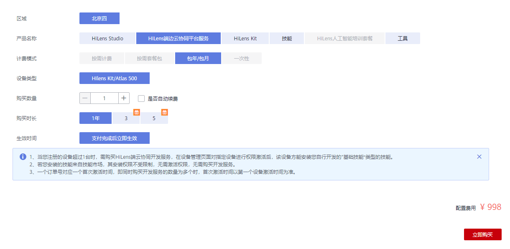
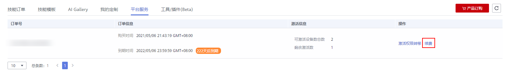

# 订购HiLens端边云协同平台服务

华为HiLens是端云协同多模态AI开发应用平台，在使用华为HiLens的过程中，涉及购买HiLens Kit、HiLens Studio开发技能、端云协同开发以及技能市场购买技能等场景均会产生费用，需要订购HiLens产品才能正常使用这些功能。

华为HiLens提供HiLens端边云协同平台服务。当您注册的设备超过1台时，超过1台的设备需购买HiLens端边云协同平台服务，在设备管理页面对指定设备进行权限激活后，该设备方能安装您自行开发的基础技能类型的技能。

## 使用场景

-   当您注册的设备超过1台时，在该设备上安装您自行开发的基础技能类型技能，包括在控制台开发的技能、在HiLens Studio开发的技能以及使用可训练技能模板开发的技能，需要购买HiLens端边云协同平台服务，在设备管理页面对指定设备进行权限激活。
-   安装来自技能市场的技能，其安装权限不受限制，无需购买HiLens端边云协同平台服务，也无需激活权限。
-   首台注册的设备，其技能安装权限不受限制，无需购买HiLens端边云协同平台服务，也无需激活权限。

## 订购操作

1.  登录华为HiLens管理控制台，在左侧导航栏选择“产品订购\>订单管理“。

    进入“订单管理“页面。

2.  单击右上角的“产品订购“。

    进入“华为HiLens产品订购“页面。

3.  按[表1](#table29132315359)填写信息，阅读“备注“和“温馨提示“，单击“立即购买“。

    **图 1**  订购HiLens端边云协同平台服务  
    

    **表 1**  订购HiLens端边云协同平台服务参数说明

    
    <table><thead align="left"><tr id="row1991215313355"><th class="cellrowborder" valign="top" width="29.470000000000002%" id="mcps1.2.3.1.1">
参数

    </th>
    <th class="cellrowborder" valign="top" width="70.53%" id="mcps1.2.3.1.2">
说明

    </th>
    </tr>
    </thead>
    <tbody><tr id="row1291263183511"><td class="cellrowborder" valign="top" width="29.470000000000002%" headers="mcps1.2.3.1.1 ">
区域

    </td>
    <td class="cellrowborder" valign="top" width="70.53%" headers="mcps1.2.3.1.2 ">
选择区域。当前HiLens端边云协同平台服务支持在“北京四”和“北京一”区域订购使用。

    </td>
    </tr>
    <tr id="row10912123173515"><td class="cellrowborder" valign="top" width="29.470000000000002%" headers="mcps1.2.3.1.1 ">
产品名称

    </td>
    <td class="cellrowborder" valign="top" width="70.53%" headers="mcps1.2.3.1.2 ">
选择订购的产品名称“HiLens端边云协同平台服务”。

    </td>
    </tr>
    <tr id="row1191203173510"><td class="cellrowborder" valign="top" width="29.470000000000002%" headers="mcps1.2.3.1.1 ">
计费模式

    </td>
    <td class="cellrowborder" valign="top" width="70.53%" headers="mcps1.2.3.1.2 ">
HiLens端边云协同平台服务仅支持“包年/包月”套餐包计费模式。

    </td>
    </tr>
    <tr id="row6912203173511"><td class="cellrowborder" valign="top" width="29.470000000000002%" headers="mcps1.2.3.1.1 ">
设备类型

    </td>
    <td class="cellrowborder" valign="top" width="70.53%" headers="mcps1.2.3.1.2 ">
HiLens端边云协同平台服务支持基础技能安装的设备类型，包括“HiLens Kit/Atlas 500”。

    </td>
    </tr>
    <tr id="row3913203113356"><td class="cellrowborder" valign="top" width="29.470000000000002%" headers="mcps1.2.3.1.1 ">
购买数量

    </td>
    <td class="cellrowborder" valign="top" width="70.53%" headers="mcps1.2.3.1.2 ">
需要购买服务的设备数量。

    </td>
    </tr>
    <tr id="row1191353143515"><td class="cellrowborder" valign="top" width="29.470000000000002%" headers="mcps1.2.3.1.1 ">
购买时长

    </td>
    <td class="cellrowborder" valign="top" width="70.53%" headers="mcps1.2.3.1.2 ">
每台设备购买HiLens端边云协同平台服务的时长，可选“1年”、“3年”、“5年”，即购买服务后，从首次激活设备开始算起，在购买时长内可安装自行开发的基础技能至设备。

    
例如，2019年1月1日购买HiLens端边云协同平台服务，完成订单支付，购买时长为3年，首次激活设备时间为2019年6月1日，那么从2019年6月1日起至2022年6月1日可安装自行开发的基础技能至设备。

    </td>
    </tr>
    <tr id="row13913123110353"><td class="cellrowborder" valign="top" width="29.470000000000002%" headers="mcps1.2.3.1.1 ">
生效时间

    </td>
    <td class="cellrowborder" valign="top" width="70.53%" headers="mcps1.2.3.1.2 ">
订购HiLens端边云协同平台服务的生效时间为“支付完成后立即生效”。即首次激活设备时间，需要在购买HiLens端边云协同平台服务的时长内激活，并不是支付完成后，即可安装自行开发的基础技能至设备。

    </td>
    </tr>
    </tbody>
    </table>

4.  确认订单后，单击右下角的“提交订单“。
5.  在“支付“页面，勾选支付方式，确认订单后，单击“确认付款“，输入支付密码，完成HiLens端边云协同平台服务的购买。

## 续费订单

如果您购买的平台服务已到期，可续费继续使用平台服务。续费后设备自动会变成已激活状态，无需重新激活。

> **说明：** 
>续费资源不能享受5天无理由退订。

1.  登录华为HiLens管理控制台，在左侧导航栏选择“产品订购\>订单管理“。

    进入“订单管理“页面。

2.  单击“平台服务“，切换至“平台服务“页签。
3.  选择待转移的订单号，单击操作列的“续费“。

    进入“续费“页面，会展示平台服务的信息。

    **图 2**  续费  
    

4.  在“续费“页面，滑动滑块选择“续费时长“，可选择“1年“、“3年“、“5年“。

    若您想设置统一到期日期（实际续费时长=当前选择时长+续费到统一到期日需要补齐的时长）。

    1.  单击右侧的，在弹出的“设置统一到期日“对话框的下拉框中，选择“统一到期日“，单击“确定“。
    2.  勾选“统一到期日设置为每月X号“。

5.  单击右下角的“去支付“，在“支付“页面，勾选支付方式，确认订单后，单击“确认付款“，输入支付密码，完成订单续费。

    支付平台管理费后，页面显示“订单支付成功“，您可以返回[华为HiLens控制台](https://console.huaweicloud.com/hilens/?region=cn-north-4#/hilens/allManagement)，在左侧导航栏中选择“设备管理\>设备列表“，等待30秒左右后查看已激活的设备状态是否更新。

## 后续操作

购买HiLens端边云协同平台服务后，需要激活权限，才能安装自行开发的基础技能至设备，详情请见[激活设备（购买端边云协同平台服务）](激活设备（购买端边云协同平台服务）.md)。

