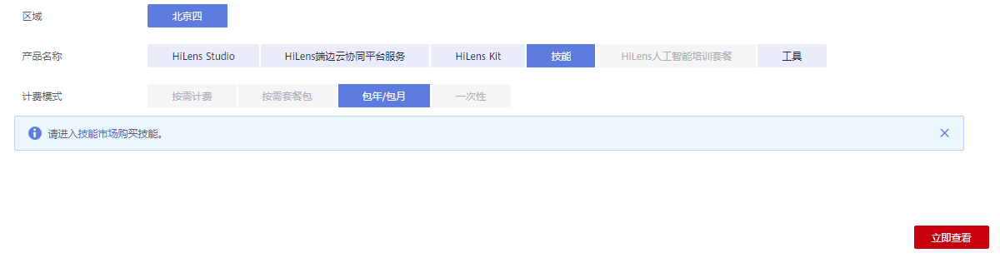

# 订购技能

设备注册完成后，您可在华为HiLens平台的技能市场订购所需要的技能，拓展设备的AI能力。例如订购一个“人脸判断”技能，安装在设备上后，即可让设备具备判断人脸的能力。

1.  登录华为HiLens管理控制台，在左侧导航栏选择“产品订购\>订单管理“。

    进入“订单管理“页面。

2.  单击右上角的“产品订购“。

    进入“华为HiLens产品订购“页面。

3.  按[表1](#table1329916226411)填写信息，然后单击右下角的“立即查看“。

    进入“技能市场“页面，选择和购买您需要的技能，具体操作请见[技能市场](技能市场.md)。

    **图 1**  订购技能  
    

    **表 1**  购买技能

    
    <table><thead align="left"><tr id="row192981922841"><th class="cellrowborder" valign="top" width="20.849999999999998%" id="mcps1.2.3.1.1">
参数

    </th>
    <th class="cellrowborder" valign="top" width="79.14999999999999%" id="mcps1.2.3.1.2">
说明

    </th>
    </tr>
    </thead>
    <tbody><tr id="row22986229412"><td class="cellrowborder" valign="top" width="20.849999999999998%" headers="mcps1.2.3.1.1 ">
区域

    </td>
    <td class="cellrowborder" valign="top" width="79.14999999999999%" headers="mcps1.2.3.1.2 ">
选择区域。当前华为HiLens已开通“北京四”和“北京一”区域。

    </td>
    </tr>
    <tr id="row178113528495"><td class="cellrowborder" valign="top" width="20.849999999999998%" headers="mcps1.2.3.1.1 ">
产品名称

    </td>
    <td class="cellrowborder" valign="top" width="79.14999999999999%" headers="mcps1.2.3.1.2 ">
选择“技能”。

    </td>
    </tr>
    <tr id="row1429810221749"><td class="cellrowborder" valign="top" width="20.849999999999998%" headers="mcps1.2.3.1.1 ">
计费模式

    </td>
    <td class="cellrowborder" valign="top" width="79.14999999999999%" headers="mcps1.2.3.1.2 ">
技能支持“包年/包月”套餐包计费模式。

    </td>
    </tr>
    </tbody>
    </table>

