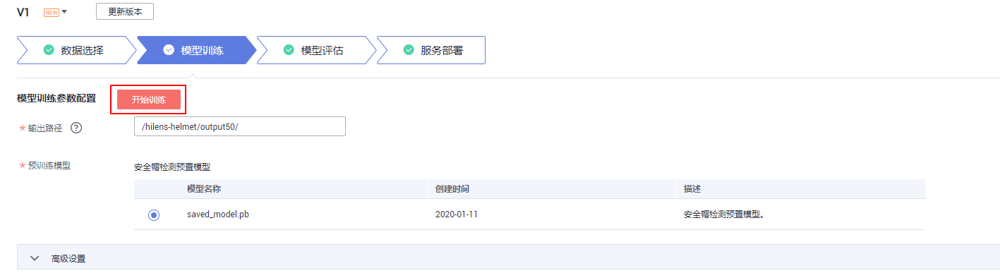
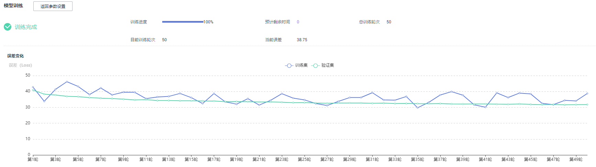

# 训练模型

选择训练数据后，基于已标注的训练数据，选择预训练模型、配置参数，用于训练安全帽检测模型。

## 前提条件

-   已创建用于存储数据的OBS桶及文件夹，且数据存储的OBS桶与ModelArts Pro在同一区域，详情请见[创建桶](https://support.huaweicloud.com/usermanual-obs/obs_03_0306.html)。
-   已在华为HiLens控制台选择“HiLens安全帽检测“技能模板新建技能，并选择训练数据集，详情请见[选择数据](选择数据.md)。

## 训练模型

在“应用开发\>模型训练“页面，配置训练参数，开始训练模型。

-   **输出路径**

    模型训练后，输出的模型和数据存储在OBS的路径。单击输入框，在输出路径的对话框中选择OBS桶和文件夹，然后单击“确定“。

-   **预训练模型**

    当前服务提供安全帽检测预置模型“saved\_model.pb“，请勾选预训练模型。

确认信息后，单击“开始训练“。

**图 1**  模型训练  

模型训练一般需要运行一段时间，等模型训练完成后，“应用开发\>模型训练“页面下方显示[训练详情](#section1525930145410)。

## 查看训练详情

模型训练完成后，可在“应用开发\>模型训练“页面查看“训练详情“。

**图 2**  训练详情  

