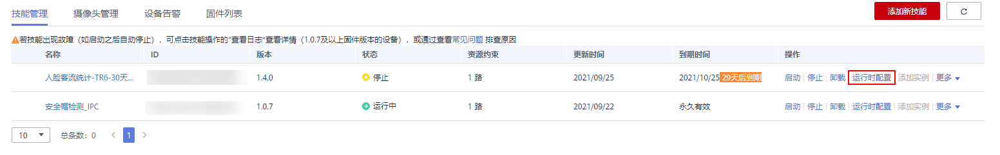
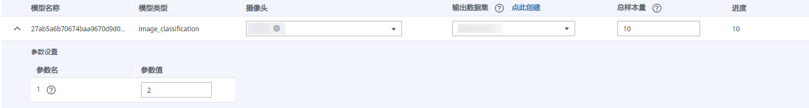

# 设置难例

部分技能具备有难例数据收集的功能，在技能运行之前需要做难例参数配置。

## 前提条件

-   技能开发者设置了难例上传的技能，才能共进行相应的难例设置。
-   在ModelArts创建难例数据集，用于训练难例筛选模型。具体操作请参见[创建数据集](https://support.huaweicloud.com/engineers-modelarts/modelarts_23_0004.html)。

## 设置难例

1.  在管理控制台左侧菜单栏选择“设备管理 \>设备列表“，然后在设备列表中，选择需要进行管理的某一设备，单击设备卡片进入设备详情页面。

    “设备详情“页面默认展示“技能管理“页签。

2.  在“技能管理“界面中，选择指定的技能，单击“操作“列的“运行时配置“。

    **图 1**  运行时配置-17  
    

3.  单击“难例设置“，在难例设置页签填写相关信息。

    **表 1**  难例设置

    
    <table><thead align="left"><tr id="row6696112712560"><th class="cellrowborder" valign="top" width="50%" id="mcps1.2.3.1.1">
参数

    </th>
    <th class="cellrowborder" valign="top" width="50%" id="mcps1.2.3.1.2">
说明

    </th>
    </tr>
    </thead>
    <tbody><tr id="row1769612725612"><td class="cellrowborder" valign="top" width="50%" headers="mcps1.2.3.1.1 ">
模型名称

    </td>
    <td class="cellrowborder" valign="top" width="50%" headers="mcps1.2.3.1.2 ">
难例筛选模型的名称，用户无需填写。

    </td>
    </tr>
    <tr id="row14696142713564"><td class="cellrowborder" valign="top" width="50%" headers="mcps1.2.3.1.1 ">
模型类型

    </td>
    <td class="cellrowborder" valign="top" width="50%" headers="mcps1.2.3.1.2 ">
难例筛选的模型类型，比如图像分类、物体检测，用户无需填写。

    </td>
    </tr>
    <tr id="row76965273563"><td class="cellrowborder" valign="top" width="50%" headers="mcps1.2.3.1.1 ">
摄像头

    </td>
    <td class="cellrowborder" valign="top" width="50%" headers="mcps1.2.3.1.2 ">
当前模型下选择上传指定摄像头的难例数据。

    </td>
    </tr>
    <tr id="row1669617271563"><td class="cellrowborder" valign="top" width="50%" headers="mcps1.2.3.1.1 ">
输出数据集

    </td>
    <td class="cellrowborder" valign="top" width="50%" headers="mcps1.2.3.1.2 ">
训练难例筛选模型的数据集。用户需要提前在ModelArts创建难例数据集，具体操作请参见<a href="https://support.huaweicloud.com/engineers-modelarts/modelarts_23_0004.html" target="_blank" rel="noopener noreferrer">创建数据集</a>。

    </td>
    </tr>
    <tr id="row56918281639"><td class="cellrowborder" valign="top" width="50%" headers="mcps1.2.3.1.1 ">
总样本量

    </td>
    <td class="cellrowborder" valign="top" width="50%" headers="mcps1.2.3.1.2 ">
输出数据集的样本数量。

    </td>
    </tr>
    <tr id="row716718091610"><td class="cellrowborder" valign="top" width="50%" headers="mcps1.2.3.1.1 ">
进度

    </td>
    <td class="cellrowborder" valign="top" width="50%" headers="mcps1.2.3.1.2 ">
当前已经上传的难例数据总量。

    </td>
    </tr>
    <tr id="row3611493310"><td class="cellrowborder" valign="top" width="50%" headers="mcps1.2.3.1.1 ">
参数设置

    </td>
    <td class="cellrowborder" valign="top" width="50%" headers="mcps1.2.3.1.2 ">
难例筛选模型需要配置的参数值。如<a href="#fig130333511711">图2</a>所示，单击模型名称左侧，在“参数设置”下方的“参数值”输入框中填写，单击参数名右侧的可查看参数的描述。

    </td>
    </tr>
    </tbody>
    </table>

    **图 2**  难例设置  
    

4.  难例设置完成后，单击右上角的“执行配置“。

