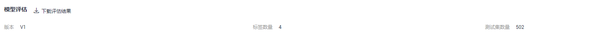
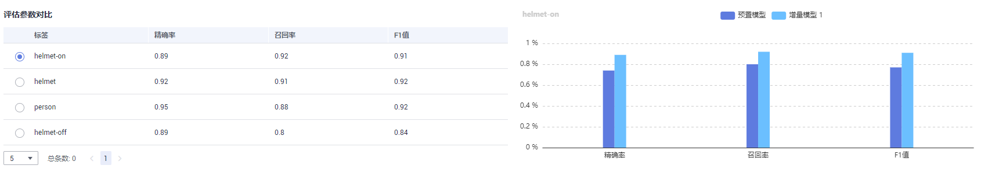
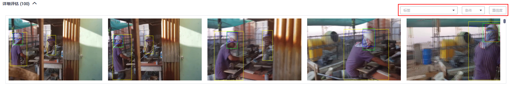

# 评估模型

训练得到模型之后，整个开发过程还不算结束，需要对模型进行评估和考察。往往不能一次性获得一个满意的模型，需要反复的调整算法参数、数据，不断评估训练生成的模型。

一些常用的指标，如精准率、召回率、F1值等，能帮助您有效的评估，最终获得一个满意的模型。

## 前提条件

已在华为HiLens控制台选择“HiLens安全帽检测“技能模板新建技能，并训练模型，详情请见[训练模型](训练模型.md)。

## 评估模型

工作流会用测试数据评估模型，在“应用开发\>评估模型“页面，查看评估结果。

-   模型评估

    **图 1**  模型评估  
    

    训练模型的版本、标签数量、测试集数量。单击“下载评估结果“，可保存评估结果至本地。

-   评估参数对比

    **图 2**  评估参数对比  
    

    左侧是各个标签数据的精确率、召回率、F1值。勾选标签，右侧会显示对应标签数据经过预置模型和增量模型评估后的参数对比柱状图。

-   详细评估

    **图 3**  详细评估  
    

    可在右上角筛选标签和置信度范围，查看详细的测试数据。

## 后续操作

针对当前版本的模型，经过模型评估后，如果根据业务需求，模型还需继续优化，请单击“上一步“，回到“模型训练“步骤，详细操作指导请见[训练模型](训练模型.md)。

如果模型已达到业务需求，请单击“发布部署“，进入“服务部署“步骤，详情请见[部署应用](部署应用.md)。

