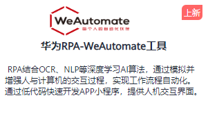
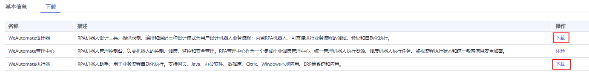
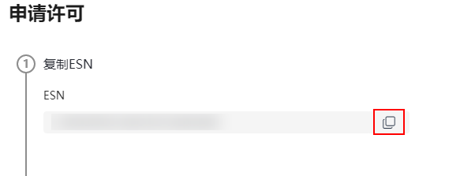
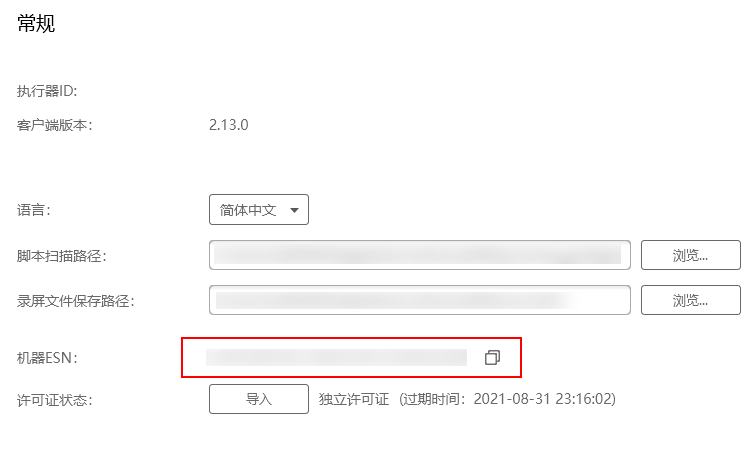

# 试用激活工具

华为RPA-WeAutomate工具结合OCR、NLP等深度学习AI算法，通过模拟并增强人与计算机的交互过程，实现工作流程自动化。快速构建企业级智能自动化平台，一站式获取RPA+AI+小程序能力，助力客户打通数字化转型最后一公里。更多详情请进入工具的基本信息页面查看。

登录华为HiLens控制台，进入“产品订购\>工具/插件“页面。单击“华为RPA-WeAutomate工具“卡片。默认进入华为RPA-WeAutomate工具“基本信息“页签，即可查看华为RPA-WeAutomate工具详细介绍。

在购买RPA-WeAutomate工具之前，您可以试用单机版华为RPA-WeAutomate工具。

-   [步骤1：获取ESN](#section14190194883618)
-   [步骤2：激活工具](#section19581105893610)
-   [步骤3：导入许可文件](#section16465183811616)

## 步骤1：获取ESN

1.  登录华为HiLens控制台，进入“产品订购\>工具/插件“页面。
2.  单击“华为RPA-WeAutomate工具“卡片。

    默认进入华为RPA-WeAutomate工具“基本信息“页签。

    **图 1** “华为RPA-WeAutomate工具“卡片  
    

3.  单击“下载“，切换至“下载“页签。
4.  根据自身业务选择“WeAutomate设计器“或“WeAutomate执行器“，然后单击对应操作列的“下载“。

    **图 2**  下载工具  
    

    -   “WeAutomate设计器“
        1.  下载工具后保存至本地，默认名为“HUAWEI\_AntRobot\_Studio\_2.13.0-SPC2.exe“。
        2.  双击应用程序，按照提示安装工具。
        3.  打开运行应用程序，单击左侧图标，选择“许可“。
        4.  复制ESN。

            **图 3**  获取ESN  
            

    -   “WeAutomate执行器“
        1.  下载工具后保存至本地，默认名为“HUAWEI\_AntRobot\_Assistant\_2.13.0.zip“。
        2.  解压压缩文件，进入文件夹“HUAWEI\_AntRobot\_Assistant\_2.13.0\>ADC\_1.5.RC30\_Component\_PKG\_IPA-Agent“，双击“install.bat“，根据提示安装工具。
        3.  打开运行应用程序，单击右上角的，选择“设置“。

            默认进入“设置\>常规“页签。

        4.  复制“机器ESN“的值。

            **图 4**  获取机器ESN  
            

## 步骤2：激活工具

1.  在华为HiLens控制台的“产品订购\>工具/插件“页面，单击“华为RPA-WeAutomate工具“卡片。

    进入“华为RPA-WeAutomate“页面。

2.  单击“试用激活“。

    弹出“试用激活“对话框。

3.  在ESN右侧文本框中粘贴[步骤1：获取ESN](#section14190194883618)获取的ESN，然后单击“确定“。
4.  保存许可文件至本地。

    > **说明：** 
    >许可文件初次获取后，可在华为HiLens控制台重新下载。
    >1.  进入控制台的“产品订购\>工具/插件\>华为RPA-WeAutomate工具“页面，单击“试用激活“。
    >2.  在对话框中单击“许可文件“，勾选对应的许可文件，然后单击“下载“。

## 步骤3：导入许可文件

-   “WeAutomate设计器“
    1.  打开RPA工具，单击左侧图标，选择“许可“。
    2.  在申请许可页面最后一步单击导入，将[步骤2：激活工具](#section19581105893610)获取的许可证文件导入。

        页面右上角提示“导入成功“，即成功激活工具。

-   “WeAutomate执行器“
    1.  打开RPA工具，单击右上角的，选择“设置“。

        默认进入“设置\>常规“页签。

    2.  单击“许可证状态“右侧的“导入“。

        弹出“导入成功“提示框，即成功激活工具。

## 后续操作

激活成功后，即可试用单击版华为RPA-WeAutomate工具。

