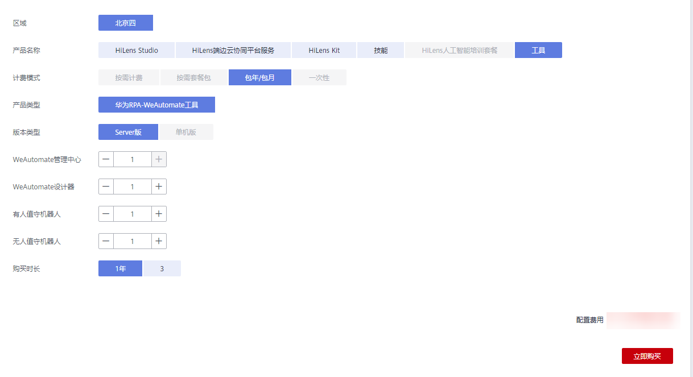
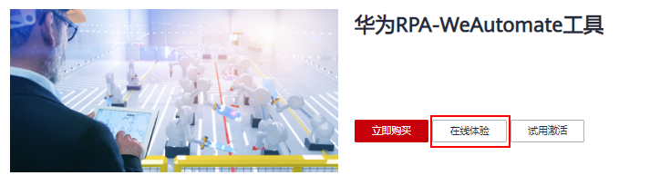
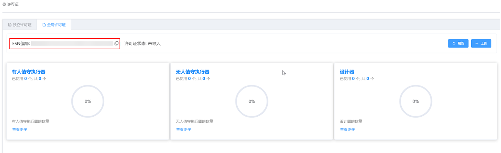
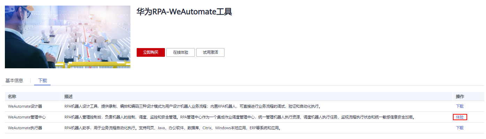

# 购买使用工具

华为RPA-WeAutomate工具结合OCR、NLP等深度学习AI算法，通过模拟并增强人与计算机的交互过程，实现工作流程自动化。快速构建企业级智能自动化平台，一站式获取RPA+AI+小程序能力，助力客户打通数字化转型最后一公里。更多详情请进入工具的基本信息页面查看。

登录华为HiLens控制台，进入“产品订购\>工具/插件“页面。单击“华为RPA-WeAutomate工具“卡片。默认进入华为RPA-WeAutomate工具“基本信息“页签，即可查看华为RPA-WeAutomate工具详细介绍。

RPA-WeAutomate工具需要购买并激活使用，详细步骤如下：

[步骤1：购买工具](#section18193034153510)

[步骤2：获取ESN](#section1412216182512)

[步骤3：激活工具](#section19581105893610)

[步骤4：导入许可文件](#section16465183811616)

## 步骤1：购买工具

1.  登录华为HiLens控制台，进入“产品订购\>工具/插件“页面。
2.  单击“华为RPA-WeAutomate工具“卡片。

    进入“华为RPA-WeAutomate工具“页面。

3.  单击“立即购买“。

    进入“华为HiLens产品订购“页面。

4.  按[表1](#table14268117411)填写信息，单击“立即购买“。

    **图 1**  购买工具  
    

    **表 1**  订购华为RPA-WeAutomate工具参数说明

    
    <table><thead align="left"><tr id="row152676114116"><th class="cellrowborder" valign="top" width="29.470000000000002%" id="mcps1.2.3.1.1">
参数

    </th>
    <th class="cellrowborder" valign="top" width="70.53%" id="mcps1.2.3.1.2">
说明

    </th>
    </tr>
    </thead>
    <tbody><tr id="row926751154116"><td class="cellrowborder" valign="top" width="29.470000000000002%" headers="mcps1.2.3.1.1 ">
区域

    </td>
    <td class="cellrowborder" valign="top" width="70.53%" headers="mcps1.2.3.1.2 ">
选择区域。当前华为RPA-WeAutomate工具支持在“北京四”区域订购使用。

    </td>
    </tr>
    <tr id="row18267201154114"><td class="cellrowborder" valign="top" width="29.470000000000002%" headers="mcps1.2.3.1.1 ">
产品名称

    </td>
    <td class="cellrowborder" valign="top" width="70.53%" headers="mcps1.2.3.1.2 ">
选择订购的产品名称“工具”。

    </td>
    </tr>
    <tr id="row8267161164112"><td class="cellrowborder" valign="top" width="29.470000000000002%" headers="mcps1.2.3.1.1 ">
计费模式

    </td>
    <td class="cellrowborder" valign="top" width="70.53%" headers="mcps1.2.3.1.2 ">
华为RPA-WeAutomate工具仅支持“包年/包月”套餐包计费模式。

    </td>
    </tr>
    <tr id="row10267171194115"><td class="cellrowborder" valign="top" width="29.470000000000002%" headers="mcps1.2.3.1.1 ">
产品类型

    </td>
    <td class="cellrowborder" valign="top" width="70.53%" headers="mcps1.2.3.1.2 ">
产品类型为“华为RPA-WeAutomate工具”。

    </td>
    </tr>
    <tr id="row2026717104110"><td class="cellrowborder" valign="top" width="29.470000000000002%" headers="mcps1.2.3.1.1 ">
版本类型

    </td>
    <td class="cellrowborder" valign="top" width="70.53%" headers="mcps1.2.3.1.2 ">
当前仅支持“Server版”。

    </td>
    </tr>
    <tr id="row16267141204113"><td class="cellrowborder" valign="top" width="29.470000000000002%" headers="mcps1.2.3.1.1 ">
WeAutomate管理中心

    </td>
    <td class="cellrowborder" valign="top" width="70.53%" headers="mcps1.2.3.1.2 ">
不可选选项，默认数量为1，详情请见<a href="购买使用工具.md">购买使用工具</a>。

    </td>
    </tr>
    <tr id="row2268171144113"><td class="cellrowborder" valign="top" width="29.470000000000002%" headers="mcps1.2.3.1.1 ">
WeAutomate设计器

    </td>
    <td class="cellrowborder" valign="top" width="70.53%" headers="mcps1.2.3.1.2 ">
需要购买WeAutomate设计器的数量。

    </td>
    </tr>
    <tr id="row32684119418"><td class="cellrowborder" valign="top" width="29.470000000000002%" headers="mcps1.2.3.1.1 ">
有人值守机器人

    </td>
    <td class="cellrowborder" valign="top" width="70.53%" headers="mcps1.2.3.1.2 ">
选择有人值守机器人数量。

    </td>
    </tr>
    <tr id="row20268617418"><td class="cellrowborder" valign="top" width="29.470000000000002%" headers="mcps1.2.3.1.1 ">
无人值守机器人

    </td>
    <td class="cellrowborder" valign="top" width="70.53%" headers="mcps1.2.3.1.2 ">
选择无人值守机器人数量。

    </td>
    </tr>
    <tr id="row126818114417"><td class="cellrowborder" valign="top" width="29.470000000000002%" headers="mcps1.2.3.1.1 ">
购买时长

    </td>
    <td class="cellrowborder" valign="top" width="70.53%" headers="mcps1.2.3.1.2 ">
默认为“1年”。

    </td>
    </tr>
    </tbody>
    </table>

5.  确认订单后，单击右下角的“提交订单“。
6.  在“支付“页面，勾选支付方式，确认订单后，单击“确认付款“，输入支付密码，完成华为RPA-WeAutomate工具的购买。

## 步骤2：获取ESN

1.  登录华为HiLens控制台，进入“产品订购\>工具/插件“页面。
2.  单击“华为RPA-WeAutomate工具“卡片。

    默认进入华为RPA-WeAutomate工具“基本信息“页签。

3.  单击“在线体验“，填写个人“基本信息“，选择“租户名称“，单击并阅读“《隐私声明》“，勾选“同意“。

    **图 2**  在线体验  
    

4.  单击“提交“。

    申请提交后，待审批成功。

5.  在控制台的“产品订购\>工具/插件\>华为RPA-WeAutomate工具“页面，单击“在线体验“。

    进入WeAutomate管理中心。

6.  单击左上角“菜单“，选择“机器人管理中心\>许可证“。

    进入“许可证“页面。

7.  单击“全局许可证“，切换至“全局许可证“页签，复制“ESN编号“。

    **图 3**  复制ESN  
    

## 步骤3：激活工具

1.  在华为HiLens控制台的“产品订购\>订单管理“页面，单击“工具/插件“。
2.  选择[步骤1：购买工具](#section18193034153510)购买的工具记录，单击操作列的“激活“。

    弹出“激活“对话框。

3.  在ESN右侧文本框中粘贴[步骤2：获取ESN](#section1412216182512)获取的ESN，然后单击“确定“。
4.  保存许可文件至本地，并压缩成zip包。

## 步骤4：导入许可文件

1.  在控制台的“产品订购\>工具/插件\>华为RPA-WeAutomate工具“页面，单击“在线体验“。

    进入WeAutomate管理中心。

    **图 4**  WeAutomate管理中心  
    

2.  单击左上角“菜单“，选择“机器人管理中心\>许可证“。

    进入“许可证“页面。

3.  单击“全局许可证“，切换至“全局许可证“页签，单击“上传“。

    弹出“上传文件“对话框。

4.  单击上传文件，上传[步骤3：激活工具](#section19581105893610)获取的zip包许可文件。
5.  待上传成功，单击“导入“。

    即可使用华为RPA-WeAutomate工具。

