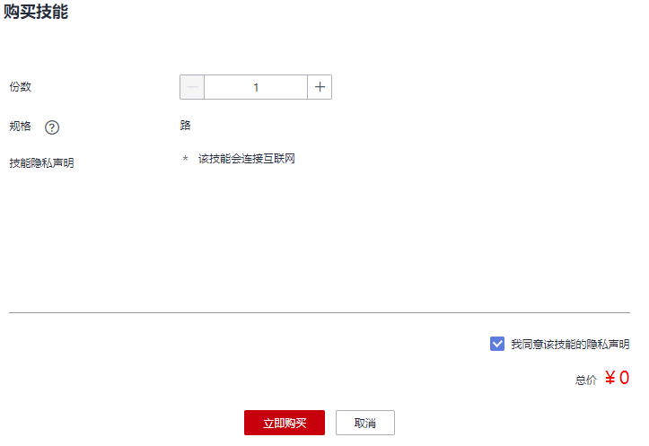
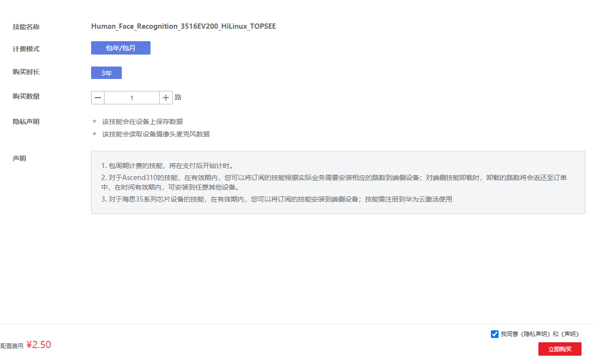
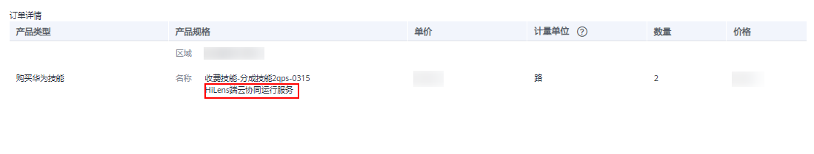

# 购买技能

不管是设备管理或者产品管理，首先您需要在“技能市场“购买一个可用的技能，也可以在ModelArts AI Gallery订阅HiLens技能。

## 背景信息

-   购买技能需要一定的费用，在使用华为HiLens前检查帐号状态，帐号不能处于欠费或冻结状态。
-   技能可以分为“适用于Ascend芯片的技能“和“适用于海思35XX系列芯片的技能“，请仔细查看界面中技能的类型，然后根据实际情况进行购买。
-   当“技能市场“没有您需要的技能，可以向华为HiLens提出定制技能的需求，详情请见[定制技能](定制技能.md)。
-   当前技能市场购买的技能暂不支持在HiLens Studio中打开，您可以选择在HiLens Studio中选择技能模板新建技能项目，详情请见[新建技能项目](新建技能项目.md)。

## 在HiLens技能市场购买技能

1.  进入华为HiLens管理控制台，单击左侧导航栏的“产品订购\>技能市场“，进入“技能市场“页面。
2.  在“技能市场“中，通过筛选、搜索等操作，找到想要安装的技能，单击技能图标进入“技能详情“页面。
3.  在技能详情页面，单击“立即购买“。
    -   若技能为**免费技能**，则弹出“购买技能“对话框。
        1.  在弹出的“购买技能“对话框中，按照“规格“选择“份数“，阅读技能隐私声明，并勾选“我同意该技能的隐私声明“，确认费用后，单击“立即购买“，完成技能购买。

            当前“规格“为“路“，表示每份License可用在设备上的视频路数，有路数和并发量两种计量方式。若以路数规格，一份License可以安装在设备上使用一路视频。

            部分技能无需勾选“我同意该技能的隐私声明“，直接单击“立即购买“，即可完成技能购买。

        2.  技能购买完成后，对话框显示购买完成，您可以单击“订单“，返回“技能市场“页面。也可以在左侧导航栏中选择“产品订购\>订单管理“进入“技能订单“页面，查看已购买技能。

            **图 1**  购买技能  
            

    -   若技能为**计费技能**，则进入“购买技能“页面。
        1.  选择“购买时长“和“购买数量“，确认“计费模式“、“隐私声明“和“声明“，勾选“我同意《隐私声明》和《声明》“，然后单击“立即购买“。

            进入“订单确认“页面。

            **图 2**  确认购买技能  
            

        2.  在“订单确认“页面，确认订单详情，单击“提交订单“。

            部分技能收费已包含HiLens端云协同运行服务，安装此技能可不用另外购买HiLens端云协同运行服务。

            **图 3**  订单确认  
            

            进入“支付“页面。

        3.  在“支付“页面，勾选支付方式，确认订单后，单击“确认付款“，输入支付密码，完成技能购买。

            技能购买完成后，页面显示订单支付成功，您可以单击“返回控制台“，进入华为HiLens控制台，在左侧导航栏中选择“产品订购\>订单管理“进入“技能订单“页面，查看已购买技能。

## 在ModelArts AI Gallery订阅技能

您也可以在ModelArts的AI Gallery中，查找并订阅您想要的技能，详情请见[AI Gallery订阅HiLens技能](https://support.huaweicloud.com/aimarket-modelarts/modelarts_18_0004.html)。

技能订阅成功后，华为HiLens控制台的“产品订购\>订单管理\>AI Gallery“页面将展示您在ModelArts AI Gallery订阅的HiLens技能，以及订阅的详细信息。

在“产品订购  \>  订单管理  \>  AI Gallery“页面，单击技能名称左侧，在技能的版本信息单击“安装”即可安装技能至设备上使用，详情请参见[安装技能](https://support.huaweicloud.com/usermanual-hilens/hilens_02_0010.html)。

**图 4**  安装技能-40  

## 后续操作

-   针对普通用户或开发者（技能使用者）：您可以将购买的技能安装在设备上。详情请参见[安装技能](https://support.huaweicloud.com/usermanual-hilens/hilens_02_0010.html)。
-   针对厂商（产品管理者）：您可以将购买的技能，分发至您的产品中。详情请参见[分发技能](分发技能.md)。

