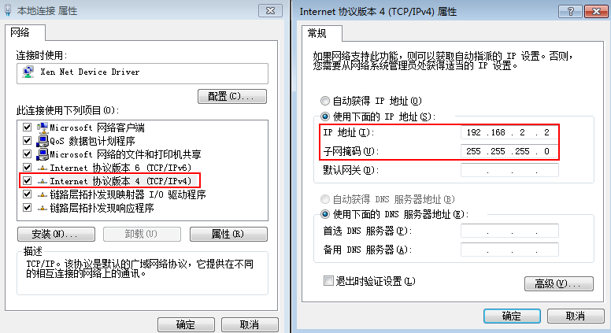

# 连接PC和HiLens Kit-1

如果需要操作HiLens Kit的系统文件等配置，可以使用SSH注册并登录设备，用Linux指令进行操作。下面以PuTTY工具（[下载地址](https://www.putty.org)）为例，介绍在Windows 7环境下如何通过SSH登录HiLens Kit。

## 准备工作

-   确保您拥有至少一台HiLens Kit设备。
-   确保华为云帐号没有欠费。
-   确保获得如下数据：
    -   待连接设备的IP地址：

        设备初始IP地址请参见[HiLens Kit 用户指南\>默认数据](https://support.huawei.com/enterprise/zh/doc/EDOC1100112066/2347bab9)中“管理网口初始IP地址“的“默认值“。

    -   登录待连接设备的用户名和密码：

        设备的初始用户名和密码请参见[HiLens Kit 用户指南\>默认数据](https://support.huawei.com/enterprise/zh/doc/EDOC1100112066/2347bab9)中“初始用户名与密码“的“默认值“。

        非首次登录，以修改后的帐号名和密码登录，修改密码详情请见[修改初始用户名和密码](https://support.huawei.com/enterprise/zh/doc/EDOC1100112066/f03e0dea)。

-   确保下载软件PuTTY.exe，此工具为第三方软件。

## 网线连接PC与HiLens Kit

HiLens Kit后面板接口如[图1](#hilens_02_0049_fig062502229)和[表1](#hilens_02_0049_table98731719132214)所示。

**图 1**  后面板接口  

**表 1**  后面板接口说明

<table><thead align="left"><tr id="hilens_02_0049_row28731419142217"><th class="cellrowborder" valign="top" width="33.18%" id="mcps1.2.3.1.1">
接口

</th>
<th class="cellrowborder" valign="top" width="66.82000000000001%" id="mcps1.2.3.1.2">
说明

</th>
</tr>
</thead>
<tbody><tr id="hilens_02_0049_row1287312194225"><td class="cellrowborder" valign="top" width="33.18%" headers="mcps1.2.3.1.1 ">
1

</td>
<td class="cellrowborder" valign="top" width="66.82000000000001%" headers="mcps1.2.3.1.2 ">
电源开关

</td>
</tr>
<tr id="hilens_02_0049_row1687391962213"><td class="cellrowborder" valign="top" width="33.18%" headers="mcps1.2.3.1.1 ">
2

</td>
<td class="cellrowborder" valign="top" width="66.82000000000001%" headers="mcps1.2.3.1.2 ">
电源接口

</td>
</tr>
<tr id="hilens_02_0049_row1687417194228"><td class="cellrowborder" valign="top" width="33.18%" headers="mcps1.2.3.1.1 ">
3

</td>
<td class="cellrowborder" valign="top" width="66.82000000000001%" headers="mcps1.2.3.1.2 ">
管理网口

</td>
</tr>
</tbody>
</table>

1.  将DC 12V的电源适配器的端口插入HiLens Kit后面板的电源接口。
2.  打开HiLens Kit的电源开关（按住开关键1到2秒放开）。
3.  将网线的一端连接到设备的管理网口上，另一端连接到PC的以太网口上。

## 互通PC与HiLens Kit网络

设置PC机的IP地址、子网掩码或者路由，使PC机能和设备网络互通。

1.  单击PC右下角网络图标，单击“网络和Internet设置“。
2.  在“网络和Internet设置“页面，单击“更改适配器设置“，进入“网络连接“页面。
3.  设置HiLens Kit的网络连接，即HiLens Kit用网线连到PC后，在“网络连接“页面上会显示HiLens Kit对应的网络连接，右键单击该网络连接（一般命名为“本地连接“），单击“属性“，弹出“属性“窗口。
4.  在“属性“设置窗口中，双击“Intenet 协议版本4“，选择“使用下面的IP地址“，在右侧输入框中输入一个和设备**同一个网段**的IP（注：非端侧设备IP），单击“子网掩码“文本框，自动生成子网掩码，单击“确定“，完成网络属性修改。

    设备的初始IP地址请参见[HiLens Kit 用户指南\>默认数据](https://support.huawei.com/enterprise/zh/doc/EDOC1100112066/2347bab9)中“管理网口初始IP地址“的“默认值“。

    > **说明：** 
    >-   只有“本地连接属性\>Internet协议版本4属性“中的IP和HiLens Kit设备IP在同一网段，才能从电脑SSH连接到HiLens Kit设备。**同一个网段**指本地连接IP的前三段地址要与设备IP一致。例如，设备IP是192.168.2.111，那么与设备IP为同一网段的IP，即“本地连接属性\>Internet协议版本4属性“中的IP，可以是192.168.2.x，其中x是2-255中除111之外的整数。
    >-   如果设备IP已修改，此处“本地连接属性\>Internet协议版本4属性“中的IP应填写与修改后的设备IP为同一网段的IP。修改IP的具体步骤请见[有线网络配置（SSH）](有线网络配置（SSH）.md)。

    **图 2**  修改网络属性-6  
    

## 后续操作

使用SSH登录HiLens Kit设备，详情请见[SSH登录HiLens Kit设备](SSH登录HiLens-Kit设备.md)。

