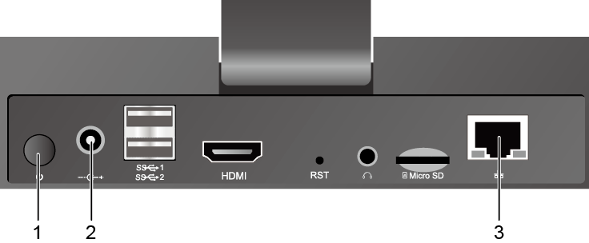
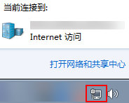
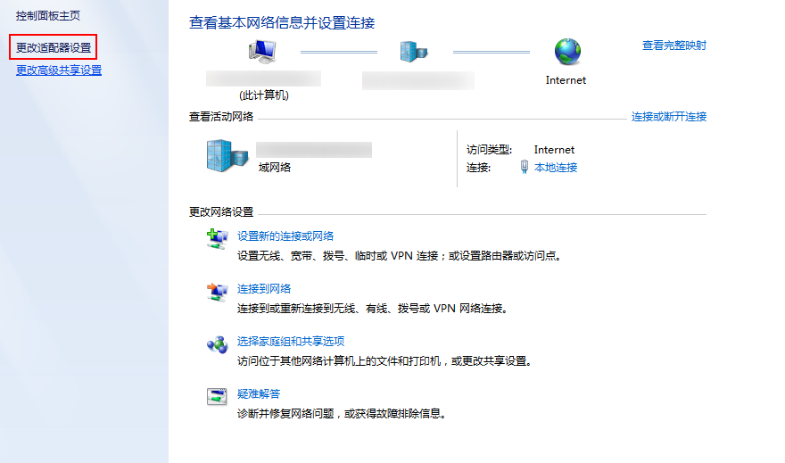
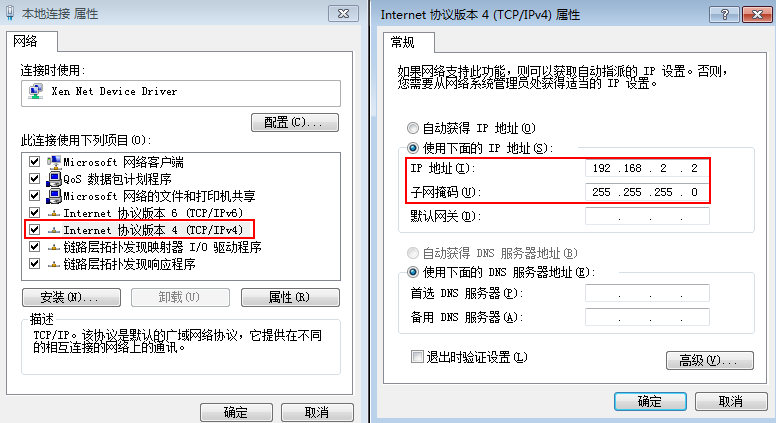

# 连接PC和HiLens Kit

在注册HiLens Kit至控制台之前，您需要连接PC和HiLens Kit。

## 操作步骤

1.  通过网线连接PC与HiLens Kit的管理网口。

    HiLens Kit后面板接口如[图1](#fig062502229)和[表1](#table98731719132214)所示。

    **图 1**  后面板接口  
    

    **表 1**  后面板接口说明

    
    <table><thead align="left"><tr id="row28731419142217"><th class="cellrowborder" valign="top" width="50%" id="mcps1.2.3.1.1">
接口

    </th>
    <th class="cellrowborder" valign="top" width="50%" id="mcps1.2.3.1.2">
说明

    </th>
    </tr>
    </thead>
    <tbody><tr id="row1287312194225"><td class="cellrowborder" valign="top" width="50%" headers="mcps1.2.3.1.1 ">
1

    </td>
    <td class="cellrowborder" valign="top" width="50%" headers="mcps1.2.3.1.2 ">
电源开关

    </td>
    </tr>
    <tr id="row1687391962213"><td class="cellrowborder" valign="top" width="50%" headers="mcps1.2.3.1.1 ">
2

    </td>
    <td class="cellrowborder" valign="top" width="50%" headers="mcps1.2.3.1.2 ">
电源接口

    </td>
    </tr>
    <tr id="row1687417194228"><td class="cellrowborder" valign="top" width="50%" headers="mcps1.2.3.1.1 ">
3

    </td>
    <td class="cellrowborder" valign="top" width="50%" headers="mcps1.2.3.1.2 ">
管理网口

    </td>
    </tr>
    </tbody>
    </table>

    1.  将DC 12V的电源适配器的端口插入HiLens Kit后面板的电源接口。
    2.  打开HiLens Kit的电源开关（按住开关键1到2秒放开）。
    3.  将网线的一端连接到设备的管理网口上，另一端连接到PC的以太网口上。

2.  设置PC机的IP地址、子网掩码或者路由，使PC机能和设备网络互通。
    1.  单击PC右下角网络图标，单击“打开网络和共享中心“。

        **图 2**  网络和共享中心  
        

    2.  在“网络和共享中心“窗口，单击左侧导航栏中的“更改适配器设置“，进入“网络连接“页面。

        **图 3**  网络连接  
        

    3.  HiLens Kit用网线连到PC后，在“网络连接“页面上会显示对应的“连接“，右键单击该“连接“（一般命名为“本地连接“），单击“属性“，弹出“属性“窗口。
    4.  在“属性“设置窗口中，双击“Intenet 协议版本4“，选择“使用下面的IP地址“，在右侧输入框中输入一个和设备**同一个网段**的IP（注：非端侧设备IP），单击“子网掩码“文本框，自动生成子网掩码，如[图4](#fig205806320264)所示，单击“确定“，完成网络属性修改。

        设备的初始IP地址请参见[HiLens Kit 用户指南\>默认数据](https://support.huawei.com/enterprise/zh/doc/EDOC1100112066/2347bab9)中“管理网口初始IP地址“的“默认值“。

        > **说明：**   
        >-   只有“本地连接属性\>Internet协议版本4属性“中的IP和HiLens Kit设备IP在同一网段，才能从电脑SSH连接到HiLens Kit设备。**同一个网段**指本地连接IP的前三段地址要与设备IP一致。例如，设备IP是192.168.2.111，那么与设备IP为同一网段的IP，即“本地连接属性\>Internet协议版本4属性“中的IP，可以是192.168.2.x，其中x是2-255中除111之外的整数，如[图4](#fig205806320264)所示。  
        >-   如果设备IP已修改，此处“本地连接属性\>Internet协议版本4属性“中的IP应填写与修改后的设备IP为同一网段的IP。修改IP的具体步骤请见[有线网络配置](有线网络配置.md)。  

        **图 4**  修改网络属性  
        

## 后续操作

注册设备至Huawei HiLens控制台。HiLens Kit有两种注册方式，分别是使用SSH注册和HiLens Kit智能边缘系统注册两种方式，具体操作指导如下：

-   [智能边缘系统注册设备](智能边缘系统注册设备.md)
-   [使用SSH注册设备](使用SSH注册设备.md)

