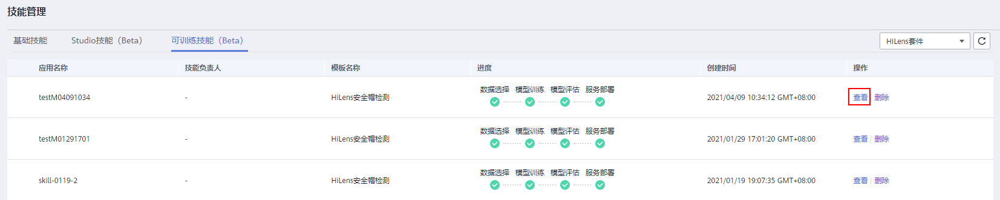
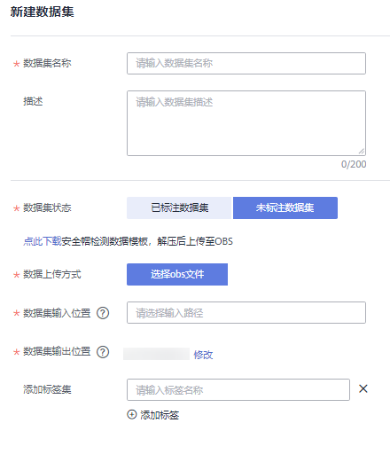
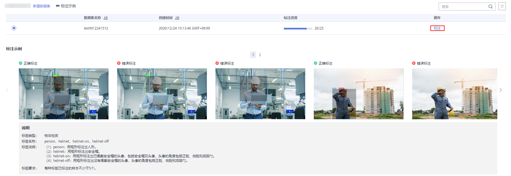

# 选择数据

在使用HiLens安全帽检测技能模板训练模型时，您需要新建训练数据集，后续训练模型操作是基于您创建的训练数据集。

## 前提条件

-   已在华为HiLens控制台选择“HiLens安全帽检测“可训练模板新建技能，详情请见[新建可训练技能](新建可训练技能.md)。
-   已准备数据并上传至OBS，详情请见[准备数据](准备数据.md)。

## 进入技能开发页面

-   方式一：首次进入

    基于可训练技能模板[新建可训练技能](新建可训练技能.md)后，直接进入“应用开发“页面。

-   方式二：新建技能后进入
    1.  登录华为HiLens控制台，在左侧导航栏选择“技能开发\>技能管理“页面。
    2.  单击“可训练技能“，切换至“可训练技能“页签。
    3.  选择已新建的技能名称，单击“操作“列的“查看“，进入“应用开发“页面。

        **图 1**  进入技能开发页面  
        

## 新建训练数据集

在“应用开发\>数据选择“页面，单击“新建训练数据集“，右侧弹出“新建数据集“页面，根据数据存储位置和数据标注情况，按[表1](#table1455214220167)填写数据集基本信息，然后单击“确定“。

**图 2**  新建数据集  

**表 1**  新建训练数据集参数说明

<table><thead align="left"><tr id="row12552164221612"><th class="cellrowborder" valign="top" width="50%" id="mcps1.2.3.1.1">
参数

</th>
<th class="cellrowborder" valign="top" width="50%" id="mcps1.2.3.1.2">
说明

</th>
</tr>
</thead>
<tbody><tr id="row8552124221610"><td class="cellrowborder" valign="top" width="50%" headers="mcps1.2.3.1.1 ">
数据集名称

</td>
<td class="cellrowborder" valign="top" width="50%" headers="mcps1.2.3.1.2 ">
待新建的数据集名称。

</td>
</tr>
<tr id="row1255264241618"><td class="cellrowborder" valign="top" width="50%" headers="mcps1.2.3.1.1 ">
描述

</td>
<td class="cellrowborder" valign="top" width="50%" headers="mcps1.2.3.1.2 ">
数据集简要描述。

</td>
</tr>
<tr id="row693332362016"><td class="cellrowborder" valign="top" width="50%" headers="mcps1.2.3.1.1 ">
数据集状态

</td>
<td class="cellrowborder" valign="top" width="50%" headers="mcps1.2.3.1.2 ">
按上传的数据是否标注分为“已标注数据集”和“未标注数据集”。数据格式请见<a href="准备数据.md#section127561729153510">数据集要求</a>。

</td>
</tr>
<tr id="row165521942181612"><td class="cellrowborder" valign="top" width="50%" headers="mcps1.2.3.1.1 ">
数据上传方式

</td>
<td class="cellrowborder" valign="top" width="50%" headers="mcps1.2.3.1.2 ">
训练数据上传的方式，当前仅支持把数据上传至OBS，默认为“选择obs文件”。

</td>
</tr>
<tr id="row55529422167"><td class="cellrowborder" valign="top" width="50%" headers="mcps1.2.3.1.1 ">
数据集输入位置

</td>
<td class="cellrowborder" valign="top" width="50%" headers="mcps1.2.3.1.2 ">
训练数据存储至OBS的位置。

单击“数据集输入位置”右侧输入框，在弹出的“数据集输入位置”对话框中，选择“OBS桶”和“文件夹”，然后单击“确定”。

</td>
</tr>
<tr id="row9553114281617"><td class="cellrowborder" valign="top" width="50%" headers="mcps1.2.3.1.1 ">
数据集输出位置

</td>
<td class="cellrowborder" valign="top" width="50%" headers="mcps1.2.3.1.2 ">
待新建的数据集存储至OBS的位置。

待新建的数据集有一个默认存储位置。如果需要修改数据集存储位置，请单击“数据集输出位置”右侧的“修改”，在弹出的“数据集输出位置”对话框中，选择“OBS桶”和“文件夹”，然后单击“确定”。

</td>
</tr>
</tbody>
</table>

新建训练数据集后，勾选当前应用开发所需的训练数据集。

## 标注数据

由于模型训练过程需要有标签的数据，针对已上传的数据集，您可以手动添加或修改标签，每个标签至少有五个数据。

**图 3**  标注数据  

-   查看标注示例：单击新建训练数据集右侧的“标注示例“，可选择查看标注示例。
-   进入标注页面：单击数据集操作列的“标注“，进入数据集概览页单击右上角的“开始标注“，在“数据标注“页面手动标注数据，详细的操作指导请参考[标注数据-物体检测](https://support.huaweicloud.com/engineers-modelarts/modelarts_23_0012.html#section2)。

## 查看标签解析

新建并选择训练数据集后，针对已标注的数据，您可以在“标签解析“中查看标签样本的统计数据，横轴为“标签“，纵轴为标签对应的有效“样本数“。

**图 4**  标签解析  

## 后续操作

在“应用开发\>数据选择“页面选择训练数据集，并针对未标注的数据进行数据标注，然后单击“下一步“，进入应用开发的“模型训练“步骤，详细操作指引请参见[训练模型](训练模型.md)。

