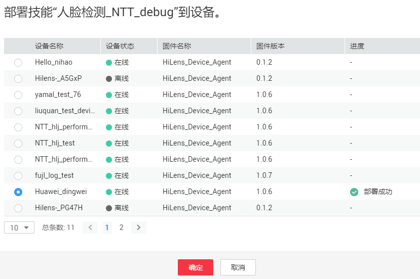

# 部署和调试技能

技能创建完成后，您可以将技能部署至设备中，通过查看设备的技能视频或原始视频，查看技能运行效果，判断此技能是否满足业务诉求。

您还可以查看端侧日志调试技能，帮助定位问题，具体操作请参见[查看设备日志](查看设备日志.md)。

## 前提条件

-   已有一个HiLens Kit设备，在Huawei HiLens中完成注册，且设备处于“在线“状态。设备管理相关指导请参见[设备管理简介](设备管理简介.md)。
-   在Huawei HiLens中[新建技能](新建技能.md)，技能已完成开发。

## 部署技能

1.  登录Huawei HiLens管理控制台，单击左侧导航栏“技能开发 \> 技能管理“，进入“技能管理“页面。
2.  选择需要部署的技能，单击右侧“部署“。
3.  在弹出的部署对话框中，选择需要部署的设备，单击“部署“。

    当显示如下类似信息时，表示部署成功。

    **图 1**  部署成功  
    

4.  部署成功后，您可以前往[数据管理](管理数据.md)，查看技能效果。

