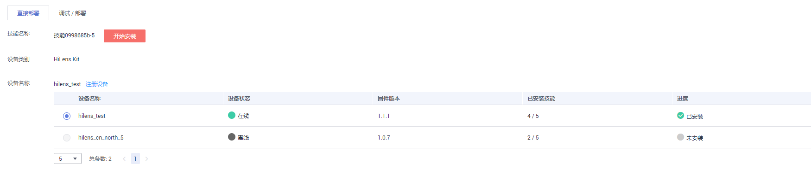

# 部署应用

模型准备完成后，您可以在“服务部署“步骤，快速创建技能，并一键安装技能至端侧设备。也可以进入HiLens Studio自动创建技能，进一步调试技能。

## 前提条件

-   已在华为HiLens控制台选择“HiLens安全帽检测“技能模板新建技能，并评估模型，详情请见[评估模型](评估模型.md)。
-   由于部署在线应用涉及ModelArts功能，需消耗资源，要确保账户未欠费。
-   安装技能至设备，需要提前在华为HiLens控制台注册HiLens Kit设备，详细操作指导请见[注册HiLens Kit](https://support.huaweicloud.com/usermanual-hilens/hilens_02_0048.html)。
-   IDPMCPS-NOTE-MARK-START
 **说明：** 

在华为HiLens控制台自动创建的技能只能安装至同一帐号同一区域下注册的HiLens Kit设备。

## 直接部署

在“应用开发\>服务部署“页面，工作流会根据训练的模型自动创建技能，您可以一键安装技能至HiLens Kit设备上。

-   技能名称：工作流自动创建技能后，生成默认技能名称。
-   设备类别：当前仅支持将技能安装至HiLens Kit设备上，安装技能之前，请在同一帐号同一区域的华为HiLens控制台注册HiLens Kit设备，详细操作指导请见[注册HiLens Kit](https://support.huaweicloud.com/usermanual-hilens/hilens_02_0048.html)。
-   设备名称：显示同一帐号同一区域下注册在华为HiLens控制台的设备列表。

勾选设备处于“在线“状态的设备，然后单击技能名称右侧的“开始安装“，就开始安装技能。

设备列表的进度列会显示安装技能的进度，安装完成后，会显示“已安装“。

**图 1**  服务部署  

## 调试/部署

此功能暂未开放，敬请期待。

## 后续步骤

安装技能至设备后，您可以[查看技能详情](查看技能详情.md)，也可以在华为HiLens控制台[管理设备上的技能](https://support.huaweicloud.com/usermanual-hilens/hilens_02_0009.html)，包括安装新技能、添加运行时配置、启动技能、停止技能、卸载技能等操作。

