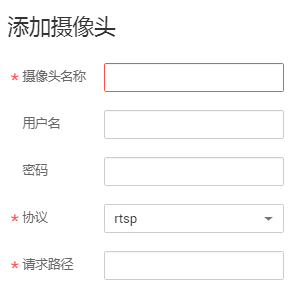
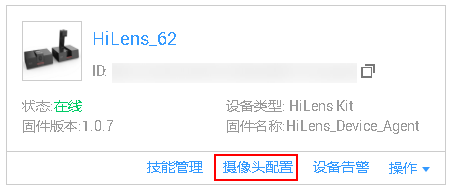

# 配置摄像头

HiLens Kit自带一个摄像头，同时也可以连接管理多个IP摄像头（最多8个）。

> **说明：**   
>支持接入1080P及以下的IPC摄像头，暂不支持接入1080P以上的IPC摄像头。  

## 添加摄像头

1.  在管理控制台左侧菜单栏选择“设备管理 \>设备列表“，在设备列表中选择指定的设备，单击“摄像头配置“，进入设备详情页的“摄像头管理“页签。

    **图 1**  进入摄像头管理页签-0  
    

    也可以在设备列表中单击设备名称，进入设备详情页，然后单击“摄像头管理“，切换至设备详情页的“摄像头管理“页签。

2.  在“摄像头管理“页面中，单击右上角“添加摄像头“，在弹出的对话框中，填写相关信息。

    **图 2**  添加摄像头  
    

    **表 1**  摄像头配置

    
    <table><thead align="left"><tr id="row357511323296"><th class="cellrowborder" valign="top" width="25.96%" id="mcps1.2.3.1.1">
参数

    </th>
    <th class="cellrowborder" valign="top" width="74.03999999999999%" id="mcps1.2.3.1.2">
参数说明

    </th>
    </tr>
    </thead>
    <tbody><tr id="row95751032112915"><td class="cellrowborder" valign="top" width="25.96%" headers="mcps1.2.3.1.1 ">
摄像头名称

    </td>
    <td class="cellrowborder" valign="top" width="74.03999999999999%" headers="mcps1.2.3.1.2 ">
摄像头的名称，用于标识区分。用户自定义。

    </td>
    </tr>
    <tr id="row6575133214292"><td class="cellrowborder" valign="top" width="25.96%" headers="mcps1.2.3.1.1 ">
用户名

    </td>
    <td class="cellrowborder" valign="top" width="74.03999999999999%" headers="mcps1.2.3.1.2 ">
登录IP摄像头时的用户名。从摄像头说明书中获取。

    </td>
    </tr>
    <tr id="row15576432192916"><td class="cellrowborder" valign="top" width="25.96%" headers="mcps1.2.3.1.1 ">
密码

    </td>
    <td class="cellrowborder" valign="top" width="74.03999999999999%" headers="mcps1.2.3.1.2 ">
登录IP摄像头的密码。

    </td>
    </tr>
    <tr id="row105760322298"><td class="cellrowborder" valign="top" width="25.96%" headers="mcps1.2.3.1.1 ">
协议

    </td>
    <td class="cellrowborder" valign="top" width="74.03999999999999%" headers="mcps1.2.3.1.2 ">
摄像头传输视频的协议。默认为“rtsp”，且不可修改。

    </td>
    </tr>
    <tr id="row115771321293"><td class="cellrowborder" valign="top" width="25.96%" headers="mcps1.2.3.1.1 ">
请求路径

    </td>
    <td class="cellrowborder" valign="top" width="74.03999999999999%" headers="mcps1.2.3.1.2 ">
访问摄像头视频的URL。例如“192.168.0.1/root”。从摄像头说明书中获取。

    </td>
    </tr>
    </tbody>
    </table>

3.  确认信息填写完成后，单击“执行配置“完成摄像头添加，并将配置下发到端侧设备生效。此时摄像头管理页面增加了一行摄像头信息。

## 编辑摄像头信息

针对已添加到此设备的摄像头，您可以编辑摄像头信息。

1.  在管理控制台左侧菜单栏选择“设备管理 \>设备列表“，在设备列表中选择指定的设备，单击“摄像头配置“，进入设备详情页的“摄像头管理“页签。

    **图 3**  进入摄像头管理页签-1  
    

    也可以在设备列表中单击设备名称，进入设备详情页，然后单击“摄像头管理“，切换至设备详情页的“摄像头管理“页签。

2.  在设备详情页的“摄像头管理“页签中，单击“操作“列的“编辑“，修改摄像头的相关信息，并单击“执行配置“，确定修改摄像头相关信息。

    支持修改“用户名“、“密码“、“协议“和“请求路径“信息。“摄像头名称“一旦确定，无法修改。

## 删除摄像头

针对已添加到此设备的摄像头，您可以删除多余的摄像头。

1.  在管理控制台左侧菜单栏选择“设备管理 \>设备列表“，在设备列表中选择指定的设备，单击“摄像头配置“，进入设备详情页的“摄像头管理“页签。

    **图 4**  进入摄像头管理页签-2  
    

    也可以在设备列表中单击设备名称，进入设备详情页，然后单击“摄像头管理“，切换至设备详情页的“摄像头管理“页签。

2.  在设备详情页的“摄像头管理“页签中，单击“操作“列的“删除“，然后单击“确定“，确定删除摄像头，即可删除多余的摄像头信息。

> **说明：**   
>删除后，信息不可恢复，请谨慎操作。  

