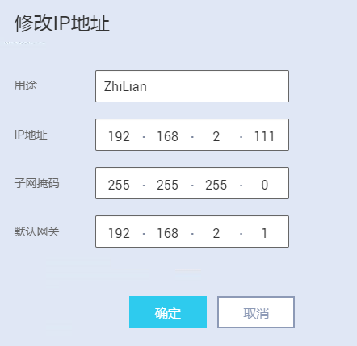

# 配置有线网络

HiLens Kit有两种组网方式，分为无线和有线两种方式连接路由器，本章介绍有线网络配置方式。

> **说明：** 
>不能同时使用无线网络和有线网络连接同一个路由器，无线连接会自动删除默认网关，再次使用有线网络时需要配置默认网关。**推荐使用无线连接到路由器，以免更新设备IP后遗忘或丢失IP。**
>无线网络配置请参见[配置无线网络](配置无线网络.md)。

## 配置说明

**针对使用有线网络直连路由器的方式，需要修改设备IP，使设备IP与路由器IP在同一网段。**

同一个网段指设备连接IP的前三段地址要与路由器IP一致。例如，设备IP是192.168.2.111，那么路由器IP可以是192.168.2.x，其中x是2-255中除111之外的整数。

## 准备工作

依次完成如下操作：

1.  网线连接PC和设备，详细操作请参见[连接PC和HiLens Kit](连接PC和HiLens-Kit.md)。
2.  升级HiLens Kit系统固件版本，详情请参见[升级HiLens Kit系统固件版本](升级HiLens-Kit系统固件版本.md)。
3.  同步设备时区和时间，详情请参见[同步时区和时间](同步时区和时间.md)。

## 操作步骤

1.  登录华为HiLens智能边缘管理系统，在本地PC中打开浏览器。在地址栏中输入华为HiLens智能边缘管理系统的地址，地址格式为“**https**://_华为HiLens__智能边缘管理系统的访问IP地址_”（默认IP为192.168.2.111）。按“Enter“键。

    > **说明：** 
    >如果浏览器显示“此网站的安全证书有问题”，请单击“继续浏览此网站\(不推荐\)”。

2.  在系统登录界面中，配置登录信息。

    在“用户名”和“密码”输入框中输入登录的用户名和密码。

    初识用户名和密码请见[默认数据](https://support.huawei.com/enterprise/zh/doc/EDOC1100112066/2347bab9)。

    **图 1**  登录华为HiLens智能边缘管理系统-4  
    

3.  在主菜单中选择“管理\>网络\>有线网络“。

    进入“有线网络“配置页面。

    **图 2**  有线连接路由器  
    

4.  单击检测网络状态后的“检测“，检查网络是否连接。
5.  修改IP地址。
    1.  单击待修改IP地址后的“修改”。
    2.  按[表1](#table3402103588)修改“IP地址“。本示例使用路由器IP是“192.168.2.1“，如[图3](#fig1640315019583)所示，单击“确定“，完成修改设备IP。
    3.  单击“保存“，重启系统，使IP配置生效。

        **表 1**  修改IP参数

        
        <table><thead align="left"><tr id="row164021200580"><th class="cellrowborder" valign="top" width="25.41%" id="mcps1.2.3.1.1">
参数

        </th>
        <th class="cellrowborder" valign="top" width="74.59%" id="mcps1.2.3.1.2">
说明

        </th>
        </tr>
        </thead>
        <tbody><tr id="row1540213017589"><td class="cellrowborder" valign="top" width="25.41%" headers="mcps1.2.3.1.1 ">
用途

        </td>
        <td class="cellrowborder" valign="top" width="74.59%" headers="mcps1.2.3.1.2 ">
IP地址的用途。

        
支持输入英文、数字和下划线字符，字符串长度1~32个字符。

        </td>
        </tr>
        <tr id="row124021205586"><td class="cellrowborder" valign="top" width="25.41%" headers="mcps1.2.3.1.1 ">
IP地址

        </td>
        <td class="cellrowborder" valign="top" width="74.59%" headers="mcps1.2.3.1.2 ">
需要修改的IPv4地址。

        
此处IP地址应和路由器IP在同一网段的IP地址。

        </td>
        </tr>
        <tr id="row240220011588"><td class="cellrowborder" valign="top" width="25.41%" headers="mcps1.2.3.1.1 ">
默认网关

        </td>
        <td class="cellrowborder" valign="top" width="74.59%" headers="mcps1.2.3.1.2 ">
该IP地址对应的默认网关。

        
 说明： 

请确保默认网关全局唯一。

        

        </td>
        </tr>
        </tbody>
        </table>

        **图 3**  修改IP地址  
        

6.  拔出PC侧网线，断开设备与PC的网线连接，然后网线连接设备与路由器。
7.  配置DNS：
    1.  在华为HiLens智能边缘管理系统“管理\>网络\>有线网络“页面。单击“配置DNS地址“的“新增“。

        添加DNS地址“nameserver 8.8.8.8“。

    2.  单击“确定“。
    3.  单击“保存“，重启系统，使配置生效。

## 后续操作

注册HiLens Kit，详情请见[智能边缘系统注册HiLens Kit](智能边缘系统注册HiLens-Kit.md)。

