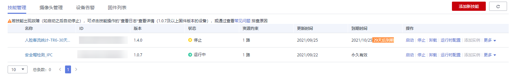
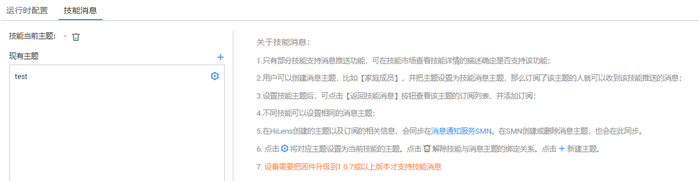
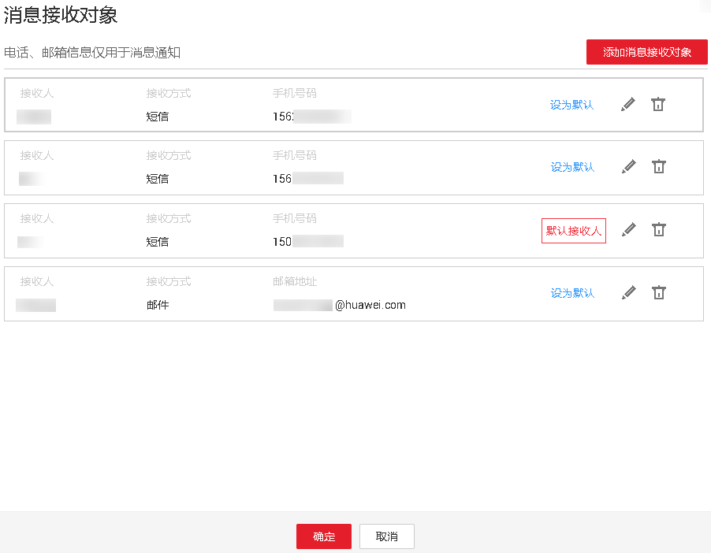
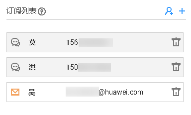
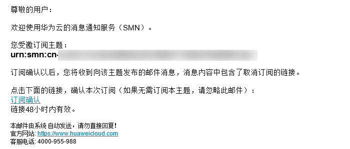

# 配置订阅消息

为指定技能订阅消息后，当技能有输出时，订阅对象会收到邮件或短信通知。

例如某一技能具备检测陌生人并同时发送消息的功能，即该技能在“技能详情“页面的“产品描述“中提示“本技能支持发送订阅消息“，您在安装部署该技能后[配置订阅对象](#section146782216229)，这样当设备检测到陌生人时，所配置的订阅对象将会收到邮件或短信通知。

## 注意事项

-   首次订阅消息后，需将技能重启，订阅对象才能收到订阅消息，重启操作参见[启动或停止技能](启动或停止技能.md)。
-   订阅消息会产生一定的费用，详细收费标准请参见[消息通知服务](https://www.huaweicloud.com/price_detail.html#/smn_detail)。

## 前提条件

-   技能支持消息通知的功能。由开发者开发技能的时候设定，详细指导和API介绍可参见《[开发指南](https://support.huaweicloud.com/devg-hilens/hilens_05_0002.html)》。

    若技能没有配置推送消息功能，普通用户将无法收到技能的消息通知。

-   技能已部署至某一设备中，且处于“运行中“状态。技能非运行状态时，用户无法收到技能的消息通知。

## 配置订阅对象

订阅对象为消息通知的接收对象，在设备检测到指定场景（例如设备所安装技能具备检测陌生人的功能，在检测到陌生人的场景），订阅对象即可收到消息通知。

1.  登录HiLens管理控制台，单击左侧导航栏“设备管理\>设备列表“，进入设备列表页面。
2.  单击技能所部署的设备卡片中“技能管理“，默认进入设备详情页的技能管理页签。

    **图 1**  技能管理  
    

3.  在“设备管理“页签中，单击需要配置订阅对象的“技能名称“，进入技能详情页面。
4.  单击“技能消息“，切换至“技能消息“页签。

    **图 2**  技能消息  
    

5.  设置“技能当前主题“。
    -   若添加新的主题
        1.  单击现有主题右侧，弹出文本框，在文本框中输入主题名称，可输入字母、数字、下划线或中划线，必须以字母、数字开头，长度不超过255个字符，然后单击。
        2.  单击主题右侧，在对话框中单击“确定“，确认设置技能主题。

    -   若添加现有主题

        单击主题右侧，在对话框中单击“确定“，确认设置技能主题。

6.  单击“技能消息“页签右上侧的“返回技能消息“，配置技能当前主题的信息接收人。
7.  在订阅列表右侧单击，弹出“消息接收对象“对话框。

    **图 3**  消息接收对象  
    

8.  根据如下情况编辑当前主题的消息接收对象。

    -   若添加新的接收对象

        单击“添加消息接收对象“，在弹出的文本框中输入接收人的信息，详细参数解释请参见[表1](#table16899172012240)。确认信息后单击。

    -   若编辑原有接收对象

        单击接收对象中的，在文本框中重新输入接收人的信息，详细参数解释请参见[表1](#table16899172012240)。确认信息后单击。

        **表 1**  消息订阅对象信息

        
        <table><thead align="left"><tr id="row189001220182414"><th class="cellrowborder" valign="top" width="26.25%" id="mcps1.2.3.1.1">
参数名

        </th>
        <th class="cellrowborder" valign="top" width="73.75%" id="mcps1.2.3.1.2">
参数说明

        </th>
        </tr>
        </thead>
        <tbody><tr id="row13900720142419"><td class="cellrowborder" valign="top" width="26.25%" headers="mcps1.2.3.1.1 ">
接收人

        </td>
        <td class="cellrowborder" valign="top" width="73.75%" headers="mcps1.2.3.1.2 ">
订阅对象的称呼。

        </td>
        </tr>
        <tr id="row12900142082418"><td class="cellrowborder" valign="top" width="26.25%" headers="mcps1.2.3.1.1 ">
接收方式

        </td>
        <td class="cellrowborder" valign="top" width="73.75%" headers="mcps1.2.3.1.2 ">
接收消息的方式：邮箱或手机。

        </td>
        </tr>
        <tr id="row1290012013249"><td class="cellrowborder" valign="top" width="26.25%" headers="mcps1.2.3.1.1 ">
手机号码/邮箱地址

        </td>
        <td class="cellrowborder" valign="top" width="73.75%" headers="mcps1.2.3.1.2 ">
接收消息的电话或邮箱地址。

        </td>
        </tr>
        </tbody>
        </table>

    可以单击“设为默认“来设置默认消息接收对象，便于快速订阅（在步骤[4](#li162891656173213)中的订阅列表右侧单击，即可执行快速订阅）。

9.  单击选中订阅该技能的接收人，然后单击“确定“，完成添加消息订阅人。

    系统跳至订阅列表，可查看刚添加的消息订阅人。

    若想添加多个消息订阅人，请至步骤[7](#li1867716427412)。

    **图 4**  订阅列表  
    

10. 添加完消息订阅人后，接收人会收到短信或邮件，单击“订阅确认“。

    反馈订阅成功信息，完成消息订阅。

    **图 5**  订阅确认  
    

    若订阅对象已确认订阅，您需重启技能，当技能有输出时，订阅对象会收到短信或邮件通知。

    同时，在订阅列表中，订阅人图标会由灰色变成橙红色，如[图4](#fig82163875416)所示。

    > **说明：**   
    >-   QQ邮箱会拦截请求订阅消息，若接收对象是QQ邮箱地址，用户需将将服务加入白名单。操作步骤如下：  
    >    1.  登录QQ邮箱。  
    >    2.  单击“设置-\>反垃圾”。  
    >    3.  在“白名单”栏中，单击“设置邮件地址白名单”。  
    >    4.  输入system@info.huaweicloud.com，单击“添加到白名单”。  
    >-   目前谷歌邮箱、微软系列的邮箱、网易系列邮箱不会拦截。  

